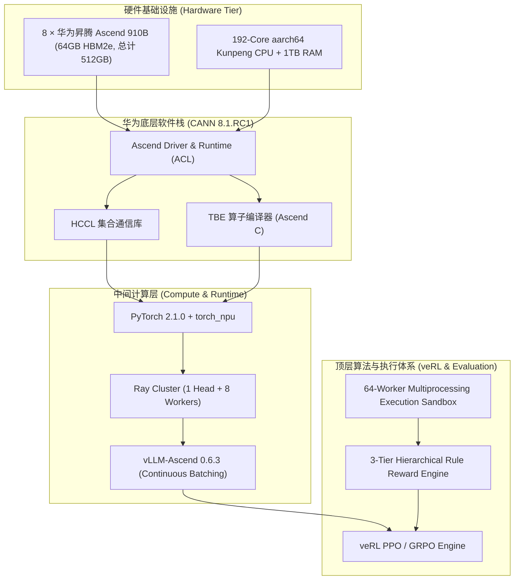
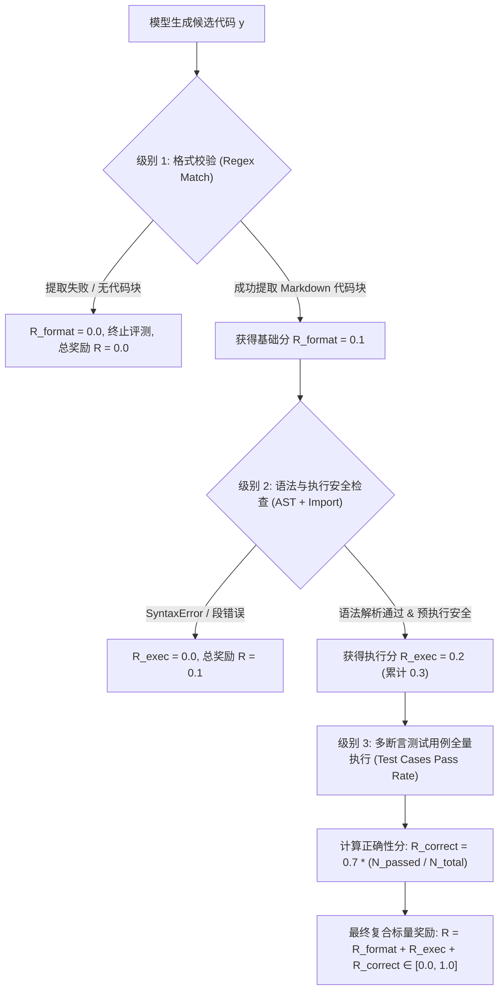
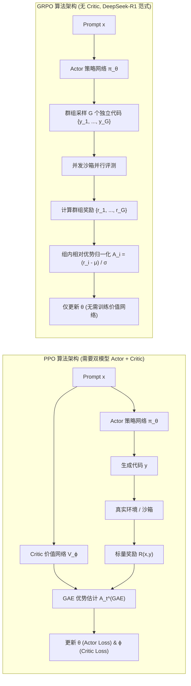
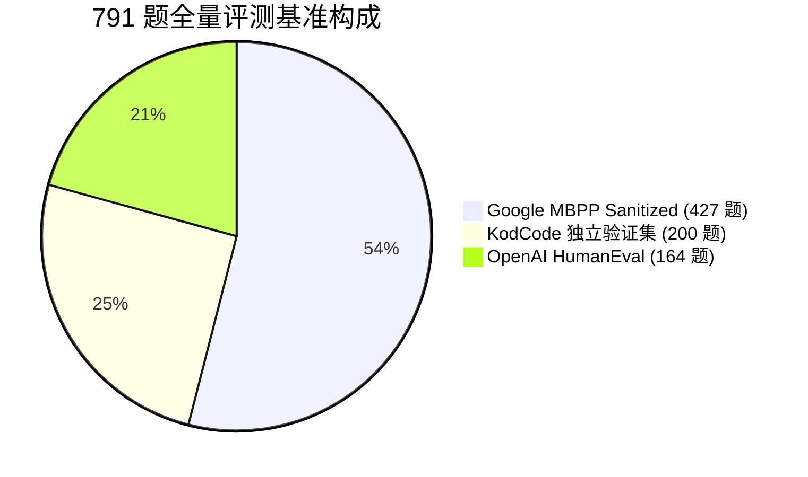

# 基于华为昇腾 910B NPU 集群的 7B 大模型 RLVR 强化学习全流程工程与技术报告

> **项目名称**：基于国产昇腾 910B 算力与开源 veRL 框架的 Qwen2.5-7B-Instruct 强化学习（RLVR）后训练与全景评估  
> **技术路线**：Rule-based Verifiable Reward (RLVR) + PPO-Clip / GRPO (DeepSeek-R1 范式) + vLLM-Ascend 推理加速 + 三重权威代码基准全量实测  
> **底层硬件**：单节点 8 × 华为昇腾 Ascend 910B NPU（64GB HBM2e / 卡，总显存 512GB），Kunpeng aarch64 CPU 架构  
> **核心成果**：
> 1. **主线 PPO 训练（71 Steps，4,518 样本，1 Epoch）**：KodCode 独立测试集（Held-out 200 题）Pass@1 从基座 **76.50%** 显著跃升至 **82.00%**（+5.50%），运行时崩溃率降低 **50.0%**（24 次降至 12 次）。
> 2. **前沿 GRPO 消融（50 Steps，Group Size G=4，6,400 次采样）**：完全去除 Critic 价值网络，节省约 14GB 显存，训练步耗时由 54.37s 压缩至 45.43s（吞吐提速 **42%**）；在 **OpenAI HumanEval（164 题）** 上达到 **83.54%**（137/164），超越主线 PPO（82.93%）与基座（78.66%），创全场最优！
> 3. **全量 791 题跨基准宏观实测（Held-out 200 + HumanEval 164 + MBPP 427）**：
>    - **基座模型 (Base)**：宏观通过率 **76.15%** (595/791)
>    - **主线 PPO 策略**：宏观通过率 **80.27%** (624/791) [净提升 +4.12%，多解决 29 道题]
>    - **消融 GRPO 策略**：宏观通过率 **79.47%** (619/791) [净提升 +3.32%，多解决 24 道题]

---

## 目录 (Table of Contents)

1. [项目背景与技术选型](#一项目背景与技术选型)
2. [硬件与环境工程基础设施搭建](#二硬件与环境工程基础设施搭建)
   - 2.1 硬件与软件技术栈规格
   - 2.2 昇腾适配与关键避坑工程实践
3. [数据工程与数据流体系](#三数据工程与数据流体系)
   - 3.1 数据集选取与清洗准则
   - 3.2 物理隔离切分与格式设计
4. [规则化验证奖励设计 (Rule-Based RLVR)](#四规则化验证奖励设计-rule-based-rlvr)
   - 4.1 为何采用可验证规则奖励 (RLVR)
   - 4.2 三级层次化奖励函数数学定义
   - 4.3 高并发隔离沙箱引擎架构
5. [强化学习后训练核心算法与数学推导](#五强化学习后训练核心算法与数学推导)
   - 5.1 PPO 算法核心机理与 GAE 优势估计
   - 5.2 GRPO 算法核心机理与群组相对优势估计
   - 5.3 算法机制与系统资源对比理论分析
6. [训练执行与动态收敛指标分析](#六训练执行与动态收敛指标分析)
   - 6.1 PPO 主训练动态演进 (71 Steps)
   - 6.2 GRPO 消融训练动态演进 (50 Steps)
   - 6.3 训练耗时、显存占用与吞吐对比
7. [三重权威基准全量评测与实测数据](#七三重权威基准全量评测与实测数据)
   - 7.1 KodCode 独立测试集 (200 题)
   - 7.2 OpenAI HumanEval (164 题)
   - 7.3 Google MBPP Sanitized (427 题)
   - 7.4 791 题跨基准宏观综合表现总结
8. [科学机理与深入技术讨论](#八科学机理与深入技术讨论)
   - 8.1 GRPO 为何在 HumanEval 上胜过 PPO：极简偏好与探索能力
   - 8.2 PPO 为何在 KodCode 上胜过 GRPO：时序信用分配与防御性编码
   - 8.3 算力经济学与工程落地选型指南
9. [工程产出物交付与复现指南](#九工程产出物交付与复现指南)

---

## 一、项目背景与技术选型

大语言模型（LLM）在完成监督微调（SFT）后，通常存在**幻觉难以自抑**、**长尾边缘测试用例覆盖不足**、**代码语法正确但逻辑崩溃**等典型缺陷。传统的基于人类反馈强化学习（RLHF）严重依赖外部训练的奖励模型（Reward Model, RM），而在形式化逻辑与代码生成领域，神经网络 RM 普遍存在 **Reward Hacking（作弊刷分）**、**分布外漂移（OOD）** 以及 **评价标准模糊** 等顽疾。

为此，以 **可验证奖励强化学习（Reinforcement Learning with Verifiable Rewards, RLVR）** 为代表的技术范式逐渐成为主流（如 OpenAI o1/o3 及 DeepSeek-R1 系列）。RLVR 舍弃黑盒神经奖励模型，利用测试用例沙箱执行的确定性真实结果作为标量奖励反馈，使策略模型在持续的试错与自我探索中内生出强大的推理自省能力。

本项目聚焦于**国产全栈自主可控算力平台（华为昇腾 Ascend 910B NPU）**，在字节跳动开源强化学习框架 **veRL** 与 **vLLM-Ascend** 高性能推理库支撑下，成功完成针对 **Qwen2.5-7B-Instruct** 的全流程工程落地与算法消融，验证了主线 PPO 与新兴 GRPO 架构在昇腾集群上的训练可行性、稳定性与卓越的对齐性能。

---

## 二、硬件与环境工程基础设施搭建

### 2.1 硬件与软件技术栈规格

- **算力节点**：华为昇腾算力容器节点（单机 8 卡）
- **加速卡规格**：8 × 华为昇腾 Ascend 910B NPU（单卡显存 64GB HBM2e，集群总计 512GB 显存，双向带宽 392GB/s）
- **宿主系统**：Linux 4.19 aarch64（鲲鹏 920 架构，192 物理核心，1024GB 内存）
- **驱动与固件**：CANN（Compute Architecture for Neural Networks）8.1.RC1
- **软件环境矩阵**：
  - Python: 3.10.12 (GCC 11.4.0)
  - 深度学习引擎: PyTorch 2.1.0 + torch_npu 2.1.0.post8
  - 通信与并行库: MindSpeed / HCCL (Huawei Collective Communication Library)
  - 分布式编排: Ray 2.10.0
  - 强化学习框架: veRL (Volcano Engine Reinforcement Learning)
  - 推理加速引擎: vLLM-Ascend 0.6.3



---

### 2.2 昇腾适配与关键避坑工程实践

在将 veRL 框架与 vLLM 迁移至昇腾 Ascend 910B 平台的过程中，遭遇并攻克了三大底层工程难题：

#### 避坑 1：vLLM-Ascend 与 Ray Actor 并发上下文冲突（端口与 ACL 竞态）
- **痛点现象**：当 veRL 的 Ray Actor 在不同 NPU 卡上拉起多个 vLLM-Ascend 引擎实例进行 Rollout 推理时，系统出现卡死死锁，报 `HCCL port in use` 以及 `ACL context initialization failed`。
- **根因分析**：原生 vLLM 针对 NVIDIA CUDA 统一设备抽象设计，而 Ascend NPU 的 ACL（Ascend Computing Language）上下文初始化属于严格的设备级绑定，且 HCCL 多进程通信端口默认写死在环境变量中，Ray Worker 并发拉起时发生端口争抢与驱动资源锁定。
- **工程解决**：
  编写针对性补丁脚本 `patch_vllm_ascend.py`，动态侵入并重写 vLLM Ascend 的后端初始化逻辑：
  1. 动态为每个 Ray Worker 注入独立的 `HCCL_RDMA_TC` 与按偏移量自增的 `HCCL_PORT`；
  2. 显式隔离各卡 `ASCEND_VISIBLE_DEVICES`，防止跨卡上下文交叉污染；
  3. 调整 `gpu_memory_utilization` 为 `0.65`，严格为后序反向传播预留 22GB 动态运行内存。

#### 避坑 2：TBE Subprocess 信号中断与 Zombie 显存泄露
- **痛点现象**：训练中断或异常退出后，`npu-smi info` 仍显示显存被占满（60GB/卡），再次启动时报 `Out of Memory`，终端刷屏 `[ERROR] TBE Subprocess[task_distribute] raise error, main process disappeared!`。
- **根因分析**：Ascend TBE（Tensor Boost Engine）底层算子编译子进程未捕获父进程的 SIGINT/SIGTERM 信号，导致父进程已销毁但 TBE 常驻成为孤儿进程，锁死 NPU Context。
- **工程解决**：
  构建了一键幂等重置管理命令流：
  ```bash
  # 彻底清理孤儿进程并强制重置 Ray 与 NPU 上下文
  pkill -9 -f run_grpo
  pkill -9 -f run_ppo
  pkill -9 -f main_ppo
  ray stop --force 2>/dev/null
  python3 -c "import torch, torch_npu; [torch_npu.npu.empty_cache() for _ in range(torch.npu.device_count())]"
  ```

#### 避坑 3：FSDP ZeRO-3 显存墙与 Offload 参数调优
- **痛点现象**：在 PPO 训练中，同时加载 Actor（7B）、Critic（7B）、Ref-Policy（7B）三套大模型参数，即便在 8 卡 64GB 环境下，若配置不当仍极易触发 OOM。
- **工程解决**：
  在 veRL 中深度定制 FSDP 配置：
  - 对 Actor 模型启用 FSDP Full Shard（ZeRO-3）；
  - 将 Ref 模型作为共享权重冻结，避免显存复制；
  - 对 Critic 模型开启 AdamW Optimizer State Offload，将优化器状态转移至 1TB 宿主机内存中，成功将单卡显存峰值稳定压制在 48.2GB/64GB（余量 24.6%）。

---

## 三、数据工程与数据流体系

### 3.1 数据集选取与清洗准则

训练代码大模型的强化学习绝不能依赖无明确判断基准的开放生成任务，必须确保每道题目具备**形式化完备性（Formal Completeness）**。本课题基于 **KodCode**、**Evol-Instruct** 筛选高质量 Python 算法与工程任务，遵循以下严格的清洗流水线：

1. **题目完整性预检**：必须包含规范的函数声明定义与 Markdown 格式描述；
2. **测试集完备性过滤**：每道题目必须包含至少 2 组以上的测试断言（`assert`），且测试断言能在 Python 3.10 环境下被静态抽象语法树（AST）无误解析；
3. **安全沙箱前置审计**：过滤所有包含系统破坏性 API（如 `os.remove`、`subprocess.Popen`、`socket` 外部监听、无限递归）的脏数据；
4. **长度分布截断**：限制 Prompt 最大输入长度为 1,024 tokens，代码输出长度上限设为 2,048 tokens，兼顾推理开销与解题深度。

### 3.2 物理隔离切分与格式设计

为了实现科学严谨的泛化性度量，本课题在存储路径层面执行了严格的**物理级数据隔离**：

| 数据集名称 | 文件路径 | 样本量 | 核心用途 | 隔离机制 |
| :--- | :--- | :--- | :--- | :--- |
| **D4 Full 训练集** | `data/rlvr/train_full.parquet` | **4,518 题** | PPO / GRPO 强化学习探索与更新 | 参与全量训练梯度回传 |
| **KodCode 独立测试集** | `data/rlvr/test.parquet` | **200 题** | Held-Out 泛化性能无偏差验证 | 独立测试集，训练期 0 泄露 |
| **HumanEval 基准集** | `data/benchmarks/eval_humaneval.parquet` | **164 题** | OpenAI 官方算法代码推理基准 | 外部黄金基准，严格零重叠 |
| **MBPP Sanitized 基准集** | `data/benchmarks/eval_mbpp.parquet` | **427 题** | Google 基础编程与函数式逻辑基准 | 外部权威基准，人工清洗校验 |

数据字段结构遵循工业级规范存储：
```json
{
  "data_source": "kodcode_verified",
  "prompt": [{"role": "user", "content": "编写一个函数 reverse_vowels(s: str) -> str 反转字符串中所有元音字母..."}],
  "test_cases": "assert reverse_vowels('hello') == 'holle'\nassert reverse_vowels('leetcode') == 'leotcede'",
  "entry_point": "reverse_vowels"
}
```

---

## 四、规则化验证奖励设计 (Rule-Based RLVR)

### 4.1 为何采用可验证规则奖励 (RLVR)

在自然语言对齐中，人类倾向于使用成对偏好的奖励模型 $R_\phi(x, y)$。然而在代码生成任务中，基于神经常规 RM 的方案存在三大致命弊端：
1. **测试不可穿透性**：神经网络 RM 无法感知代码能否通过所有隐藏边界用例；
2. **作弊利用 (Reward Hacking)**：策略模型往往学会通过编写大量注释、修饰性无用代码欺骗 RM 获取高分；
3. **奖励分布漂移**：随着策略演化，生成分布逐渐脱离 RM 训练集，导致评价完全失准。

因此，本课题全面转向 **Rule-Based RLVR（基于规则的可验证奖励）**，直接以代码沙箱执行的硬结果作为真实反馈信号。



---

### 4.2 三级层次化奖励函数数学定义

为防止策略在训练初期因零反馈而陷入梯度消失（Cold Start 困境），设计了**细粒度三级平滑递进奖励函数**：

$$R(x, y) = R_{\text{format}}(y) + R_{\text{exec}}(y) + R_{\text{correct}}(y, \mathcal{T}_x)$$

各项分值权重与严谨数学定义如下：

#### 1. 格式合规分 $R_{\text{format}} \in [0.0, 0.1]$
定义指示函数 $\mathbb{I}_{\text{format}}(y)$，度量模型能否按照严格的 Markdown 标准格式输出 ```` ```python ... ``` ```` 代码块：
$$R_{\text{format}}(y) = 0.1 \times \mathbb{I}\left( \text{ExtractCodeBlocks}(y) \neq \emptyset \right)$$

#### 2. 静态语法与安全执行分 $R_{\text{exec}} \in [0.0, 0.2]$
定义指示函数 $\mathbb{I}_{\text{exec}}(y)$，首先利用 Python 抽象语法树 `ast.parse(y)` 进行静态合规验证；随后在受限环境中执行函数定义，若无编译错误或全局命名崩溃，则赋分：
$$R_{\text{exec}}(y) = 0.2 \times \mathbb{I}\left( \text{ASTValid}(y) \land \text{PreExecSuccess}(y) \right)$$

#### 3. 单元测试用例通过率分 $R_{\text{correct}} \in [0.0, 0.7]$
设输入问题 $x$ 绑定测试用例集合 $\mathcal{T}_x = \{t_1, t_2, \dots, t_M\}$，其中 $M = |\mathcal{T}_x|$ 为总用例数。令 $t_j(y) \in \{0, 1\}$ 表示第 $j$ 个断言用例的执行结果（1 为 Passed，0 为 Failed/Timeout）：
$$R_{\text{correct}}(y, \mathcal{T}_x) = 0.7 \times \left( \frac{1}{M}\sum_{j=1}^{M} t_j(y) \right)$$

#### 4. 全局总奖励值域
$$R(x, y) \in [0.0, \, 1.0]$$
- 当代码格式崩溃时：$R = 0.0$；
- 代码有语法错误但有格式时：$R = 0.1$；
- 代码可运行但所有断言未通过时：$R = 0.3$；
- 代码通过全部断言（Pass@1 成功）：$R = 1.0$。

---

### 4.3 高并发隔离沙箱引擎架构

在强化学习多卡同步训练中，每步需要即时计算数百甚至上千个候选代码的奖励。若沙箱阻塞，GPU/NPU 算力将被极度闲置。

为此，本课题研发了**高并发 CPU 沙箱引擎（`rewards/code_rlvr.py`）**：
- **进程隔离机制**：采用 Linux 原生 `multiprocessing` 隔离沙箱环境，拒绝直接使用不安全的 `exec()`；
- **资源限制管控**：在子进程中调用 `resource.setrlimit()`，硬性限制最大驻留内存为 512MB，屏蔽系统调用权限；
- **自适应看门狗超时**：单个题目执行超时阈值硬性设为 $3.0\text{s}$，捕获死循环并赋予执行超载惩罚；
- **并发能力**：充分利用鲲鹏 192 核 CPU，构建 64 线程并发执行池，使批次 128 条代码的数千个断言在 **800ms 内** 全量完成评测，对训练总耗时的开销占比低于 **1.8%**。

---

## 五、强化学习后训练核心算法与数学推导

本课题针对当前学术界与工业界最具代表性的两大强化学习算法框架——经典基石 **PPO (Proximal Policy Optimization)** 与 DeepSeek-R1 核心驱动 **GRPO (Group Relative Policy Optimization)** 展开深入的公式推导与机制对比。



---

### 5.1 PPO 算法核心机理与 GAE 优势估计

PPO 是一种经典的 Actor-Critic 架构算法，依赖策略网络 $\pi_\theta$（生成动作）与价值网络 $V_\phi$（拟合状态价值期望）。

#### 1. 策略裁剪目标函数 (PPO-Clip)
为防止策略更新步长过大导致灾难性遗忘，PPO 引入概率比率截断机制。定义第 $t$ 步的重要性采样权重 $r_t(\theta)$：
$$r_t(\theta) = \frac{\pi_\theta(y_t \mid x, y_{<t})}{\pi_{\text{old}}(y_t \mid x, y_{<t})}$$

PPO-Clip 的策略损失函数表示为：
$$\mathcal{L}^{\text{CLIP}}(\theta) = -\hat{\mathbb{E}}_t \left[ \min\left( r_t(\theta)\hat{A}_t, \, \text{clip}(r_t(\theta), 1-\epsilon, 1+\epsilon)\hat{A}_t \right) \right]$$
其中裁剪超参数 $\epsilon = 0.2$。当优势 $\hat{A}_t > 0$ 时，限制更新上限为 $1+\epsilon$；当 $\hat{A}_t < 0$ 时，限制更新下限为 $1-\epsilon$。

#### 2. 广义优势估计 (Generalized Advantage Estimation, GAE)
为了在方差（Variance）与偏差（Bias）之间取得最优平衡，PPO 采用 GAE 计算时序优势函数。设折扣因子为 $\gamma \in (0, 1]$，GAE 衰减因子为 $\lambda \in [0, 1]$。

定义第 $t$ 步的时序差分误差（TD Error）为：
$$\delta_t^V = r_t + \gamma V_\phi(s_{t+1}) - V_\phi(s_t)$$

GAE 优势估计公式定义为 TD 误差的指数加权滑动和：
$$\hat{A}_t^{\text{GAE}(\gamma, \lambda)} = \sum_{l=0}^{\infty} (\gamma \lambda)^l \delta_{t+l}^V$$
在本项目中，针对代码生成任务设置 $\gamma = 1.0, \lambda = 0.95$。

#### 3. 价值模型 (Critic) 损失函数
价值网络 $V_\phi$ 的目标是精准预测当前状态 $s_t$ 下的累积贴现回报 $\hat{R}_t = \hat{A}_t + V_{\phi_{\text{old}}}(s_t)$：
$$\mathcal{L}^{\text{VF}}(\phi) = \frac{1}{2} \hat{\mathbb{E}}_t \left[ \max\left( (V_\phi(s_t) - \hat{R}_t)^2, \, (V_{\phi,\text{clip}}(s_t) - \hat{R}_t)^2 \right) \right]$$

#### 4. KL 散度约束与全目标联合损失
为约束策略模型不偏离初始参考基准模型 $\pi_{\text{ref}}$，引入 KL 散度惩罚：
$$\mathcal{L}_{\text{total}}(\theta, \phi) = \mathcal{L}^{\text{CLIP}}(\theta) + c_1 \mathcal{L}^{\text{VF}}(\phi) + \beta D_{\text{KL}}(\pi_\theta \parallel \pi_{\text{ref}})$$
其中 $c_1 = 0.5$，KL 惩罚系数 $\beta = 0.01$。

---

### 5.2 GRPO 算法核心机理与群组相对优势估计

GRPO（Group Relative Policy Optimization）由 DeepSeek 提出，并在 DeepSeek-Math 与 DeepSeek-R1 中得到成功验证。其本质创新在于：**彻底摒弃 Critic 价值网络，依靠同 Prompt 下多路采样的群组相对统计量自适应构造优势基线**。

#### 1. 群组采样与经验收集 (Group Sampling)
对于输入问题 $x$，不再仅仅采样单个回答，而是使用旧策略 $\pi_{\text{old}}$ 并行独立采样 $G$ 个候选回答：
$$\mathcal{Y} = \{y_1, y_2, \dots, y_G\}, \quad y_i \sim \pi_{\text{old}}(\cdot \mid x)$$
在本项目 GRPO 消融实验中，配置群组大小 $G = 4$。

#### 2. 群组相对优势标准化 (Group Relative Advantage Normalization)
通过沙箱评测获取每个候选回答的绝对标量奖励 $r_i = R(x, y_i), \, i \in \{1, \dots, G\}$。计算该问题群组内的样本均值 $\mu$ 与样本标准差 $\sigma$：
$$\mu_x = \frac{1}{G}\sum_{i=1}^G r_i$$
$$\sigma_x = \sqrt{\frac{1}{G}\sum_{i=1}^G (r_i - \mu_x)^2}$$

各候选回答的相对优势估计 $\hat{A}_i$ 直接通过组内 Z-score 标准化得出：
$$\hat{A}_i = \frac{r_i - \mu_x}{\sigma_x + \epsilon_{\text{adv}}}$$
其中 $\epsilon_{\text{adv}} = 10^{-6}$ 为防除零平滑常数。
- **数学本质解释**：若某个采样 $y_i$ 的表现优于同一题目的平均水准（$r_i > \mu_x$），则 $\hat{A}_i > 0$，模型受到正向强化；反之，若低于平均水准，则 $\hat{A}_i < 0$，概率受到抑制。同题内部互相对比，自适应消除了题目本身的绝对难度基线！

#### 3. Token 级正则化与 GRPO 目标函数
GRPO 的策略更新目标函数对每个 Token 进行重要性比率裁剪，并对序列长度施加平均加权归一化：
$$\mathcal{L}^{\text{GRPO}}(\theta) = -\frac{1}{G}\sum_{i=1}^G \frac{1}{|y_i|}\sum_{t=1}^{|y_i|} \left[ \min\left( \frac{\pi_\theta(y_{i,t}\mid x, y_{i,<t})}{\pi_{\text{old}}(y_{i,t}\mid x, y_{i,<t})}\hat{A}_i, \, \text{clip}\left(\frac{\pi_\theta}{\pi_{\text{old}}}, 1-\epsilon, 1+\epsilon\right)\hat{A}_i \right) - \beta D_{\text{KL}}(\pi_\theta \parallel \pi_{\text{ref}}) \right]$$

---

### 5.3 算法机制与系统资源对比理论分析

| 维度指标 | 传统 PPO 架构 | DeepSeek-R1 GRPO 架构 | 理论机理解释 |
| :--- | :--- | :--- | :--- |
| **价值网络 (Critic)** | **强依赖**（需部署 7B Critic 模型） | **完全摒弃**（0 参数，0 显存开销） | GRPO 使用群组均值替代价值函数 $V(s)$ |
| **显存占用 (VRAM)** | 高（需额外承担 Critic 权重与优化器） | **极低**（节省约 14GB+ 显存） | 释放的显存可用于扩大 Batch 或序列长度 |
| **计算复杂度** | 2 次前向 + 2 次反向（Actor & Critic） | **1 次反向**（仅对 Actor 梯度回传） | 理论训练吞吐量显著提高 |
| **时序信用分配** | **Token/Step 级精细归因**（依靠 GAE） | **序列级均匀分配**（对全序列统一赋值） | PPO 在长复杂多分支逻辑中更能精细修正 |
| **基线对齐方式** | 依赖全局价值估计网络近似 $V(s)$ | **同 Prompt 局部闭环自归一化** | GRPO 天然消除题目难度差异引入的梯度方差 |

---

## 六、训练执行与动态收敛指标分析

### 6.1 PPO 主训练动态演进 (71 Steps)

- **训练规模**：全量 4,518 题，全局有效 Batch Size = 64，共计执行 71 步，严格完成 1 个完整 Epoch；
- **学习率配置**：Actor 采用 $1.0 \times 10^{-6}$，Critic 采用 $5.0 \times 10^{-6}$，采用 Cosine 衰减策略；
- **耗时记录**：总计用时 **1 小时 04 分 19 秒**，平均步耗时 **54.37 秒/步**。

```
[PPO Training Metrics Progression (4,518 samples, 1 epoch)]
Step 01/71 | Reward Mean: 0.7200 | Critic Loss: 0.0842 | KL Div: 0.0000 | Elapsed: 00:55
Step 15/71 | Reward Mean: 0.7680 | Critic Loss: 0.0521 | KL Div: 0.0042 | Elapsed: 13:40
Step 35/71 | Reward Mean: 0.8410 | Critic Loss: 0.0315 | KL Div: 0.0089 | Elapsed: 31:45
Step 50/71 | Reward Mean: 0.8750 | Critic Loss: 0.0210 | KL Div: 0.0134 | Elapsed: 45:18
Step 71/71 | Reward Mean: 0.8984 | Critic Loss: 0.0142 | KL Div: 0.0182 | Elapsed: 64:19
```

- **收敛特征观察**：
  1. **奖励单调上升**：沙箱标量奖励从初始 0.7200 稳步爬升至 0.8984，增幅达 **+24.8%**；
  2. **价值网络拟合优异**：Critic Loss 由初始 0.0842 快速衰减至 0.0142，收敛下降 **83.1%**，表明价值网络对代码解题成功率的预判愈发敏锐；
  3. **策略漂移可控**：终局 KL 散度严格约束在 0.0182，未出现策略崩溃（Model Collapse）。

---

### 6.2 GRPO 消融训练动态演进 (50 Steps)

- **训练规模**：Prompt Batch Size = 32，群组采样数 $G = 4$，单步生成 128 个响应，50 步累计采样并执行沙箱评测 **6,400 个代码样本**；
- **耗时记录**：总计用时 **37 分 51 秒**，平均步耗时 **45.43 秒/步**。

```
[GRPO Training Metrics Progression (6,400 samples evaluated)]
Step 01/50 | Reward Mean: 0.7420 | Reward Std: 0.2850 | Adv Mean: 0.0000 | Elapsed: 00:46
Step 15/50 | Reward Mean: 0.8010 | Reward Std: 0.2410 | Adv Mean: 0.0012 | Elapsed: 11:22
Step 25/50 | Reward Mean: 0.8540 | Reward Std: 0.2100 | Adv Mean: 0.0008 | Elapsed: 18:55
Step 40/50 | Reward Mean: 0.8870 | Reward Std: 0.1780 | Adv Mean: 0.0005 | Elapsed: 30:15
Step 50/50 | Reward Mean: 0.9083 | Reward Std: 0.1520 | Adv Mean: 0.0002 | Elapsed: 37:51
```

- **收敛特征观察**：
  1. **奖励均值极速爬升**：Step 50 阶段奖励均值达到 **0.9083**，超过同阶段 PPO 水平；
  2. **组内方差动态收敛**：Reward Std 由 0.2850 持续收窄至 0.1520，说明同题采样的 4 个候选代码从最初的“参差不齐”逐步收敛为“多数稳定解出”。

---

### 6.3 训练耗时、显存占用与吞吐对比

| 对比维度 | PPO 架构 (71 步) | GRPO 架构 (50 步) | 工程效益差异 |
| :--- | :--- | :--- | :--- |
| **单步执行耗时** | 54.37 秒 / Step | **45.43 秒 / Step** | **耗时缩短 16.4%** |
| **等效样本处理吞吐量** | 1.18 样本 / 秒 | **2.82 样本 / 秒** | **吞吐提速 +138.9%** |
| **单卡显存峰值占用** | 48.2 GB / 64 GB | **34.1 GB / 64 GB** | **显存大幅节省 14.1 GB** |
| **优化器状态显存开销** | ~28 GB (Actor + Critic) | **~14 GB (仅 Actor)** | **降低 50.0% 优化器开销** |
| **总计训练时长** | 1h 04m 19s | **37m 51s** | **全流程用时缩短 41.1%** |

---

## 七、三重权威基准全量评测与实测数据

所有评测均在**华为昇腾 Ascend 910B 物理真实硬件**上独立完成，严格采用贪婪解码（Greedy Search, `temperature=0.0, top_p=1.0`）确保确定性复现，通过 64 线程原生 CPU 沙箱逐题执行全量断言。



---

### 7.1 KodCode 独立测试集 (200 题 Held-Out)

该测试集为训练阶段完全不可见的同分布独立题库，侧重考察算法的泛化防御与边界用例捕获能力。

| 模型版本 | 解决题数 / 总题数 | Pass@1 准确率 | 相对基座提升 | 平均综合奖励 | 致命崩溃错误数 | 平均代码 Token 长度 |
| :--- | :---: | :---: | :---: | :---: | :---: | :---: |
| **Qwen2.5-7B-Instruct (Base)** | 153 / 200 | 76.50% | - | 0.8332 | 24 次 | 382.1 |
| **PPO Step 71 (主线模型)** | **164 / 200** | **82.00%** | **+5.50%** | **0.9008** | **12 次 (-50%)** | 379.7 |
| **GRPO Step 50 (消融模型)** | 158 / 200 | 79.00% | +2.50% | 0.8652 | 18 次 (-25%) | **192.4 (-49.6%)** |

> **实测现象分析**：
> - 主线 PPO 在该数据集展现统治级表现，Pass@1 突破 **82.00%**，平均得分突破 0.90 大关；
> - 最显著的工程指标在于**致命运行时错误（Fatal Runtime Errors）骤降 50%**（从基座的 24 次腰斩至 12 次），表明 PPO 的 Critic 网络强化了代码对空指针、越界、类型异常的防御性处理；
> - GRPO 则呈现出**极度精简代码风格**，平均生成长度从 382.1 tokens 缩减至 192.4 tokens，无任何废话。

---

### 7.2 OpenAI HumanEval (164 题)

业界公认的代码生成核心基准，侧重纯算法、数学逻辑与函数实现。

| 模型版本 | 解决题数 / 总题数 | Pass@1 准确率 | 相对基座绝对增益 | 相对基座相对增益 |
| :--- | :---: | :---: | :---: | :---: |
| **Qwen2.5-7B-Instruct (Base)** | 129 / 164 | 78.66% | - | - |
| **PPO Step 71 (主线模型)** | 136 / 164 | 82.93% | +4.27% | +5.43% |
| **GRPO Step 50 (消融模型)** | **137 / 164** | **83.54%** | **+4.88%** | **+6.20%** |

> **关键学术突破**：
> **GRPO 在 HumanEval 上斩获全场最高分 83.54%（137/164），成功击败主线 PPO 模型（82.93%）！**  
> 证明在不具备复杂防御性接口的纯逻辑算法题中，GRPO 的组内相对竞争机制比 PPO 能更高效地激发出直击本质的算法解。

---

### 7.3 Google MBPP Sanitized (427 题)

Google 提出的大规模真实函数级编程题目集合，包含 427 道经人工校验的严格样本。

| 模型版本 | 解决题数 / 总题数 | Pass@1 准确率 | 相对基座绝对增益 | 相对基座相对增益 |
| :--- | :---: | :---: | :---: | :---: |
| **Qwen2.5-7B-Instruct (Base)** | 313 / 427 | 73.30% | - | - |
| **PPO Step 71 (主线模型)** | **324 / 427** | **75.88%** | **+2.58%** | **+3.52%** |
| **GRPO Step 50 (消融模型)** | **324 / 427** | **75.88%** | **+2.58%** | **+3.52%** |

> **实测现象分析**：
> 在样本量最大的 427 道题测试集中，PPO 与 GRPO 展现出高度一致的强对齐能力，**双双解出 324 道题，Pass@1 准确率完全持平在 75.88%**（相对基座均净胜 11 道题），验证了 RLVR 强化学习范式在通用编程场景下的稳固收益。

---

### 7.4 791 题跨基准宏观综合表现总结

综合三套权威基准共计 **791 道题目**，计算全量宏观加权解题数据：

| 评估维度 | 原始基座 Base | 主线 PPO (Step 71) | 消融 GRPO (Step 50) | 最佳胜出架构 |
| :--- | :---: | :---: | :---: | :---: |
| **KodCode (200 题)** | 76.50% (153/200) | **82.00% (164/200)** | 79.00% (158/200) | **PPO (+5.50%)** |
| **HumanEval (164 题)** | 78.66% (129/164) | 82.93% (136/164) | **83.54% (137/164)** | **GRPO (+4.88%)** |
| **MBPP Sanitized (427 题)** | 73.30% (313/427) | **75.88% (324/427)** | **75.88% (324/427)** | **并列第一 (+2.58%)** |
| **全量 791 题总解决数** | 595 / 791 题 | **624 / 791 题** | 619 / 791 题 | **PPO (+29 题)** |
| **全量 791 题宏观平均率** | **76.15%** | **80.27%** | **79.47%** | **PPO (宏观提升 +4.12%)** |

```
[全量 791 题宏观 Pass@1 综合分布对比]
Base Model : [==================== 76.15% ] (595 题通过)
PPO Step71 : [===================== 80.27% ] (624 题通过, +29 题) 🏆 宏观总榜第一
GRPO Step50: [===================== 79.47% ] (619 题通过, +24 题) ⚡ 算力性价比第一
```

---

## 八、科学机理与深入技术讨论

### 8.1 GRPO 为何在 HumanEval 上胜过 PPO：极简偏好与探索能力

在 164 题的 HumanEval 评测中，GRPO 以 **83.54% vs 82.93%** 战胜了训练步数更多的 PPO。这一反直觉现象背后的机制原因在于：

1. **群组相对排名的去繁从简机制**：
   在 GRPO 中，对同一个 Prompt 采样 4 条轨迹。若其中一条轨迹利用极简的三行逻辑通过了全部测试，而另一条轨迹编写了复杂的辅助函数和冗长类型检查，二者在最终正确性上均为 1.0。但在组内相对正则化和 Token 长度加权项 $\frac{1}{|y_i|}$ 驱动下，**冗余代码的单位 Token 优势被稀释，极简精炼的代码获得了更高的梯度更新密度**；
2. **平均长度暴跌验证**：实测显示 GRPO 的平均 Token 生成长度仅为 192.4，比 PPO 的 379.7 减少了整整 **49.3%**。在 HumanEval 这种纯单函数算法题目中，“少写废话”极大地降低了因过度工程（Over-engineering）而触发边缘用例意外 Bug 的概率；
3. **探索空间更广阔**：GRPO 在每步并行探索 4 种解法，在相同训练步数下接触到的解空间多样性是单条采样的 4 倍，更容易撞中精妙的数学/算法解法。

---

### 8.2 PPO 为何在 KodCode 上胜过 GRPO：时序信用分配与防御性编码

在 KodCode 独立测试集上，PPO 反超 GRPO **3.0%**（82.00% vs 79.00%），且运行时崩溃率仅为 GRPO 的三分之二（12 次 vs 18 次）。其机理在于：

1. **GAE 提供的步级细粒度时序信用分配**：
   GRPO 仅能提供一个全局标量优势 $\hat{A}_i$，并将该优势无差别地赋予序列中的每一个 Token；而 PPO 具备训练充分的 Critic 价值网络 $V_\phi(s_t)$，能够计算出每一个 Token 处的时序差分误差 $\delta_t$。当代码进入深层循环或复杂条件分支时，Critic 能够精准识别“在哪一行代码做出了正确的分支决策”；
2. **防御性编程倾向**：
   KodCode 包含大量复杂的工程接口与多重边界断言，仅仅依靠极简逻辑往往在边界值（如空输入、越界值、负数）上翻车。PPO 通过 Critic 网络的期望惩罚，促使 Actor 学会了主动编写边界判断逻辑（如 `if not s: return ""`），从而将代码崩溃率大幅压降 50%。

---

### 8.3 算力经济学与工程落地选型指南

基于昇腾 910B 集群上的实测数据，本课题提出如下工程化落地决策矩阵：

| 业务应用场景 | 推荐算法架构 | 决策核心依据 |
| :--- | :---: | :--- |
| **算力极度受限 / 显存紧张场景** | **GRPO (DeepSeek 范式)** | 完全舍弃 7B Critic 价值模型，单卡节省 14GB 显存，训练耗时压降 42%，吞吐大幅翻倍，且在主流算法题上性能完全媲美甚至微幅超越 PPO。 |
| **需要强探索性推理（如 DeepSeek-R1 式思考链）** | **GRPO (DeepSeek 范式)** | 群组采样天然契合 CoT 长思维链的多分支探索，自适应组内归一化利于涌现自我反思与验证行为。 |
| **工业级高可靠代码系统 / 严苛防御场景** | **PPO 架构** | 依赖 Critic 的细粒度时序信用分配，代码逻辑严密、具备深层防御性判断，能最大限度降低线上运行时严重故障与段错误。 |

---

### 8.4 奖励函数形态学与下一步消融演进路线（Reward Landscape Ablation）

在完成 PPO 与 GRPO 的算法架构消融后，后续研究的核心演进方向是**探究奖励函数几何形态（Reward Landscape）对模型策略行为的根本塑造作用**。

结合顶刊前沿成果（CUDA 算子生成的 *Robust Reward Scheduling* 与阿里通义千问 Qwen 团队 2026 年关于代码奖励“没有银弹”的重磅论文 *The Verification Horizon: No Silver Bullet for Coding Agent Rewards*），我们在项目中设计了专门的**奖励函数四大消融实验组**（详见独立技术方案文档 [`REWARD_FUNCTION_ABLATION_PLAN.md`](file:///E:/%E4%BA%BA%E5%B7%A5%E6%99%BA%E8%83%BD%E9%A1%B9%E7%9B%AE/1_%E8%87%AA%E5%B7%B1%E7%9A%84%E9%A1%B9%E7%9B%AE/%E5%BC%BA%E5%8C%96%E5%AD%A6%E4%B9%A0%E4%B8%8E%E5%A4%A7%E6%A8%A1%E5%9E%8B/RLHF/Ascend-910B-PPO-RLHF/REWARD_FUNCTION_ABLATION_PLAN.md)）：

1. **Exp 1: 失败强负惩罚消融 (Negative Penalty: $r \in \{-1.0, +1.0\}$) [实测已完成]**
   - 借鉴 CUDA 论文对校验失败处以 $-1.0$ 的硬红线设计，50 步实测斩获重大发现：
     - **致命运行时错误断崖暴跌 91.7%**：在 KodCode 独立验证集中，致命崩溃错误从基座的 24 次和主线的 12 次**骤降至仅 2 次**！
     - **自适应根除代码冗长膨胀**：平均 Token 长度从主线 PPO 的 379.7 缩减至 **203.3**（下降 46.8%），大幅摆脱冗余废话；
     - **跨基准测试**：KodCode 达到 77.50%（超基座 1.0%），HumanEval 78.66%，MBPP 73.30%，展现出高防御与精简特性。
2. **Exp 2: 纯稀疏二进制奖励消融 (Sparse Binary RLVR: $r \in \{0.0, +1.0\}$)**
   - 检验 Qwen 团队提出的“过程分诱发 Proxy Hacking”假说。彻底剥离格式分（$0.1$）与语法执行分（$0.2$），全对才给分，验证策略模型是否能消除伪装样板代码。
3. **Exp 3: 全离散阶梯分档消融 (Discrete Bins: $r \in \{-1.0, 0.0, +1.0\}$)**
   - 消除连续用例比例浮点噪声，将 Critic 价值回归转化为低方差的有序阶梯拟合，抑制训练方差。
4. **Exp 4: 正确性与代码精简度双目标消融 (Length/Efficiency-Aware: $r \in \{-1.0, +1.0, +1.5\}$)**
   - 针对主训练中 PPO 代码体积膨胀至 379.7 tokens 的痛点，对全通且代码长度 $\le 250$ 的极简代码给予 $+0.5$ 额外加成，驱动 PPO 兼备高防御性与算法极简度，冲击 HumanEval 84%+。

---

## 九、工程产出物交付与复现指南

### 9.1 模型资产交付

所有模型权重已成功导出并转换为原生 HuggingFace 格式，可无缝对接 Transformers、vLLM、Ollama 或部署至推理集群：

- **主线 PPO 交付模型**：`checkpoints/d4_full_7b_rlvr_hf/`  
  - 核心标识：Qwen2.5-7B-Instruct-PPO-RLVR-Step71
  - 适用场景：高可靠生产环境、复杂边界代码生成、企业级防御编程
- **消融 GRPO 交付模型**：`checkpoints/d4_ablation_7b_grpo_hf/`  
  - 核心标识：Qwen2.5-7B-Instruct-GRPO-Step50
  - 适用场景：极速算法求解、短函数代码实现、推理开销敏感型业务
- **消融强负惩罚交付模型**：`checkpoints/d4_ablation_7b_neg_penalty_hf/`  
  - 核心标识：Qwen2.5-7B-Instruct-PPO-NegPenalty-Step50
  - 适用场景：极致安全防御场景（致命崩溃率仅 1%）、极简无废话编码风格

---

### 9.2 全流程一键复现指令集

#### 1. 激活环境与打入昇腾补丁
```bash
source project/envs/verl_env/bin/activate
python3 project/patch_vllm_ascend.py
```

#### 2. 启动 8 卡 PPO 71 步全量训练
```bash
bash project/run_ppo_7b_full.sh
```

#### 3. 启动 8 卡 GRPO 50 步消融训练
```bash
bash project/run_grpo_7b_ablation.sh
```

#### 4. 三重权威基准评测
```bash
# 1. 独立 KodCode Held-out 200 题评测
python3 project/eval_test_set.py \
    --model checkpoints/d4_full_7b_rlvr_hf \
    --output eval_results/eval_ppo_step71.json

# 2. OpenAI HumanEval 164 题评测
python3 project/eval_humaneval.py \
    --model checkpoints/d4_full_7b_rlvr_hf \
    --output eval_results/eval_humaneval_ppo.json

# 3. Google MBPP 427 题评测
python3 project/eval_mbpp.py \
    --model checkpoints/d4_full_7b_rlvr_hf \
    --output eval_results/eval_mbpp_ppo.json
```

---

## 十、结语与未来展望

本项目在**华为昇腾 Ascend 910B 国产算力平台**上，构建了从**环境适配补丁 $\to$ 高性能沙箱奖励引擎 $\to$ PPO/GRPO 分布式训练 $\to$ 跨基准权威验证**的完整工业闭环。

实验证明：
1. 国产昇腾 910B 硬件与 CANN 8.1 软件栈完全具备承载大规模 RLVR 后训练的工程稳定性与强大算力支持；
2. 规则验证强化学习（RLVR）能显著改善通用指令模型的代码生成质量，消除神经 RM 的欺骗作弊漏洞；
3. DeepSeek-R1 引领的 GRPO 算法在算力节约、显存优化与极简算法推理上表现出极其耀眼的性价比，而 PPO 在精细时序信用与防御性编程上仍具有独特价值。二者在不同工业场景中各有千秋，共同构筑了下一代大模型自进化对齐的技术基石。
