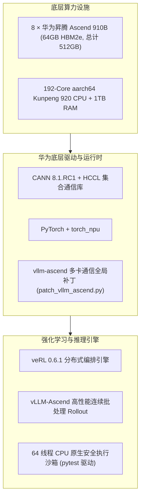

# Ascend-910B-PPO-RLHF: 华为昇腾 910B 集群大模型 RLVR 强化学习全流程工程套件

> **项目定位**：基于国产华为昇腾 Ascend 910B3（8 卡 NPU）集群与开源 veRL 框架的 **Qwen2.5-7B-Instruct** / **0.5B** 可验证规则奖励（RLVR）强化学习后训练全流程套件。
> 
> 本文档为**项目主控总纲**，集成了：**项目整体规划**、**D1 ~ D4 全周期各阶段实施任务指南**、**北理工智算平台（SCOW AI / K8s）全景操作 SOP** 以及 **实测避坑宝典**。
> 
> 📊 **全量实验结果、PPO/GRPO 架构消融、5 组奖励函数消融与深度机理分析**，请直接参阅：👉 [**`EXPERIMENT_RESULTS.md`（实验结果与科研分析总汇）**](./EXPERIMENT_RESULTS.md)。
> 
> 💡 **下一代前沿奖励函数理论设计与工业落地指南**（融合 VeRPO 基数偏差校准、TIPS 连续势能塑形、DHRCL 三阶段课程退火与 MAPO 混合优势估计），请直接参阅：👉 [**`ADVANCED_REWARD_DESIGN.md`（前沿奖励设计与生产代码）**](./ADVANCED_REWARD_DESIGN.md)。

---

## 目录 (Table of Contents)

- [一、项目架构与技术栈定位](#一项目架构与技术栈定位)
- [二、外部资源与数据准备清单](#二外部资源与数据准备清单)
- [三、全周期阶段演进与任务指南 (D1 ~ D4)](#三全周期阶段演进与任务指南-d1--d4)
  - [3.1 D1 阶段：平台摸底与极速冒烟验证](#31-d1-阶段平台摸底与极速冒烟验证)
  - [3.2 D2 阶段：代码数据清洗与沙箱难度筛选](#32-d2-阶段代码数据清洗与沙箱难度筛选)
  - [3.3 D3 阶段：7B × 8 卡 PPO 调通与 20-Step 闭环验证](#33-d3-阶段7b--8-卡-ppo-调通与-20-step-闭环验证)
  - [3.4 D4 阶段：全量主训练、消融矩阵与权威评测](#34-d4-阶段全量主训练消融矩阵与权威评测)
- [四、智算平台全景操作 SOP (北理工 / SCOW 容器环境)](#四智算平台全景操作-sop-北理工--scow-容器环境)
  - [4.1 第 1 步：注册与拉取官方配套镜像](#41-第-1-步注册与拉取官方配套镜像)
  - [4.2 第 2 步：上传模型权重与基础数据](#42-第-2-步上传模型权重与基础数据)
  - [4.3 第 3 步：创建开发与训练作业容器](#43-第-3-步创建开发与训练作业容器)
  - [4.4 第 4 步：容器内环境初始化 (持久 venv)](#44-第-4-步容器内环境初始化-持久-venv)
  - [4.5 第 5 步：打入 vllm-ascend 多卡通信补丁](#45-第-5-步打入-vllm-ascend-多卡通信补丁)
  - [4.6 第 6 步：日常工作循环与无人值守训练 (模式 A / B)](#46-第-6-步日常工作循环与无人值守训练-模式-a--b)
- [五、避坑宝典 (18 大实测已知踩坑与终极修复对照表)](#五避坑宝典-18-大实测已知踩坑与终极修复对照表)
- [六、仓库完整目录结构与导航](#六仓库完整目录结构与导航)

---

## 一、项目架构与技术栈定位

### 1.1 核心技术选型

大语言模型在经过监督微调（SFT）后，常出现推理幻觉、长尾边界用例崩溃等问题。本项目采用 **RLVR（可验证规则奖励强化学习）** 范式（OpenAI o1/o3 与 DeepSeek-R1 核心思想）：
1. **舍弃神经网络打分模型 (RM)**：利用单元测试沙箱的客观真值作为反馈，彻底根除神经 RM 的 Reward Hacking（刷分欺骗）与显存开销；
2. **确定性底层技术栈**：
   - 底座镜像：`quay.io/openeuler/vllm-ascend:0.9.1rc1-torch_npu2.5.1-cann8.1.rc1-python3.10-oe2203lts`
   - 引擎版本：`verl 0.6.1` + `PyTorch 2.1/2.5` + `torch_npu` + `CANN 8.1.rc1` + `vllm-ascend 0.9.1rc1`；
3. **8 卡并行通信拓扑修复**：针对 vllm-ascend 在多 Worker 下通信组 ranks 分配冲突的严重缺陷，自研幂等全局补丁（`patch_vllm_ascend.py`），攻克 8 卡 NPU 分布式 rollout 核心瓶颈；
4. **挂载盘持久化隔离**：针对 K8s/SCOW 容器“容器即焚、仅挂载目录留存”机制，构建持久虚拟环境 `envs/verl_env`，跨作业免编译免重装。



---

## 二、外部资源与数据准备清单

由于 GitHub 存在单文件 100MB 限制且代码仓库不存储大模型与海量数据，以下内容在首次部署时需下载并放置在集群挂载目录中：

| 资源类别 | 文件/目录名称 | 预估大小 | 官方/镜像下载源 | 集群内目标放置路径 | 核心用途说明 |
|:---|:---|:---:|:---|:---|:---|
| **大模型权重** | `Qwen2.5-7B-Instruct/` | ~15.2 GB | [ModelScope](https://modelscope.cn/models/qwen/Qwen2.5-7B-Instruct) / [HF-Mirror](https://hf-mirror.com/Qwen/Qwen2.5-7B-Instruct) | `/data/home/<学号>/Qwen2.5-7B-Instruct` | 主训练基座（共 13 个文件，含 4 个 safetensors 分片） |
| **大模型权重** | `Qwen2.5-0.5B-Instruct/` | ~954 MB | [ModelScope](https://modelscope.cn/models/qwen/Qwen2.5-0.5B-Instruct) / [HF-Mirror](https://hf-mirror.com/Qwen/Qwen2.5-0.5B-Instruct) | `/data/home/<学号>/Qwen2.5-0.5B-Instruct` | 快速冒烟/拓扑验证基座（10 个文件） |
| **Web IDE** | `code-server-4.137.0-linux-arm64` | ~223 MB (.tar) | [GitHub Releases v4.137.0](https://github.com/coder/code-server/releases/download/v4.137.0/code-server-4.137.0-linux-arm64.tar.gz) | `/data/home/<学号>/project/code-server-4.137.0-linux-arm64` | 容器内网页 VSCode 服务（解压后使用） |
| **冒烟数据集** | `data/gsm8k/` | ~5 MB | 由内置脚本在线生成 | `/data/home/<学号>/project/data/gsm8k/` | 包含 `train_300.parquet` 与 `test.parquet` |
| **候选代码库** | `kodcode_candidates.jsonl` | ~264 MB | 本地抽取 / [KodCode-V1](https://huggingface.co/datasets/kodcode/kodcode-v1) | `/data/home/<学号>/project/data/` | D2 阶段数据清洗原料（15,000 题） |

### 1. 模型快速下载脚本（推荐在高速网络环境执行后上传）
```bash
pip install modelscope
modelscope download --model qwen/Qwen2.5-7B-Instruct --local_dir ./Qwen2.5-7B-Instruct
modelscope download --model qwen/Qwen2.5-0.5B-Instruct --local_dir ./Qwen2.5-0.5B-Instruct
```

### 2. code-server 下载与就位规范
1. 下载 `code-server-4.137.0-linux-arm64.tar.gz`（必须为 **linux-arm64** 架构）；
2. 上传至 `/data/home/<学号>/` 并在终端解压移动：
   ```bash
   cd /data/home/<学号>
   tar -xzf code-server-4.137.0-linux-arm64.tar.gz
   mv code-server-4.137.0-linux-arm64 project/
   ```
3. 确保启动路径存在：`/data/home/<学号>/project/code-server-4.137.0-linux-arm64/bin/code-server`。

### 3. 冒烟数据集一键就绪
```bash
cd /data/home/<学号>/project
bash prepare_gsm8k.sh
```

---

## 三、全周期阶段演进与任务指南 (D1 ~ D4)

项目包含四阶段渐进式演进哲学：**先单卡冒烟定型环境，再本地构建清洗沙箱，接着 8 卡打通 20-step 闭环，最后全量主训练与矩阵消融**。


---

### 3.1 D1 阶段：平台摸底与极速冒烟验证

* **核心目标**：摸清平台调度、挂载、时长约束，在单卡 NPU 上以极小代价跑通 RL 全链路。
* **关键实测成果**：
  1. 确认作业时长上限 24h，网络出网正常；
  2. 敲定官方镜像 `vllm-ascend 0.9.1rc1`（原生自带 CANN 8.1.rc1 与 PyTorch 2.5.1）；
  3. **0.5B PPO 冒烟 4 步全通**（Actor/Critic 加载、vLLM Rollout、奖励计算全部正常）；
  4. **7B 单卡 A/B 推理实测通过**：vLLM 引擎加载 33.2s，生成吞吐 316 tok/s，显存仅占 14.25GB + 2327 KV blocks，彻底打消 7B 显存溢出疑虑。

---

### 3.2 D2 阶段：代码数据清洗与沙箱难度筛选

* **核心目标**：构建“代码提取器 + 64 线程原生安全沙箱 + 判分器”，从 1.5 万题候选库提炼出 0.1~0.9 黄金难度池。
* **四大筛选漏斗实操**：
  ```bash
  cd /data/home/<学号>/project

  # 1. 运行沙箱与提取器回归单测（115 项全边界极限测试，100% 全部通过）
  python -m pytest pipeline/tests/ -v

  # 2. 筛 1：模板规范化与 Prompt 冻结（15,000 题全入库，约 10 秒）
  python pipeline/f1_template.py --input data/kodcode_candidates.jsonl --output data/step1_templated.jsonl

  # 3. 筛 2：官方解答过沙箱自洽校验（16 核多线程，28 分钟跑完，通过率 92.5%，保留 13,871 题）
  nohup python pipeline/f2_verify.py \
      --input data/step1_templated.jsonl \
      --output data/step2_kept.jsonl \
      --rejects data/step2_rejects.jsonl \
      --workers 16 > f2_verify.log 2>&1 &

  # 4. 筛 3：去重 + 截长(>2000字) + 泄漏过滤(>0.9)（纯 CPU 计算，保留 10,434 题）
  python pipeline/f3_dedup.py \
      --input data/step2_kept.jsonl \
      --output data/step3_verified_pool.jsonl \
      --rejects data/step3_rejects.jsonl

  # 5. 筛 4：7B 基座 8 卡并行采样（每题采 8 次，集群总吞吐 ~1800 tok/s）
  nohup python pipeline/f4_sample_filter.py \
      --input data/step3_verified_pool.jsonl \
      --rl_pool data/rl_pool.jsonl \
      --heldout data/heldout.jsonl \
      --rejects data/step4_rejects.jsonl \
      --model /data/home/<学号>/Qwen2.5-7B-Instruct \
      --gpus 8 --batch_size 50 --gpu_memory_utilization 0.6 > f4_filter.log 2>&1 &
  ```

* **筛 4 提前收割机制**：
  实测处理至 6,000 题时，黄金池已达 2,670 条，可运行以下命令直接一键结算并打包：
  ```bash
  pkill -9 -f f4_sample_filter
  python3 -c "
  import glob, json, os, random
  random.seed(42)
  files = sorted(glob.glob('data/_tmp_f4_worker_*.jsonl'))
  all_data = [json.loads(l) for f in files for l in open(f, encoding='utf-8') if l.strip()]
  golden, easy, hard = [], [], []
  for item in all_data:
      pr = item.get('sample_pass_rate', 0.0)
      if pr > 0.9: easy.append(item)
      elif pr < 0.1: hard.append(item)
      else: golden.append(item)
  random.shuffle(golden)
  heldout, rl_pool = golden[:200], golden[200:]
  open('data/heldout.jsonl', 'w', encoding='utf-8').writelines([json.dumps(x, ensure_ascii=False)+'\n' for x in heldout])
  open('data/rl_pool.jsonl', 'w', encoding='utf-8').writelines([json.dumps(x, ensure_ascii=False)+'\n' for x in rl_pool])
  open('data/step4_rejects.jsonl', 'w', encoding='utf-8').writelines([json.dumps(x, ensure_ascii=False)+'\n' for x in (easy+hard)])
  print(f'🎉 结算完成！heldout: {len(heldout)} | rl_pool: {len(rl_pool)} | rejects: {len(easy+hard)}')
  "
  ```
  - **最终产出**：`data/rl_pool.jsonl`（4,518 题黄金池）、`data/heldout.jsonl`（200 题完全隔离独立测试集）。

---

### 3.3 D3 阶段：7B × 8 卡 PPO 调通与 20-Step 闭环验证

* **核心目标**：拒绝上来就跑过夜长训！先在 8 卡 910B 上跑通 20 步最小全链路，确认显存无泄漏、奖励函数挂载正常。
* **执行步骤**：
  ```bash
  cd /data/home/<学号>/project
  source envs/verl_env/bin/activate

  # 1. 转换数据集为 verl 标准 Parquet
  python3 pipeline/pack_to_parquet.py

  # 2. 验证正式代码沙箱奖励函数 (rewards/code_rlvr.py)
  python3 rewards/code_rlvr.py

  # 3. 启动 7B × 8 卡 20-step 闭环训练
  bash smoke_ppo_7b_rlvr.sh 2>&1 | tee d3_smoke_7b.log
  ```
* **5 大健康验收门槛**：
  1. **显存平稳**：单卡峰值稳定在 35GB ~ 45GB（64GB 留有 18GB+ 余量，无 OOM）；
  2. **迭代耗时**：单步迭代耗时在 2 ~ 3 分钟以内；
  3. **Reward 上行**：`rewards/mean` 从初始 ~0.3 稳步上升至 0.6+；
  4. **KL 散度受控**：`kl_divergence` 稳定在 0.001 ~ 0.05，未发生策略崩溃；
  5. **Checkpoint 成功存盘**：`project/checkpoints/d3_smoke_7b_rlvr/` 成功保存。

---

### 3.4 D4 阶段：全量主训练、消融矩阵与权威评测

* **核心目标**：主训练产出工业级对齐模型，消融实验探索算法与奖励机理，在三大权威基准（791 题）上全量实测。
* **任务清单与启动命令**：
  ```bash
  cd /data/home/<学号>/project
  source envs/verl_env/bin/activate

  # 1. 启动 8 卡 PPO 71-step 主训练（全量 4,518 题，耗时 1h 04m）
  nohup bash run_ppo_7b_full.sh > train_ppo.log 2>&1 &

  # 2. 启动 8 卡 GRPO 50-step 架构消融训练（无 Critic，耗时 37m 51s）
  nohup bash run_grpo_7b_ablation.sh > train_grpo.log 2>&1 &

  # 3. 启动 5 组奖励函数消融训练（各 50 步）
  nohup bash run_ppo_7b_ablation_neg_penalty.sh > train_neg.log 2>&1 &       # Exp 1: 强负惩罚
  nohup bash run_ppo_7b_ablation_sparse.sh > train_sparse.log 2>&1 &         # Exp 2: 纯稀疏
  nohup bash run_ppo_7b_ablation_discrete_bins.sh > train_bins.log 2>&1 &   # Exp 3: 全离散阶梯
  nohup bash run_ppo_7b_ablation_len_efficiency.sh > train_len.log 2>&1 &   # Exp 4: 长度双目标
  nohup bash run_ppo_7b_ablation_denser.sh > train_denser.log 2>&1 &         # Exp 5: DenseR 散度信用与独特性

  # 4. 三重基准一键评测（以主线 PPO 为例）
  python3 eval_test_set.py --model checkpoints/d4_full_7b_rlvr_hf --output eval_results/eval_ppo_step71.json
  python3 eval_humaneval.py --model checkpoints/d4_full_7b_rlvr_hf --output eval_results/eval_humaneval_ppo.json
  python3 eval_mbpp.py --model checkpoints/d4_full_7b_rlvr_hf --output eval_results/eval_mbpp_ppo.json
  ```

---

## 四、智算平台全景操作 SOP (北理工 / SCOW 容器环境)

### 4.1 第 1 步：注册与拉取官方配套镜像

平台网页端 → **镜像** → **添加镜像**：
* **镜像来源**：远程镜像
* **镜像地址**：
  ```text
  quay.io/openeuler/vllm-ascend:0.9.1rc1-torch_npu2.5.1-cann8.1.rc1-python3.10-oe2203lts
  ```
* ⚠️ **用户名 / 密码**：**必须全部留空！**（填了学号会导致匿名拉取报 401 Unauthorized）；
* **类型**：选择通用/自定义类。

---

### 4.2 第 2 步：上传模型权重与基础数据

平台网页端 → **文件管理**，上传到用户根目录 `/data/home/<学号>/`：
* `Qwen2.5-7B-Instruct/`（完整目录，13 个文件，4 个 safetensors 分片缺一不可）；
* `Qwen2.5-0.5B-Instruct/`（完整目录，10 个文件）；
* `mbpp_sanitized.jsonl`（放置于 `project/` 目录下）。

> ⚠️ **路径核对**：平台作业详情页可能显示 `f<学号>` 的显示别名，请以进入终端后执行 `mount | grep <学号>` 的实际挂载绝对路径为准！

---

### 4.3 第 3 步：创建开发与训练作业容器

平台网页端 → **应用** → **创建 VSCode**：
* **镜像源**：选择已拉取的 `vllm-ascend-091:v1`；
* **加速卡**：开发/冒烟选 1 卡；正式训练/8卡消融选 **8 卡**（910B3）；
* **最长运行时间**：调至最大值 **24h**（防止 1 小时默认超时被杀）；
* **挂载点**：**勾选 3 个目录**（`project`、`Qwen2.5-7B-Instruct`、`Qwen2.5-0.5B-Instruct`，缺一不可！）；
* **运行命令**（整段复制，不可填裸的 code-server）：
  ```bash
  chmod +x /data/home/<学号>/project/code-server-4.137.0-linux-arm64/bin/code-server && /data/home/<学号>/project/code-server-4.137.0-linux-arm64/bin/code-server --auth none
  ```
* 提交作业，状态变为 `RUNNING` 后点击“连接”即可进入网页版 VSCode。

---

### 4.4 第 4 步：容器内环境初始化 (持久 venv)

打开 VSCode 终端（`Ctrl + \``），执行初始化：
```bash
# 1. 验证原生镜像底层驱动（输出应为: 2.5.1 True 0.9.1rc1）
python3 -c "import torch, torch_npu, vllm; print(torch.__version__, torch.npu.is_available(), vllm.__version__)"

# 2. 在挂载目录创建持久虚拟环境（跨容器作业永驻，仅需创建一次！）
python3 -m venv --system-site-packages /data/home/<学号>/project/envs/verl_env
source /data/home/<学号>/project/envs/verl_env/bin/activate

# 3. 安装扩展库（⚠️ 挂载盘必须加 PIP_NO_COMPILE=1 避免 pyc 预编译断言冲突）
export PIP_NO_COMPILE=1
pip install verl==0.6.1 pytest

# 4. 验证装包成功
python3 -c "import verl, pytest; print('verl & pytest OK')"
```

> 💡 **建议写入终端配置**：
> ```bash
> echo 'source /data/home/<学号>/project/envs/verl_env/bin/activate' >> ~/.bashrc
> ```

---

### 4.5 第 5 步：打入 vllm-ascend 多卡通信补丁

针对 vllm-ascend 0.9.1rc1 在 8 卡 NPU 下报 `AssertionError: assert self.cpu_group is not None` 的通信组缺陷，在项目根目录下执行补丁脚本（该脚本修改容器层，幂等可重复运行）：
```bash
cd /data/home/<学号>/project
python3 patch_vllm_ascend.py
# 控制台输出：[PATCHED OK] 或 [ALREADY PATCHED] 即可！
```

---

### 4.6 第 6 步：日常工作循环与无人值守训练 (模式 A / B)

| 对比维度 | 模式 A：无人值守训练 ⭐ | 模式 B：交互式开发 |
|:---|:---|:---|
| **适用场景** | 过夜长训、正式 8 卡主训练、批量消融 | 编写代码、交互调试、单步测试 |
| **作业运行命令** | `bash /data/home/<学号>/project/start_train.sh` | 第 4.3 节提供的 code-server 启动命令 |
| **断网/关机影响** | **完全无影响**，作业在服务器后台持续运行 | 关机断网会关闭终端（长命令需使用 nohup） |
| **进度查看方式** | 点击“连接”进入 VSCode 执行 `tail -f project/train_*.log` | 终端前台直接输出 |

#### 每次进入新终端的 10 秒自检三部曲：
```bash
# 1) 进入项目目录并激活环境
cd /data/home/<学号>/project && source envs/verl_env/bin/activate

# 2) 检查四大件与 8 卡就绪状态（输出 OK True 且检测到 8 张卡）
python3 -c "import torch, torch_npu, vllm, verl; print('OK', torch.npu.is_available(), torch.npu.device_count())"

# 3) 顺手执行多卡通信补丁
python3 patch_vllm_ascend.py
```

---

## 五、避坑宝典 (18 大实测已知踩坑与终极修复对照表)

以下问题均为团队在真实昇腾 910B 集群上全流程踩坑排查实录：

| # | 踩坑现象 | 根本原因 | 正确终极对策 |
|:---:|:---|:---|:---|
| **1** | 注册镜像报 `401 Unauthorized` | 镜像表单填写了个人学号/密码 | 清空用户名与密码两栏，执行匿名拉取 |
| **2** | 容器创建秒挂 `command not found` | 运行命令直接写了 `code-server`，镜像内无此二进制 | 运行命令必须写解压后的绝对路径 `/data/home/<学号>/project/code-server-.../bin/code-server` |
| **3** | 启动命令报 `--bind-addr` 参数异常 | 平台自动追加了 bind 参数，普通 sleep 脚本无法处理 | 使用内置 `start_train.sh` 或启动 code-server（原生兼容该参数） |
| **4** | 解压后文件多了一层 `.tar/` 目录 | 使用了平台网页端自带的解压工具 | 手动在终端执行 `mv code-server-.../*` 移至标准 `project/` 目录下 |
| **5** | pip 安装报 `AssertionError: pyc_path` | dpc 网络文件系统与 pyc 预编译机制冲突 | 安装前必须先执行 `export PIP_NO_COMPILE=1` |
| **6** | 首次 import torch 卡住数分钟 | 昇腾算子缓存首次写入挂载盘 | 耐心等待完成即可，**严禁中途强行 Ctrl+C** |
| **7** | 新作业容器内找不到 `verl` | pip 包安装在容器临时层，随作业销毁 | 必须使用建在挂载盘的持久 venv（`envs/verl_env`） |
| **8** | 算子执行全崩 `ADD_TO_LAUNCHER_LIST` | 手动 source 了外置的 CANN `set_env.sh` 导致符号污染 | **绝对不要 source 任何外置 CANN 脚本**，镜像原生 8.1.rc1 已配置就绪 |
| **9** | Git clone 频繁报错 `HTTP/2 stream 1` | 集群直连 GitHub 遭遇网络阻断与抖动 | 执行 `git config --global http.version HTTP/1.1` 或使用加速镜像源 |
| **10** | HuggingFace 权重下载失败 / 401 | 未设置镜像源或触发 Xet 协议 | 设置环境变量 `HF_ENDPOINT=https://hf-mirror.com` 并禁用 XET |
| **11** | 网页断开后前台训练进程意外退出 | 终端会话被终端守护程序回收杀死 | 使用后台守护命令 `nohup ... &` 或使用 `start_train.sh` |
| **12** | 筛 2 验证 1.5 万题耗时数小时 | 单线程逐题执行 pytest 进程创建开销过大 | 开启 `--workers 16` 多线程并发，28 分钟内全量跑通 |
| **13** | 沙箱运行报 `ModuleNotFoundError: pytest` | 虚拟环境仅安装了 verl，遗漏了测试框架 | 执行 `export PIP_NO_COMPILE=1; pip install pytest` |
| **14** | vLLM 加载报 `unexpected keyword argument` | 混淆了 verl 配置形参与 vLLM 原生 Python API | 原生构造形参为 `tensor_parallel_size=1`（单卡亦可直接缺省） |
| **15** | 筛 4 多卡采样主进程永久卡死 | `multiprocessing.Queue` 跨进程传输大对象填满系统管道 | 改造为各 Worker 独立写入分片文件 `_tmp_f4_worker_*.jsonl`，安全聚合 |
| **16** | 昇腾 910B 报 HBM 碎片或 OOM | `gpu_memory_utilization` 设为 0.85+ 挤占了算子与系统显存 | 设为 `0.6` 即可（14.25GB 权重 + 24GB KV Cache，单卡 64GB 极充裕） |
| **17** | pkill 后二次启动报显存 OOM | pkill 仅杀死 Python 主进程，残留 `spawn` 子进程仍霸占 8 卡显存 | 执行 `npu-smi info` 核验，若有残留执行 `pkill -9 -f spawn_main` |
| **18** | 新开终端报 `No module named 'verl'` | 新开终端默认处于全局 Python 环境 | 必须先执行 `source envs/verl_env/bin/activate` 激活挂载盘持久环境 |

---

## 六、仓库完整目录结构与导航

```text
Ascend-910B-PPO-RLHF/
├── README.md                      # [本项目] 主控总纲：规划、D1-D4阶段任务、平台SOP与避坑宝典
├── EXPERIMENT_RESULTS.md          # [核心交付] 791题权威实测、PPO/GRPO架构消融、奖励消融报告
├── _refs/                         # 参考文档归档（含北理工智算集群用户指南等）
├── project/                       # 核心执行脚本与流水线代码
│   ├── patch_vllm_ascend.py       # vllm-ascend 0.9.1rc1 8卡通信组关键修复补丁
│   ├── prepare_gsm8k.sh           # GSM8K 冒烟数据集一键生成与转换脚本
│   ├── smoke_ppo_05b.sh           # 0.5B PPO 极速冒烟验证脚本（单卡/8卡均支持）
│   ├── smoke_ppo_7b.sh            # 7B 8 卡拓扑与算力校验脚本
│   ├── smoke_ppo_7b_rlvr.sh       # 7B 8 卡 20-step 完整闭环验证脚本
│   ├── run_ppo_7b_full.sh         # 7B 8 卡 PPO 71 步全量主训练入口
│   ├── run_grpo_7b_ablation.sh    # 7B 8 卡 GRPO 50 步架构消融训练入口
│   ├── run_ppo_7b_ablation_*.sh   # 4 组奖励函数消融训练脚本（强负惩罚/纯稀疏/离散阶梯/长度双目标）
│   ├── eval_test_set.py           # KodCode 独立测试集 200 题评测
│   ├── eval_humaneval.py          # OpenAI HumanEval 164 题评测
│   ├── eval_mbpp.py               # Google MBPP Sanitized 427 题评测
│   ├── start_train.sh             # 无人值守正式训练入口（含保活与 code-server 代理）
│   ├── mbpp_sanitized.jsonl       # MBPP 冒烟小型测试集
│   ├── rewards/
│   │   ├── smoke_gsm8k.py         # verl 0.6.1 兼容签名 GSM8K 规则打分包装器
│   │   ├── code_rlvr.py           # 主线代码 RLVR 沙箱奖励函数
│   │   └── code_rlvr_ablation.py  # 4 组形态学消融专用奖励函数引擎
│   └── pipeline/                  # 数据清洗漏斗与沙箱判分器
│       ├── config.py              # 全局配置中心（超时、去重、模板）
│       ├── extract.py             # 模型输出代码提取器
│       ├── sandbox.py             # 64 线程安全沙箱引擎（超时强杀、无 shell 注入）
│       ├── score.py               # 判分器核心（pytest 断言捕获、部分分计算）
│       ├── f1_template.py         # 筛 1：规范化 Prompt 模板
│       ├── f2_verify.py           # 筛 2：官方解答沙箱自洽性过滤
│       ├── f3_dedup.py            # 筛 3：去重 + 截长 + 防泄漏过滤
│       ├── f4_sample_filter.py    # 筛 4：7B 8 卡并行采样与黄金难度池提取
│       ├── pack_to_parquet.py     # 数据集转 verl 标准 Parquet 格式
│       └── tests/                 # 115 项全边界单测（100% Passed）
```

---

## 👥 快速上手指引
克隆本仓库后，只需在各启动脚本或命令中将 `/data/home/<学号>/` 替换为您自己在智算集群中的实际挂载路径，即可无缝复现从 D1 冒烟到 D4 全量训练与跨基准评测的全部成果！
