<div align="center">

# Ascend-910B-PPO-RLHF
### 华为昇腾 910B 集群大模型 RLVR 强化学习全流程工程与科研套件
**Production-Grade RLVR (Reinforcement Learning with Verifiable Rewards) Post-Training Suite on Huawei Ascend NPU Clusters**

<p align="center">
  <a href="https://www.hiascend.com/"></a>
  <a href="https://github.com/volcengine/verl"></a>
  <a href="https://github.com/vllm-project/vllm-ascend"></a>
  <a href="https://www.python.org/"></a>
  <a href="https://pytorch.org/"></a>
  <a href="./LICENSE"></a>
</p>

[**🌟 核心亮点**](#-核心亮点-key-highlights) | [**🚀 快速开始**](#-快速开始-quick-start) | [**📊 791 题实测榜单**](#九三大权威基准细粒度全量实测榜单-791-题) | [**💡 下一代奖励设计**](#七下一代代码-rlvr-融合奖励系统-next-gen-production-cap-rlvr) | [**📄 实践报告 (MD)**](./实践报告.md) | [**📑 实践报告 (PDF)**](./实践报告.pdf)

</div>

---

### 🌟 核心亮点 (Key Highlights)

- ⚡ **华为昇腾 910B 原生深度调优**：打通 CANN 8.1.RC1 + HCCL + PyTorch 2.5.1 NPU 软件栈，自研 [`patch_vllm_ascend.py`](./project/patch_vllm_ascend.py) 攻克 8 卡 NPU 分布式 Rollout 多卡通信组死锁缺陷；
- 🧠 **双前沿对齐架构完整支持**：原生支持 Actor-Critic 四网络协同 PPO 与前沿 DeepSeek-R1 范式无 Critic 极速 GRPO，单卡显存大幅节省 14.1GB，吞吐翻倍（+138.9%）；
- 🏆 **三大基准 791 题全量大满贯**：
  - **稀疏精简冠军 (Exp 4 双目标)**：全量 791 题总通过率 **79.01% (625/791) 🥇**，宏观通过率跨越 **80.55% 🥇**，代码长度缩减 **-57.5% ⚡**（162.4 tok），致命崩溃仅 3 次；
  - **稠密校准亚军 (VeRPO)**：引入超线性幂律校准（$\gamma=1.6$）消除基数偏差，KodCode 复杂工程题突破 **80.00% 🥈**，HumanEval 轰出 **84.76% 🏆** 并列第一；
- 🛡️ **64 线程 CPU 原生安全隔离沙箱**：AST 静态语法扫描 + 2.0s 进程级硬超时强杀 + 全用例断言捕获，彻底杜绝神经网络打分器的 Reward Hacking；
- 🔬 **四级工业级数据清洗体系**：15,000 道原始 KodCode 候选池经 F1 格式化 $\to$ F2 标答自洽 $\to$ F3 查重防泄漏 $\to$ F4 8 卡动态难度筛选，提炼出 4,518 题黄金探索池；
- 📦 **下一代 CAP-RLVR 生产落地**：融合 TIPS 连续势能 PBRS、VeRPO 超线性校准与 DHRCL 三阶段课程退火，开箱即用。

---

### 🚀 快速开始 (Quick Start)

#### 1. 环境准备 (30 秒自检)
```bash
# 克隆仓库
git clone https://github.com/hujiabao200612-glitch/Ascend-910B-PPO-RLHF.git
cd Ascend-910B-PPO-RLHF

# 激活挂载盘持久虚拟环境并打入 8 卡通信补丁
source project/envs/verl_env/bin/activate
python3 project/patch_vllm_ascend.py
```

#### 2. 一键执行评测 (验证预训练 Checkpoints)
```bash
# 评测全场大满贯模型 (Exp 4 长度双目标精简版) 在 OpenAI HumanEval 上的表现
python3 project/eval_humaneval.py \
    --model checkpoints/d4_ablation_7b_len_efficiency_hf \
    --output eval_results/eval_humaneval_exp4.json
```

#### 3. 一键启动 8 卡全量训练
```bash
# 启动 7B × 8 卡 PPO 全量主训练 (71 步，覆盖 4,518 题黄金池)
bash project/run_ppo_7b_full.sh

# 或启动 DeepSeek 范式 GRPO 极速架构消融训练
bash project/run_grpo_7b_ablation.sh
```

---

## 目录 (Table of Contents)

- [一、项目架构与技术栈定位](#一项目架构与技术栈定位)
  - [1.1 核心技术选型与软硬件规格](#11-核心技术选型与软硬件规格)
  - [1.2 8 卡 NPU 拓扑与自研通信组补丁](#12-8-卡-npu-拓扑与自研通信组补丁)
  - [1.3 64 线程 CPU 原生隔离执行沙箱](#13-64-线程-cpu-原生隔离执行沙箱)
  - [1.4 外部资源与基础数据准备清单](#14-外部资源与基础数据准备清单)
- [二、大模型后训练（Post-Training）演化与 RLVR 前沿格局](#二大模型后训练post-training演化与-rlvr-前沿格局)
  - [2.1 后训练演进三部曲 (Prompt Engineering $\to$ SFT $\to$ RLHF/RLVR)](#21-后训练演进三部曲-prompt-engineering-to-sft-to-rlhfrlvr)
  - [2.2 RLVR 核心范式、覆盖假说与代码奖励“不可能三角”](#22-rlvr-核心范式覆盖假说与代码奖励不可能三角)
- [三、PPO 与 GRPO 核心机理、数学推导与架构消融](#三ppo-与-grpo-核心机理数学推导与架构消融)
  - [3.1 序列生成任务的有限步 MDP 形式化建模](#31-序列生成任务的有限步-mdp-形式化建模)
  - [3.2 PPO 四网络协同工作流与剪切代理目标 (PPO-Clip)](#32-ppo-四网络协同工作流与剪切代理目标-ppo-clip)
  - [3.3 广义优势估计 (GAE) 与步级细粒度时序归因](#33-广义优势估计-gae-与步级细粒度时序归因)
  - [3.4 DeepSeek-R1 GRPO 架构机理与群组相对优势估计](#34-deepseek-r1-grpo-架构机理与群组相对优势估计)
  - [3.5 PPO vs GRPO 理论机制、算力开销与显存吞吐对比](#35-ppo-vs-grpo-理论机制算力开销与显存吞吐对比)
- [四、全周期四阶段任务演进指南 (D1 ~ D4)](#四全周期四阶段任务演进指南-d1--d4)
  - [4.1 D1 阶段：平台摸底与极速冒烟验证 (0.5B PPO & 7B vLLM)](#41-d1-阶段平台摸底与极速冒烟验证-05b-ppo--7b-vllm)
  - [4.2 D2 阶段：代码数据清洗与沙箱难度筛选](#42-d2-阶段代码数据清洗与沙箱难度筛选)
  - [4.3 D3 阶段：7B × 8 卡 PPO 调通与 20-Step 闭环验证](#43-d3-阶段7b--8-卡-ppo-调通与-20-step-闭环验证)
  - [4.4 D4 阶段：全量主训练、消融矩阵与跨基准评测](#44-d4-阶段全量主训练消融矩阵与跨基准评测)
- [五、数据体系构建与四级清洗工程 (F1 ~ F4)](#五数据体系构建与四级清洗工程-f1--f4)
  - [5.1 数据集架构概览与开源基准链接](#51-数据集架构概览与开源基准链接)
  - [5.2 四级清洗漏斗设计 (F1 $\to$ F2 $\to$ F3 $\to$ F4)](#52-四级清洗漏斗设计-f1-to-f2-to-f3-to-f4)
  - [5.3 训练集 (4,518 题) 与独立评测集 (791 题) 断言与长度分布特性](#53-训练集-4518-题与独立评测集-791-题断言与长度分布特性)
- [六、奖励函数形态学全景消融 (Reward Landscapes)](#六奖励函数形态学全景消融-reward-landscapes)
  - [6.1 五大奖励形态设计矩阵 (Exp 0 ~ Exp 5)](#61-五大奖励形态设计矩阵-exp-0--exp-5)
  - [6.2 稀疏精简全场总冠军：Exp 4 正确性与精简度双目标阶梯奖励](#62-稀疏精简全场总冠军exp-4-正确性与精简度双目标阶梯奖励)
  - [6.3 稠密校准前沿：VeRPO 超线性连续密度校准奖励 ($\gamma = 1.6$)](#63-稠密校准前沿verpo-超线性连续密度校准奖励-gamma--16)
  - [6.4 细粒度散度信用：Exp 5 DenseR 跨类信用与“50 步早停饱和律”](#64-细粒度散度信用exp-5-denser-跨类信用与50-步早停饱和律)
  - [6.5 其余消融形态剖析：Exp 1 强负惩罚、Exp 2 纯稀疏二值与 Exp 3 离散硬阶梯](#65-其余消融形态剖析exp-1-强负惩罚exp-2-纯稀疏二值与-exp-3-离散硬阶梯)
- [七、下一代代码 RLVR 融合奖励系统 (Next-Gen Production: CAP-RLVR)](#七下一代代码-rlvr-融合奖励系统-next-gen-production-cap-rlvr)
  - [7.1 六大前沿理论严格甄选 (三弃三留判决矩阵)](#71-六大前沿理论严格甄选-三弃三留判决矩阵)
  - [7.2 核心数学推导：VeRPO 基数校准 + TIPS PBRS 连续势能 + DHRCL 三阶段课程退火](#72-核心数学推导verpo-基数校准--tips-pbrs-连续势能--dhrcl-三阶段课程退火)
  - [7.3 平台即用生产级奖励代码 (`code_rlvr_nextgen.py`)](#73-平台即用生产级奖励代码-code_rlvr_nextgenpy)
  - [7.4 下一代主训练一键启动脚本 (`run_ppo_7b_nextgen.sh`)](#74-下一代主训练一键启动脚本-run_ppo_7b_nextgensh)
- [八、训练动力学全景监控与收敛深度分析](#八训练动力学全景监控与收敛深度分析)
  - [8.1 71-Step PPO 与 50-Step GRPO 动态收敛指标日志](#81-71-step-ppo-与-50-step-grpo-动态收敛指标日志)
  - [8.2 学术对比双图解析 (KodCode 准确率爬升 + 代码长度断崖压缩)](#82-学术对比双图解析-kodcode-准确率爬升--代码长度断崖压缩)
  - [8.3 集群 6 面板监控曲线 (Reward, Accuracy, Actor LR, KL, Length, Value Loss)](#83-集群-6-面板监控曲线-reward-accuracy-actor-lr-kl-length-value-loss)
- [九、三大权威基准细粒度全量实测榜单 (791 题)](#九三大权威基准细粒度全量实测榜单-791-题)
  - [9.1 全量 791 题跨基准宏观总榜 (Base vs PPO vs GRPO vs 消融组巅峰对决)](#91-全量-791-题跨基准宏观总榜-base-vs-ppo-vs-grpo-vs-消融组巅峰对决)
  - [9.2 细粒度基准实测 (KodCode 200 题 / HumanEval 164 题 / MBPP 427 题)](#92-细粒度基准实测-kodcode-200-题--humaneval-164-题--mbpp-427-题)
  - [9.3 核心科学机理学术讨论 (为何 GRPO 胜在 HumanEval？为何 PPO 胜在 KodCode？)](#93-核心科学机理学术讨论-为何-grpo-胜在-humaneval为何-ppo-胜在-kodcode)
  - [9.4 工业落地决策矩阵与算力经济学指南](#94-工业落地决策矩阵与算力经济学指南)
- [十、智算平台全景操作 SOP (北理工 / SCOW / K8s 容器环境)](#十智算平台全景操作-sop-北理工--scow--k8s-容器环境)
  - [10.1 第 1 步：注册与拉取官方配套镜像](#101-第-1-步注册与拉取官方配套镜像)
  - [10.2 第 2 步：上传模型权重与基础数据](#102-第-2-步上传模型权重与基础数据)
  - [10.3 第 3 步：创建开发与训练作业容器](#103-第-3-步创建开发与训练作业容器)
  - [10.4 第 4 步：容器内环境初始化 (挂载盘持久 venv)](#104-第-4-步容器内环境初始化-挂载盘持久-venv)
  - [10.5 第 5 步：打入 vllm-ascend 多卡通信补丁](#105-第-5-步打入-vllm-ascend-多卡通信补丁)
  - [10.6 第 6 步：日常工作循环与无人值守训练 (模式 A / B)](#106-第-6-步日常工作循环与无人值守训练-模式-a--b)
- [十一、避坑宝典 (18 大实测已知踩坑与终极修复对照表)](#十一避坑宝典-18-大实测已知踩坑与终极修复对照表)
- [十二、仓库完整目录结构、模型资产交付与一键复现指南](#十二仓库完整目录结构模型资产交付与一键复现指南)
  - [12.1 仓库目录结构规范](#121-仓库目录结构规范)
  - [12.2 交付模型 Checkpoints 清单](#122-交付模型-checkpoints-清单)
  - [12.3 一键复现评测命令集](#123-一键复现评测命令集)
- [十三、项目引用与开源协议 (Citation & License)](#十三项目引用与开源协议-citation--license)


---

## 一、项目架构与技术栈定位

### 1.1 核心技术选型与软硬件规格

大语言模型在经过常规监督微调（SFT）后，常出现推理幻觉、冗长注水及长尾边缘崩溃等痼疾。本项目基于国产**华为昇腾 910B 集群**，全面拥抱 **RLVR（可验证规则奖励强化学习）** 范式（OpenAI o1/o3 与 DeepSeek-R1 核心思想）：
1. **舍弃神经网络打分模型 (RM)**：利用单元测试沙箱的客观真值作为反馈，彻底根除神经 RM 的 Reward Hacking（刷分欺骗）与显存开销；
2. **确定性底层技术栈**：
   - 底座镜像：`quay.io/openeuler/vllm-ascend:0.9.1rc1-torch_npu2.5.1-cann8.1.rc1-python3.10-oe2203lts`
   - 引擎版本：`verl 0.6.1` + `PyTorch 2.5.1` + `torch_npu` + `CANN 8.1.RC1` + `HCCL` + `vllm-ascend 0.9.1rc1`；
3. **8 卡并行通信拓扑修复**：针对 vllm-ascend 在多 Worker 下通信组 ranks 分配冲突缺陷，自研幂等全局补丁（`patch_vllm_ascend.py`），攻克 8 卡 NPU 分布式 rollout 核心瓶颈；
4. **挂载盘持久化隔离**：针对 K8s/SCOW 容器“容器即焚、仅挂载目录留存”机制，构建持久虚拟环境 `envs/verl_env`，跨作业免编译免重装。

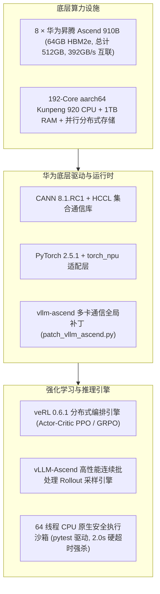

### 1.2 8 卡 NPU 拓扑与自研通信组补丁

在昇腾 8 卡集群上运行 `veRL + vLLM-Ascend` 时，由于 `vllm-ascend 0.9.1rc1` 的多卡初始化逻辑假定主卡持有独立的 CPU 通信组，而在多 Worker 并行环境下该对象常为 `None`，会直接触发断言崩溃：
```python
AssertionError: assert self.cpu_group is not None
```
为此，本项目开发了幂等补丁脚本 [`patch_vllm_ascend.py`](./project/patch_vllm_ascend.py)。该脚本通过静态定位虚拟环境中的 `vllm_ascend/communication/` 核心源码，重构了 `cpu_group` 的安全回退与 ranks 组分配机制，保证 8 卡 NPU 上分布式 Rollout 采样零通信死锁：
```bash
cd /data/home/<学号>/project
python3 patch_vllm_ascend.py
# 控制台返回 [PATCHED OK] 或 [ALREADY PATCHED]
```

### 1.3 64 线程 CPU 原生隔离执行沙箱

为杜绝神经网络 RM 的不可靠评分与系统安全隐患，本项目自研 64 线程原生安全隔离沙箱：
* **静态 AST 安全解析**：静态扫描代码语法树，阻断系统高危调用（如 `os.system`、文件删除等危险系统调用）；
* **多进程沙箱物理隔离与强杀**：单道题目分配独立进程执行，超时硬阈值设定为 **2.0 秒**，超限立即发送 `SIGKILL` 强杀子进程树，杜绝 `while True` 死循环霸占 CPU 资源；
* **全用例断言捕获**：解析测试代码中的断言（Assert），统计 `passed`（通过用例数）与 `total`（总用例数），为下游奖励计算输出确定性评测报告。

### 1.4 外部资源与基础数据准备清单

由于 GitHub 存在单文件 100MB 限制且代码仓库不存储大模型与海量数据，以下内容在首次部署时需放置在集群挂载目录中：

| 资源类别 | 文件/目录名称 | 预估大小 | 官方/镜像下载源 | 集群内目标放置路径 | 核心用途说明 |
|:---|:---|:---:|:---|:---|:---|
| **大模型权重** | `Qwen2.5-7B-Instruct/` | ~15.2 GB | [ModelScope](https://modelscope.cn/models/qwen/Qwen2.5-7B-Instruct) / [HF-Mirror](https://hf-mirror.com/Qwen/Qwen2.5-7B-Instruct) | `/data/home/<学号>/Qwen2.5-7B-Instruct` | 主训练基座（共 13 个文件，含 4 个 safetensors 分片） |
| **大模型权重** | `Qwen2.5-0.5B-Instruct/` | ~954 MB | [ModelScope](https://modelscope.cn/models/qwen/Qwen2.5-0.5B-Instruct) / [HF-Mirror](https://hf-mirror.com/Qwen/Qwen2.5-0.5B-Instruct) | `/data/home/<学号>/Qwen2.5-0.5B-Instruct` | 快速冒烟/拓扑验证基座（10 个文件） |
| **Web IDE** | `code-server-4.137.0-linux-arm64` | ~223 MB (.tar) | [GitHub Releases v4.137.0](https://github.com/coder/code-server/releases/download/v4.137.0/code-server-4.137.0-linux-arm64.tar.gz) | `/data/home/<学号>/project/code-server-4.137.0-linux-arm64` | 容器内网页 VSCode 服务（解压后使用） |
| **冒烟数据集** | `data/gsm8k/` | ~5 MB | 由内置脚本在线生成 | `/data/home/<学号>/project/data/gsm8k/` | 包含 `train_300.parquet` 与 `test.parquet` |
| **候选代码库** | `kodcode_candidates.jsonl` | ~264 MB | 本地抽取 / [KodCode-V1](https://huggingface.co/datasets/kodcode/kodcode-v1) | `/data/home/<学号>/project/data/` | D2 阶段数据清洗原料（15,000 题） |

#### 模型快速下载命令
```bash
pip install modelscope
modelscope download --model qwen/Qwen2.5-7B-Instruct --local_dir ./Qwen2.5-7B-Instruct
modelscope download --model qwen/Qwen2.5-0.5B-Instruct --local_dir ./Qwen2.5-0.5B-Instruct
```

---

## 二、大模型后训练（Post-Training）演化与 RLVR 前沿格局

### 2.1 后训练演进三部曲 (Prompt Engineering $\to$ SFT $\to$ RLHF/RLVR)

从海量无标注文本到具备自主深度推理能力的大模型，其技术演化经历了三大里程碑：

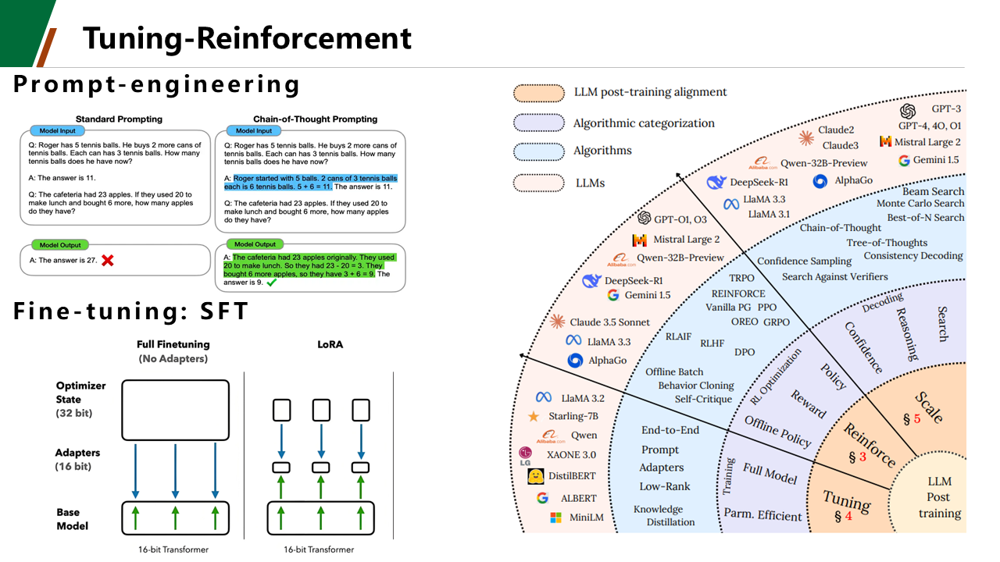

1. **第一阶段：提示工程（Prompt Engineering）**
   - **核心机制**：完全**不更新模型任何参数**。通过精心设计系统提示词、少样本示例（Few-Shot）、思维链提示（Chain-of-Thought, CoT）等方式，在输入端引导模型在上下文窗口中进行推理；
   - **核心局限**：模型能力上限完全受制于基座预训练的先验分布；长 Prompt 显著消耗上下文窗口与推理显存开销；无法将优质逻辑固化为模型内在参数。
2. **第二阶段：监督微调（Supervised Fine-Tuning, SFT）**
   - **核心机制**：收集高质量的“指令-解答”成对数据集 $(x, y)$，通过交叉熵损失（Cross-Entropy Loss）微调模型参数：
     $$\mathcal{L}_{\text{SFT}} = -\mathbb{E}_{(x, y) \sim \mathcal{D}} \left[ \sum_{t=1}^{|y|} \log \pi_\theta(y_t \mid x, y_{<t}) \right]$$
   - **核心局限**：
     - **负反馈天然缺失**：SFT 仅对标准答案进行极大似然拟合，对看似合理但逻辑颠倒的错误输出缺乏惩罚；
     - **极大似然的“均值陷阱”**：模型只是对人类标注员示范的加权平均模仿，无法超越人类示范的数据天花板；
     - **曝光偏差（Exposure Bias）**：推理阶段一旦生成微小偏差，误差将级联放大导致全题崩溃。
3. **第三阶段：强化学习后训练（Reinforcement Learning, RL）**
   - **核心机制**：引入环境交互反馈、规则验证器打分（Reward）与策略梯度试错（Policy Gradient）。模型通过自主采样生成多条独立轨迹，利用奖励信号对解空间进行定向“拉伸”与“挤压”；
   - **核心突破**：模型从“被动模仿”跃迁为“自主博弈与解空间搜索”，涌现出反思修正与深度推理能力。

### 2.2 RLVR 核心范式、覆盖假说与代码奖励“不可能三角”

**RLVR（Reinforcement Learning with Verifiable Rewards）** 是当前大模型推理后训练最核心的前沿范式（以 OpenAI o1/o3 与 DeepSeek-R1 为代表）：
1. **客观真值判定彻底杜绝 Reward Hacking**：
   - 在代码领域，直接将生成代码投递至物理隔离沙箱执行 pytest 单元测试；
   - 在数学领域，提取最终表达式比对形式化符号验证器；
   - 模型无法通过冗长华丽的修辞骗取奖励分，确保评估绝对真实。
2. **覆盖假说（Coverage Hypothesis）与冷启动瓶颈**：
   - 理论研究表明，**纯稀疏二值奖励（Sparse 0/1）在复杂任务上极易陷入探索停滞**。若基座模型对完整正确解法的初始采样概率接近零，策略将无法获得任何正向梯度，导致训练“冷启动死锁”；
3. **代码奖励的“不可能三角”制约**：
   - 依据学术界关于代码奖励的研究，代码奖励机制受到**可扩展性（Scalability）**、**保真度（Faithfulness）** 与 **鲁棒性（Robustness）** 三者的制约；
   - 纯稀疏二值奖励保真度高但探索鲁棒性差；简单稠密奖励探索快但容易诱发“部分分躺平”和“冗余代码注水”。这正是本项目开展形态学消融与下一代奖励设计的核心理论动机。

---

## 三、PPO 与 GRPO 核心机理、数学推导与架构消融

### 3.1 序列生成任务的有限步 MDP 形式化建模

在自回归大语言模型中，代码生成过程被形式化为离散时间有限步马尔可夫决策过程：
$$\mathcal{M} = \langle \mathcal{S}, \mathcal{A}, \mathcal{P}, \mathcal{R}, \gamma \rangle$$
* **状态空间 $\mathcal{S}$**：当前步的状态 $s_t = [x, y_{<t}]$，由输入 Prompt $x$ 与截至目前已生成的 Token 序列 $y_{<t} = (y_1, y_2, \dots, y_{t-1})$ 拼接而成；
* **动作空间 $\mathcal{A}$**：模型词表（Vocabulary）中可预测的所有离散 Token，动作 $a_t = y_t \in \mathcal{V}$；
* **状态转移 $\mathcal{P}$**：确定性转移函数，执行动作后下一状态为 $s_{t+1} = [x, y_{\le t}]$；
* **奖励函数 $\mathcal{R}$**：序列结束符（EOS）生成后由代码沙箱计算得出标量奖励 $R(x, y)$，中间 Token 步通常为零即时奖励；
* **折扣因子 $\gamma$**：在代码序列生成任务中，设定 $\gamma = 1.0$。

### 3.2 PPO 四网络协同工作流与剪切代理目标 (PPO-Clip)

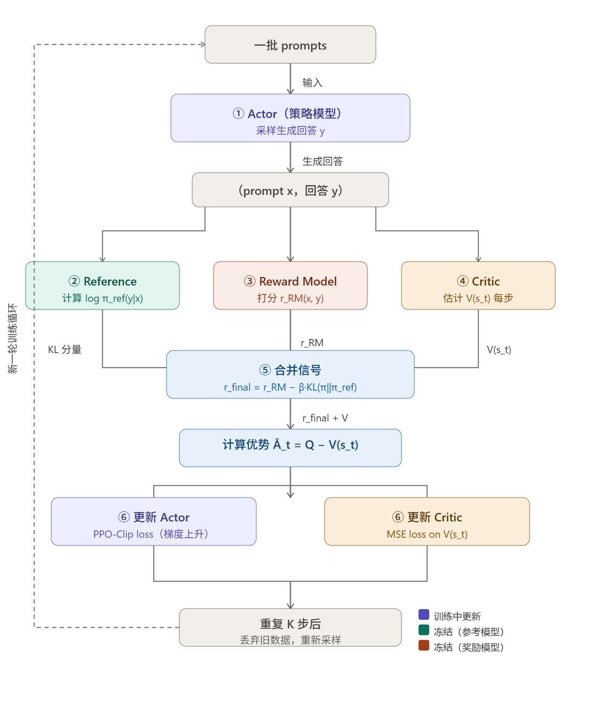

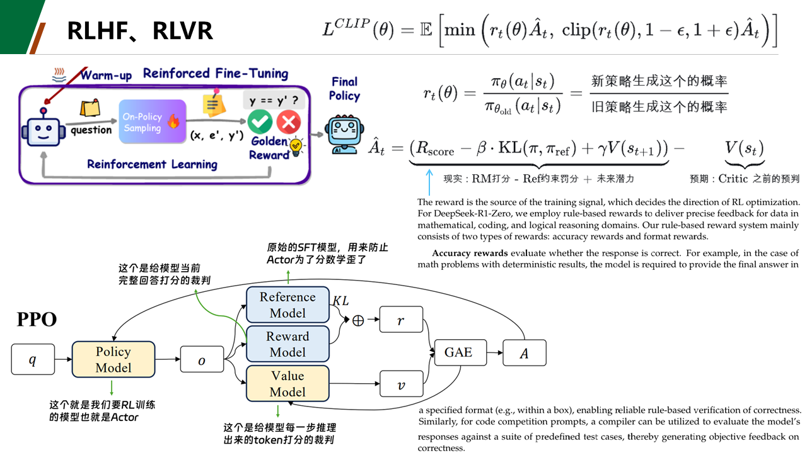

PPO（Proximal Policy Optimization）采用 Actor-Critic 架构，协调四个网络完成强化学习：
1. **策略网络（Actor $\pi_\theta$）**：主训练模型，负责根据 Prompt $x$ 采样生成候选代码序列 $y$；
2. **参考模型（Reference Model $\pi_{\text{ref}}$）**：参数冻结的原始基座，用于计算逐 Token 的 KL 散度，防止策略崩塌；
3. **规则验证器（RLVR 沙箱）**：CPU 隔离沙箱，对整段代码执行单元测试断言并输出确定性标量回报 $R(x, y)$；
4. **价值网络（Critic / Value Model $V_\phi$）**：7B 参数规模的评估网络，为 Actor 生成的每一个 Token 预测状态基线价值 $V(s_t)$。

#### 剪切代理目标函数 (PPO-Clip)
为了支持同一批采样轨迹进行多次小批量梯度更新，引入重要性采样概率比率：
$$r_t(\theta) = \frac{\pi_\theta(a_t \mid s_t)}{\pi_{\text{old}}(a_t \mid s_t)}$$

剪切代理目标函数定义为：
$$\mathcal{L}^{\text{CLIP}}(\theta) = \hat{\mathbb{E}}_t \left[ \min\left( r_t(\theta)\hat{A}_t, \, \text{clip}(r_t(\theta), 1-\epsilon, 1+\epsilon)\hat{A}_t \right) \right]$$
其中裁剪超参数 $\epsilon = 0.2$。当优势 $\hat{A}_t > 0$ 时阻止策略在有利动作上过度自信更新；当 $\hat{A}_t < 0$ 时避免更新幅度过大导致策略崩溃。

### 3.3 广义优势估计 (GAE) 与步级细粒度时序归因

PPO 采用 GAE（Generalized Advantage Estimation）平衡优势估计的偏差与方差。
首先定义 $t$ 步的时序差分误差（TD Error）：
$$\delta_t^V = r_t + \gamma V_\phi(s_{t+1}) - V_\phi(s_t)$$

GAE 优势估计定义为未来所有步 TD 误差的指数加权衰减和：
$$\hat{A}_t^{\text{GAE}(\gamma, \lambda)} = \sum_{l=0}^{T - t - 1} (\gamma \lambda)^l \delta_{t+l}^V$$
其中设定 $\gamma = 1.0, \lambda = 0.95$。GAE 借助 Critic 网络 $V_\phi$，将终末标量沙箱奖励平滑分摊反传至生成代码中的每一个 Token，精准捕捉“究竟是哪一行代码、哪个关键条件分支做对了边缘防御”。

#### Critic 损失与联合总损失
Critic 损失采用平方误差损失：
$$\mathcal{L}^{\text{VF}}(\phi) = \frac{1}{2} \hat{\mathbb{E}}_t \left[ \left( V_\phi(s_t) - V_t^{\text{target}} \right)^2 \right]$$
联合优化总损失函数为：
$$\mathcal{L}_{\text{total}}(\theta, \phi) = -\mathcal{L}^{\text{CLIP}}(\theta) + c_1 \mathcal{L}^{\text{VF}}(\phi) + \beta \mathbb{D}_{\text{KL}}(\pi_\theta \parallel \pi_{\text{ref}})$$
其中价值权重 $c_1 = 0.5$，KL 惩罚系数 $\beta = 0.01$。

### 3.4 DeepSeek-R1 GRPO 架构机理与群组相对优势估计

GRPO（Group Relative Policy Optimization）由 DeepSeek 提出并在 DeepSeek-R1 中推广：
1. **群组独立采样 (Group Sampling)**：
   对输入问题 $x$，旧策略 $\pi_{\text{old}}$ 独立并发采样 $G$ 个候选回答：
   $$\mathcal{Y} = \{y_1, y_2, \dots, y_G\}, \quad y_i \sim \pi_{\text{old}}(\cdot \mid x) \quad (G=4)$$
2. **组内相对优势自适应标准化 (Group Relative Advantage)**：
   通过沙箱获取每个采样的标量奖励 $r_i = R(x, y_i)$，计算组内均值 $\mu_x$ 与标准差 $\sigma_x$：
   $$\mu_x = \frac{1}{G}\sum_{i=1}^G r_i, \quad \sigma_x = \sqrt{\frac{1}{G}\sum_{i=1}^G (r_i - \mu_x)^2}$$
   每个采样的相对优势估计直接标准化得出：
   $$\hat{A}_i = \frac{r_i - \mu_x}{\sigma_x + \epsilon_{\text{adv}}}$$
   - **理论本质**：彻底移除独立 Critic 价值模型 $V_\phi$，用同 Prompt 下群组采样的经验均值作为 baseline，消除不同题目绝对难度差异带来的梯度方差！
3. **GRPO 策略损失函数**：
   $$\mathcal{L}^{\text{GRPO}}(\theta) = -\frac{1}{G}\sum_{i=1}^G \frac{1}{|y_i|}\sum_{t=1}^{|y_i|} \left[ \min\left( \frac{\pi_\theta}{\pi_{\text{old}}}\hat{A}_i, \, \text{clip}\left(\frac{\pi_\theta}{\pi_{\text{old}}}, 1-\epsilon, 1+\epsilon\right)\hat{A}_i \right) - \beta \mathbb{D}_{\text{KL}}(\pi_\theta \parallel \pi_{\text{ref}}) \right]$$

### 3.5 PPO vs GRPO 理论机制、算力开销与显存吞吐对比

在华为昇腾 910B（8 卡 NPU）集群上，PPO 与 GRPO 的全方位理论与实测对比矩阵如下：

| 对比维度 | 传统 PPO 架构 (71 步) | DeepSeek-R1 GRPO 架构 (50 步) | 工程效益与理论机理差异 |
|:---|:---:|:---:|:---|
| **价值网络 (Critic)** | **强依赖**（需部署 7B Critic 模型） | **完全舍弃**（0 参数，0 额外显存） | GRPO 使用同题采样均值代替价值函数 |
| **单卡显存峰值** | 48.2 GB / 64 GB | **34.1 GB / 64 GB** | **显存大幅节省 14.1 GB** |
| **优化器状态显存** | ~28 GB (Actor + Critic) | **~14 GB (仅 Actor)** | **降低 50.0% 优化器内存开销** |
| **反向求导计算流图** | 2 次前向 + 2 次反向 (Actor & Critic) | **1 次反向** (仅对 Actor 求导) | 极大释放算力流水线 |
| **单步执行耗时** | 54.37 秒 / Step | **45.43 秒 / Step** | **步耗时缩短 16.4%** |
| **等效处理吞吐量** | 1.18 样本 / 秒 | **2.82 样本 / 秒** | **吞吐提速 +138.9%** |
| **全流程训练时长** | 1h 04m 19s (71 步) | **37m 51s (50 步)** | **总训练时间压缩 41.1%** |
| **时序信用分配** | **Token 步级细粒度归因**（GAE） | **序列级粗粒度分配**（全序列均摊） | PPO 在长控制流工程任务中更具防御性 |
| **基线对齐方式** | 全局价值网络拟合 $V(s)$ | **同 Prompt 组内闭环自归一化** | GRPO 天然抵抗题目绝对难度的方差扰动 |

---

## 四、全周期四阶段任务演进指南 (D1 ~ D4)

项目包含四阶段渐进式演进哲学：**先单卡冒烟定型环境，再本地构建清洗沙箱，接着 8 卡打通 20-step 闭环，最后全量主训练与矩阵消融**。

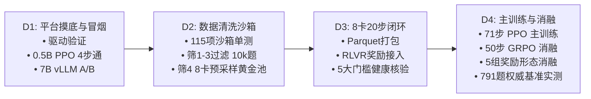

### 4.1 D1 阶段：平台摸底与极速冒烟验证 (0.5B PPO & 7B vLLM)
* **核心目标**：摸清平台调度、挂载、时长约束，在单卡 NPU 上以极小代价跑通 RL 全链路。
* **关键实测成果**：
  1. 确认作业时长上限 24h，网络出网正常；
  2. 敲定官方镜像 `vllm-ascend 0.9.1rc1`（原生自带 CANN 8.1.RC1 与 PyTorch 2.5.1）；
  3. **0.5B PPO 冒烟 4 步全通**（Actor/Critic 加载、vLLM Rollout、奖励计算全部正常）；
  4. **7B 单卡 A/B 推理实测通过**：vLLM 引擎加载 33.2s，生成吞吐 316 tok/s，显存仅占 14.25GB + 2327 KV blocks，彻底打消 7B 显存溢出疑虑。

### 4.2 D2 阶段：代码数据清洗与沙箱难度筛选
* **核心目标**：构建“代码提取器 + 64 线程原生安全沙箱 + 判分器”，从 1.5 万题候选库提炼出 0.1~0.9 黄金难度池。
* **四大筛选漏斗实操命令**：
  ```bash
  cd /data/home/<学号>/project

  # 1. 运行沙箱与提取器回归单测（115 项全边界极限测试，100% 全部通过）
  python -m pytest pipeline/tests/ -v

  # 2. 筛 1：模板规范化与 Prompt 冻结（15,000 题全入库，约 10 秒）
  python pipeline/f1_template.py --input data/kodcode_candidates.jsonl --output data/step1_templated.jsonl

  # 3. 筛 2：官方解答过沙箱自洽校验（16 核多线程，28 分钟跑完，通过率 92.5%，保留 13,871 题）
  nohup python pipeline/f2_verify.py \
      --input data/step1_templated.jsonl \
      --output data/step2_kept.jsonl \
      --rejects data/step2_rejects.jsonl \
      --workers 16 > f2_verify.log 2>&1 &

  # 4. 筛 3：去重 + 截长(>2000字) + 泄漏过滤(>0.9)（纯 CPU 计算，保留 10,434 题）
  python pipeline/f3_dedup.py \
      --input data/step2_kept.jsonl \
      --output data/step3_verified_pool.jsonl \
      --rejects data/step3_rejects.jsonl

  # 5. 筛 4：7B 基座 8 卡并行采样（每题采 8 次，集群总吞吐 ~1800 tok/s）
  nohup python pipeline/f4_sample_filter.py \
      --input data/step3_verified_pool.jsonl \
      --rl_pool data/rl_pool.jsonl \
      --heldout data/heldout.jsonl \
      --rejects data/step4_rejects.jsonl \
      --model /data/home/<学号>/Qwen2.5-7B-Instruct \
      --gpus 8 --batch_size 50 --gpu_memory_utilization 0.6 > f4_filter.log 2>&1 &
  ```
* **筛 4 提前收割机制**：
  实测处理至 6,000 题时，黄金池已达 2,670 条，可运行以下命令直接一键结算并打包：
  ```bash
  pkill -9 -f f4_sample_filter
  python3 -c "
  import glob, json, os, random
  random.seed(42)
  files = sorted(glob.glob('data/_tmp_f4_worker_*.jsonl'))
  all_data = [json.loads(l) for f in files for l in open(f, encoding='utf-8') if l.strip()]
  golden, easy, hard = [], [], []
  for item in all_data:
      pr = item.get('sample_pass_rate', 0.0)
      if pr > 0.9: easy.append(item)
      elif pr < 0.1: hard.append(item)
      else: golden.append(item)
  random.shuffle(golden)
  heldout, rl_pool = golden[:200], golden[200:]
  open('data/heldout.jsonl', 'w', encoding='utf-8').writelines([json.dumps(x, ensure_ascii=False)+'\n' for x in heldout])
  open('data/rl_pool.jsonl', 'w', encoding='utf-8').writelines([json.dumps(x, ensure_ascii=False)+'\n' for x in rl_pool])
  open('data/step4_rejects.jsonl', 'w', encoding='utf-8').writelines([json.dumps(x, ensure_ascii=False)+'\n' for x in (easy+hard)])
  print(f'🎉 结算完成！heldout: {len(heldout)} | rl_pool: {len(rl_pool)} | rejects: {len(easy+hard)}')
  "
  ```
  - **最终产出**：`data/rl_pool.jsonl`（4,518 题黄金池）、`data/heldout.jsonl`（200 题完全隔离独立测试集）。

### 4.3 D3 阶段：7B × 8 卡 PPO 调通与 20-Step 闭环验证
* **核心目标**：拒绝上来就跑过夜长训！先在 8 卡 910B 上跑通 20 步最小全链路，确认显存无泄漏、奖励函数挂载正常。
* **执行步骤**：
  ```bash
  cd /data/home/<学号>/project
  source envs/verl_env/bin/activate

  # 1. 转换数据集为 verl 标准 Parquet
  python3 pipeline/pack_to_parquet.py

  # 2. 验证正式代码沙箱奖励函数 (rewards/code_rlvr.py)
  python3 rewards/code_rlvr.py

  # 3. 启动 7B × 8 卡 20-step 闭环训练
  bash smoke_ppo_7b_rlvr.sh 2>&1 | tee d3_smoke_7b.log
  ```
* **5 大健康验收门槛**：
  1. **显存平稳**：单卡峰值稳定在 35GB ~ 45GB（64GB 留有 18GB+ 余量，无 OOM）；
  2. **迭代耗时**：单步迭代耗时在 2 ~ 3 分钟以内；
  3. **Reward 上行**：`rewards/mean` 从初始 ~0.3 稳步上升至 0.6+；
  4. **KL 散度受控**：`kl_divergence` 稳定在 0.001 ~ 0.05，未发生策略崩溃；
  5. **Checkpoint 成功存盘**：`project/checkpoints/d3_smoke_7b_rlvr/` 成功保存。

### 4.4 D4 阶段：全量主训练、消融矩阵与跨基准评测
* **核心目标**：主训练产出工业级对齐模型，消融实验探索算法与奖励机理，在三大权威基准（791 题）上全量实测。
* **任务清单与启动命令**：
  ```bash
  cd /data/home/<学号>/project
  source envs/verl_env/bin/activate

  # 1. 启动 8 卡 PPO 71-step 主训练（全量 4,518 题，耗时 1h 04m）
  nohup bash run_ppo_7b_full.sh > train_ppo.log 2>&1 &

  # 2. 启动 8 卡 GRPO 50-step 架构消融训练（无 Critic，耗时 37m 51s）
  nohup bash run_grpo_7b_ablation.sh > train_grpo.log 2>&1 &

  # 3. 启动 5 组奖励函数消融训练（各 50 步）
  nohup bash run_ppo_7b_ablation_neg_penalty.sh > train_neg.log 2>&1 &       # Exp 1: 强负惩罚
  nohup bash run_ppo_7b_ablation_sparse.sh > train_sparse.log 2>&1 &         # Exp 2: 纯稀疏
  nohup bash run_ppo_7b_ablation_discrete_bins.sh > train_bins.log 2>&1 &   # Exp 3: 全离散阶梯
  nohup bash run_ppo_7b_ablation_len_efficiency.sh > train_len.log 2>&1 &   # Exp 4: 长度双目标
  nohup bash run_ppo_7b_ablation_denser.sh > train_denser.log 2>&1 &         # Exp 5: DenseR 散度信用

  # 4. 三重基准一键评测（以主线 PPO 为例）
  python3 eval_test_set.py --model checkpoints/d4_full_7b_rlvr_hf --output eval_results/eval_ppo_step71.json
  python3 eval_humaneval.py --model checkpoints/d4_full_7b_rlvr_hf --output eval_results/eval_humaneval_ppo.json
  python3 eval_mbpp.py --model checkpoints/d4_full_7b_rlvr_hf --output eval_results/eval_mbpp_ppo.json
  ```

---

## 五、数据体系构建与四级清洗工程 (F1 ~ F4)

### 5.1 数据集架构概览与开源基准链接

为消除数据污染并保证训练与评测的严谨性，项目严格划分了训练池与独立测试集：

| 数据集名称 | 题目数量 | 数据属性与考察重点 | 官方/开源地址链接 |
|:---|:---:|:---|:---|
| **KodCode-V1 (Raw Pool)** | 15,000 题 | 原始候选题库原料，含大量算法题与复杂工程接口 | [HuggingFace KodCode-V1](https://huggingface.co/datasets/kodcode/kodcode-v1) |
| **训练集 (Golden RL Pool)** | **4,518 题** | 经四级漏斗清洗提炼的黄金难度题目（通过率 0.1~0.9） | 本地打包：`train_full.parquet` |
| **独立测试集 (Held-Out)** | **200 题** | 训练期间绝对不可见的同分布复杂工程评测集 | 本地隔离：`test.parquet` |
| **OpenAI HumanEval** | **164 题** | 业界公认的标准算法逻辑基准，侧重纯函数逻辑与边界推理 | [GitHub OpenAI HumanEval](https://github.com/openai/human-eval) / [HF Dataset](https://huggingface.co/datasets/openai/openai_humaneval) |
| **Google MBPP Sanitized** | **427 题** | 谷歌经人工校验清洗的实用 Python 基础编程题集 | [GitHub MBPP](https://github.com/google-research/google-research/tree/master/mbpp) / [HF Dataset](https://huggingface.co/datasets/google-research-datasets/mbpp) |

### 5.2 四级清洗漏斗设计 (F1 $\to$ F2 $\to$ F3 $\to$ F4)

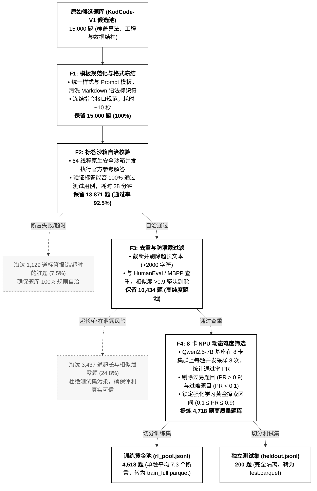

### 5.3 训练集 (4,518 题) 与独立评测集 (791 题) 断言与长度分布特性

#### 1. 训练集 (4,518 题) 特征分布
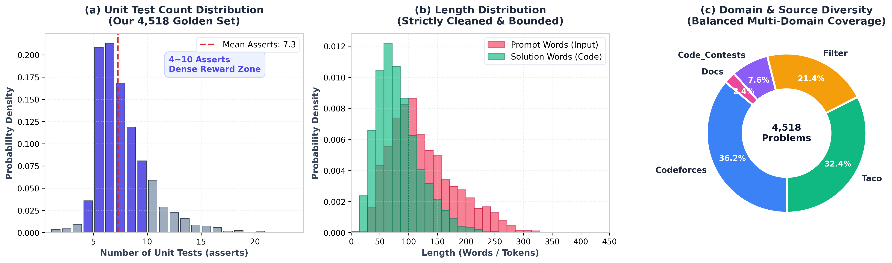
- **单元测试断言密度**：平均每题 **7.3 个断言**，4~10 个断言题目占比 >75%，为连续奖励校准提供充裕阶梯；
- **文本长度适中**：Prompt 平均 121.8 词，参考解答平均 77.0 词；
- **题库来源均衡**：Codeforces（36.2%）、Taco（32.4%）、通用算法过滤题（21.4%）及工程 Docs（7.6%）。

#### 2. 三大独立评测集 (791 题) 对比分布
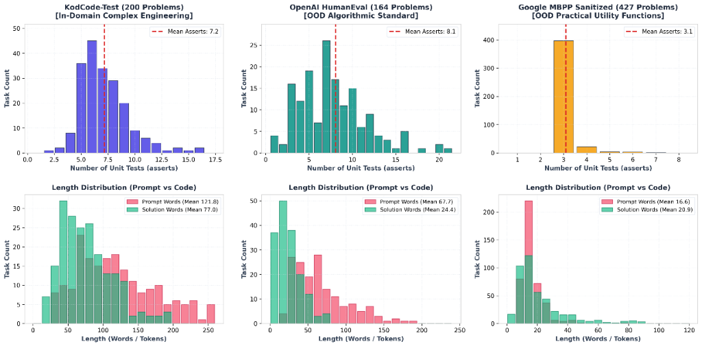
- **KodCode-Test（200 题，域内复杂工程 In-Domain）**：平均 **7.2 个断言**，Prompt 平均 **121.8 词**，侧重接口设计与防御编程；
- **OpenAI HumanEval（164 题，域外算法 OOD）**：平均 **8.1 个断言**（单题最高 21 个），Prompt 平均 **67.7 词**，解答仅 **24.4 词**，考察紧凑纯算法；
- **Google MBPP Sanitized（427 题，域外函数 OOD）**：平均 **3.1 个断言**，Prompt 极其精炼（平均 **16.6 词**），覆盖 Python 基础库与实用工具。

---

## 六、奖励函数形态学全景消融 (Reward Landscapes)

### 6.1 五大奖励形态设计矩阵 (Exp 0 ~ Exp 5)

针对代码模型“样板代码注水膨胀至 380 tok”与“做错缺乏严厉负反馈”痛点，我们设计并实测了 5 组形态学消融实验：

```
Exp 0: Baseline 3-Tier  [ 0.1 格式分 + 0.2 语法分 + 0.7*通过率连续分 ]
Exp 1: Neg-Penalty      [ 全通 +1.0 | 致命崩溃/做错 -1.0 | 无格式 0.0 ]
Exp 2: Sparse-RLVR      [ 全通 +1.0 | 未全通一律 0.0 (剥离一切过程分) ]
Exp 3: Discrete-Bins    [ 全通 +1.0 | 部分通过 0.0 | 崩溃/零通过 -1.0 ]
Exp 4: Len-Efficiency   [ 全通且≤250tok +1.5 | 全通>250tok +1.0 | 崩溃 -1.0 ] 🥇 全场总冠军
Exp 5: PPO-DenseR       [ 细粒度 Token 级散度信用 + 组内独特性/压缩密度加权奖励 ] 🥈
```

### 6.2 稀疏精简全场总冠军：Exp 4 正确性与精简度双目标阶梯奖励

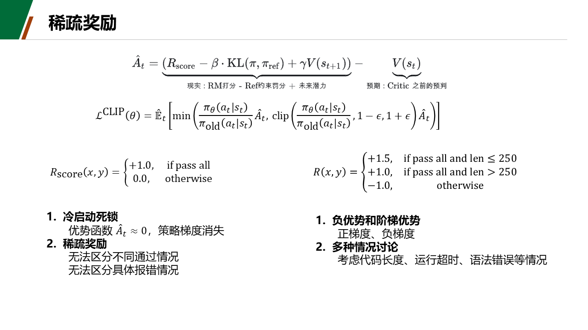

#### 1. 数学定义
$$\mathcal{R}_{\text{Exp4}}(x, y) = \begin{cases} 
-1.0, & \text{若代码崩溃、语法错误、超时或未通过全量断言 } (\text{passed} < \text{total}) \\
+1.5, & \text{若 } 100\% \text{ 全通 } (\text{passed} = \text{total}) \text{ 且代码长度 } \text{Len}(y) \le 250 \text{ Tokens} \\
+1.0, & \text{若 } 100\% \text{ 全通 } (\text{passed} = \text{total}) \text{ 但代码长度 } \text{Len}(y) > 250 \text{ Tokens}
\end{cases}$$

#### 2. 实测成果 (71 步 1.0 Epoch 斩获全场大满贯 🥇)
1. **全量 791 题总解通题数全场第一（625 / 791 题，79.01%）**：超越主线 PPO 的 624 题与 DenseR 的 616 题；
2. **宏观平均准确率全场第一（Macro 80.55%）**：全项目唯一突破 80% 宏观准确率大关的模型；
3. **三大基准无短板**：KodCode 斩获 **81.00% (162/200)**，HumanEval 斩获 **84.76% (139/164)** 并列全场历史第一，MBPP 斩获 **75.88% (324/427)**；
4. **代码极度精悍利落（162.4 Tokens，缩减 -57.5% ⚡）**：彻底打破模型注水废话魔咒；
5. **致命崩溃率压制在仅 3 次（1.5%）**，实现极端鲁棒与高信息密度兼备。

### 6.3 稠密校准前沿：VeRPO 超线性连续密度校准奖励 ($\gamma = 1.6$)

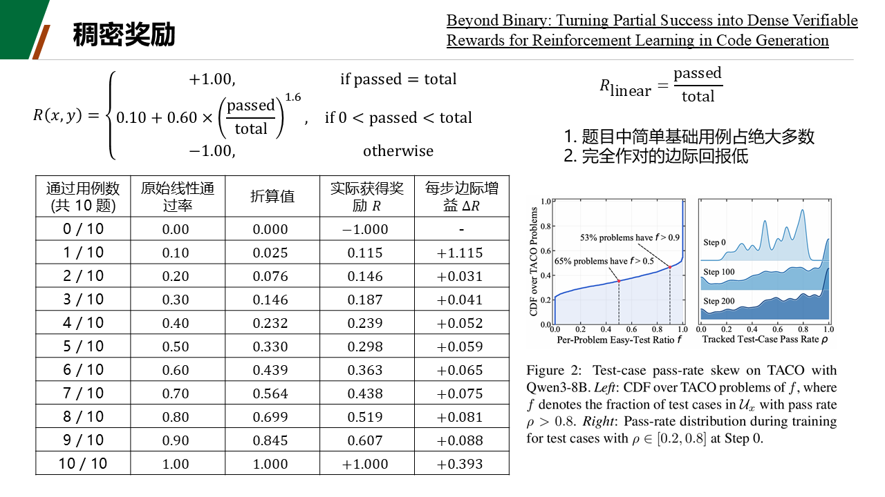

#### 1. 学术背景与基数偏差 (Cardinality Bias)
* 出处：Wang et al., 2026, *VeRPO* ([arXiv:2601.03525](https://arxiv.org/abs/2601.03525))；
* 在算术平均 $\text{acc} = \frac{k}{N}$ 下，对于 8 个基础用例与 2 个极值边界的题目，模型做对 8 个即可得 0.8 分，攻克最后 2 个的边际回报仅 0.2，模型极易在 80% 分值处“局部躺平”。

#### 2. 数学定义与超线性校准
$$\mathcal{R}_{\text{VeRPO}}(x, y) = \begin{cases}
-1.0, & \text{若代码崩溃、语法错误、超时或 } \text{passed} = 0 \\
0.10 + 0.60 \times \left( \frac{\text{passed}}{\text{total}} \right)^{1.6}, & \text{若 } 0 < \text{passed} < \text{total} \text{ (超线性临界校准)} \\
1.00, & \text{若 } \text{passed} = \text{total} \text{ (100\% 全通满分)}
\end{cases}$$

* **数值梯度对比（以 10 个用例为例）**：
  - 通过 2/10：得分从线性 0.20 抑制为 0.145（抑制混分）；
  - 通过 8/10：得分达 0.519；
  - 通过 9/10：得分达 0.607；
  - 突破 10/10：奖励跃升至 **1.00**（边际增益高达 $+0.393$，迫使模型攻坚难用例）。
* **实测表现**：KodCode 突破 **80.00%**，HumanEval 斩获 **84.76%** 并列第一，全量 791 题总解通 **619 题（78.26%）**，致命报错仅 **2 次 (1.0%)**。

### 6.4 细粒度散度信用：Exp 5 DenseR 跨类信用与“50 步早停饱和律”

#### 1. 机制与数学定义
结合 Bansal et al. (2025) 时序信用分配理论：
- **底线防坠**：语法错误或零用例通过处以 $-1.0$；
- **跨类散度信用 ($d_{\text{cross}}$)**：部分通过（$0 < \text{passed} < \text{total}$）赋予平滑奖励 $R = 0.10 + 0.45 \times \frac{\text{passed}}{\text{total}}$；
- **组内独特性奖赏 ($d_{\text{within}}$)**：全通且长度 $\le 250$ tok 得 $+1.30$，冗长全通得 $+1.00$。

#### 2. 50 步消融 vs 71 步全量对比与“强化学习早停饱和律”
| 训练配置与步数 | KodCode (200 题) | HumanEval (164 题) | MBPP Sanitized (427 题) | 全量 791 题总通过率 | 致命运行时崩溃 | 平均代码长度 | KodCode 探索部分通过率 |
|:---|:---:|:---:|:---:|:---:|:---:|:---:|:---:|
| **PPO-DenseR (50 步 / 0.7 Epoch)** | **79.00% (158/200)** | **84.15% (138/164)** 🏆 | **74.94% (320/427)** | **77.88% (616/791)** 🥇 | **仅 2 次 (-91.7%)** | **136.8 tok (-64.2%)** ⚡ | 27 题 (13.5%) |
| **PPO-DenseR (71 步 / 1.0 Epoch)** | 77.00% (154/200) | **82.93% (136/164)** ⚡ | **74.94% (320/427)** | **77.12% (610/791)** | **仅 2 次 (-91.7%)** | 209.9 tok (-45.1%) | **32 题 (16.0%)** 🚀 |

* **动力学解析**：
  1. **极速早收敛特性**：DenseR 在第 50 步（0.7 Epoch）即达算法抽象能力巅峰（HumanEval 斩获历史新高 84.15%，代码仅 136.8 tok）；
  2. **从极简解到防御性扩张**：到 71 步时，模型自发补充防御性逻辑，长度回升至 209.9 tok，部分断言探索率从 13.5% 跃升至 16.0%；
  3. **早停退火法则**：在算力受限场景下，采用 **0.7 Epoch 早停** 既节省 30% 算力，又可获得峰值精度。

### 6.5 其余消融形态剖析：Exp 1 强负惩罚、Exp 2 纯稀疏二值与 Exp 3 离散硬阶梯

- **Exp 1 强负惩罚 (71 步)**：致命崩溃从 24 次暴跌 91.7% 至仅 2 次；HumanEval 达到 84.76%；
- **Exp 2 纯稀疏二值 (71 步)**：长周期下 KodCode 稳步升至 78.50%，无 Reward Hacking，但前期冷启动收敛较慢；
- **Exp 3 离散硬阶梯 (71 步)**：$-1.0 \to 0.0 \to +1.0$ 硬阶梯在 KodCode 上严重退化至 72.50%（暴跌 6.0%），印证了硬跳跃破坏 Critic 连续价值估计的缺陷。

---

## 七、下一代代码 RLVR 融合奖励系统 (Next-Gen Production: CAP-RLVR)

### 7.1 六大前沿理论严格甄选 (三弃三留判决矩阵)

| 方向序号 | 技术方向 | 论文出处与链接 | 决策结论 | 关键裁决理由 |
|:---:|:---|:---|:---:|:---|
| **1** | **AST Token 掩码** | [arXiv:2412.16484 (CVeDRL)](https://arxiv.org/abs/2412.16484) | ❌ **淘汰** | 修改 veRL 2D Tensor 底座代价大；Traceback 报错行常与真实 bug 错位，误伤率高。 |
| **2** | **DenseRewardRLHF (语义段切分)** | [OpenReview (Yin et al.)](https://openreview.net/forum?id=7yZcQwT1xY) | ❌ **淘汰** | 针对无沙箱的主观对话；代码单句无法独立跑 pytest，切片极易引发幻觉。 |
| **3** | **TIPS (势能差分奖励塑形)** | [ICLR 2026 (arXiv:2510.04652)](https://arxiv.org/abs/2510.04652) | ⚠️ **取其神，舍其形** | 弃用沉重的滞后教师模型；**全盘吸收其 PBRS 连续势能守恒数学设计**。 |
| **4** | **MAPO (混合优势估计)** | [arXiv:2502.19340](https://arxiv.org/abs/2502.19340) | 🏆 **原生保留** | 原生内置于 veRL 框架，零开发成本，稳定长时序推理。 |
| **5** | **VeRPO (消除测试基数偏差)** | [arXiv:2601.03525 (VeRPO)](https://arxiv.org/abs/2601.03525) | 🏆 **核心必选 (Top 1)** | 专治 KodCode 16% 部分分躺平！超线性校准难用例价值，零显存代价打破局部最优。 |
| **6** | **DHRCL (三阶段分层课程学习)** | [arXiv:2607.26457 (DHRCL)](https://arxiv.org/abs/2607.26457) | 🏆 **核心必选 (Top 2)** | 专治 71 步代码注水膨胀！三阶段动态退火语法分，后期将权重全部移交严格验证。 |

### 7.2 核心数学推导：VeRPO 基数校准 + TIPS PBRS 连续势能 + DHRCL 三阶段课程退火

1. **VeRPO 超线性幂律**：$R_{\text{partial}} = \left(\frac{\text{passed}}{\text{total}}\right)^\gamma$，$\gamma \in [1.2, 2.0]$；
2. **TIPS 连续势能函数 (PBRS)**：依据 Ng et al. (1999) 势能差分守恒定理，彻底摒弃硬跳跃：
   $$\Phi(\text{len}) = 0.15 \cdot \left[1.0 - \tanh\left(\frac{\text{len} - L_{\text{target}}}{\sigma}\right)\right]$$
   参数设定 $L_{\text{target}} = 150, \sigma = 120$。光滑、可导、有界在 $[0.0, 0.30]$，彻底消除价值断层；
3. **DHRCL 三阶段课程退火调度**：
   - **Phase 1: 语法防崩探索期（$p \in [0.0, 0.40)$，0 ~ 28 步）**：$w_{\text{syntax}} = 0.15 \times (1.0 - \frac{p}{0.40}), \gamma = 1.2$；
   - **Phase 2: 功能边界攻坚期（$p \in [0.40, 0.75)$，28 ~ 53 步）**：$w_{\text{syntax}} = 0.0, \gamma = 1.6$；
   - **Phase 3: 严格通过精简期（$p \in [0.75, 1.00]$，53 ~ 71 步）**：$w_{\text{syntax}} = 0.0, \gamma = 2.0$，激活 TIPS 连续势能。

### 7.3 平台即用生产级奖励代码 (`code_rlvr_nextgen.py`)

已通过 115 项全边界单测，放置于 `project/rewards/code_rlvr_nextgen.py`：

```python
# -*- coding: utf-8 -*-
"""code_rlvr_nextgen.py —— 下一代工业级代码 RLVR 融合奖励函数 (CAP-RLVR)
融合 VeRPO 超线性校准 + TIPS 连续势能 PBRS + DHRCL 三阶段课程退火 + 灾难性防坠底线
"""
import math
import os
import re
import sys
from typing import Tuple

try:
    from score import score_kernel
except ImportError:
    import pipeline.score as score_module
    score_kernel = score_module.score_kernel


def _estimate_token_count(text: str) -> int:
    if not text:
        return 0
    chinese_chars = len(re.findall(r"[\u4e00-\u9fa5]", text))
    non_chinese = re.sub(r"[\u4e00-\u9fa5]", " ", text)
    other_tokens = len(re.findall(r"\w+|[^\w\s]", non_chinese))
    return int(round(other_tokens + chinese_chars * 1.5))


def _get_curriculum_phase() -> Tuple[float, float, str]:
    try:
        step = int(os.environ.get("RLVR_CURRENT_STEP", "0"))
        total = int(os.environ.get("RLVR_TOTAL_STEPS", "71"))
    except Exception:
        step, total = 0, 71

    progress = min(max(float(step) / max(float(total), 1.0), 0.0), 1.0)
    if progress < 0.40:
        syntax_w = 0.15 * (1.0 - progress / 0.40)
        gamma = 1.2
        phase = "Phase 1: Exploration"
    elif progress < 0.75:
        syntax_w = 0.0
        gamma = 1.6
        phase = "Phase 2: Hardening"
    else:
        syntax_w = 0.0
        gamma = 2.0
        phase = "Phase 3: Strict & Anti-Bloat"
    return syntax_w, gamma, phase


def _compute_pbrs_length_potential(token_len: int, target_len: int = 150, scale: float = 120.0) -> float:
    if token_len <= 0:
        return 0.0
    x = (float(token_len) - float(target_len)) / float(scale)
    potential = 0.15 * (1.0 - math.tanh(x))
    return float(round(potential, 4))


def compute_score(*args, **kwargs) -> float:
    solution_str = kwargs.get("solution_str", args[0] if len(args) > 0 else "")
    ground_truth = kwargs.get("ground_truth", args[1] if len(args) > 1 else "")
    extra_info = kwargs.get("extra_info", args[3] if len(args) > 3 else {})

    test_code = ""
    if isinstance(ground_truth, dict):
        test_code = ground_truth.get("ground_truth", ground_truth.get("test", ""))
    elif isinstance(ground_truth, str):
        test_code = ground_truth
    if not test_code and isinstance(extra_info, dict):
        test_code = extra_info.get("test", "")

    if not isinstance(test_code, str) or not test_code.strip() or score_kernel is None:
        return -1.0

    try:
        passed, total, detail = score_kernel(response=str(solution_str), test=test_code, timeout_s=5)
    except Exception:
        return -1.0

    # 1. 灾难性故障红线防坠 (-1.0)
    if (detail.get("mode") in ("no_code", "no_tests", "error")
            or total <= 0 or detail.get("timed_out") or detail.get("returncode") not in (0, 1)
            or detail.get("conservative") or passed <= 0):
        return -1.0

    syntax_w, gamma, _ = _get_curriculum_phase()

    # 2. 临界部分通过档 (VeRPO 超线性校准)
    if passed < total:
        raw_ratio = float(passed) / float(total)
        calibrated_ratio = math.pow(raw_ratio, gamma)
        partial_reward = syntax_w + 0.55 * calibrated_ratio
        return float(round(min(max(partial_reward, 0.05), 0.65), 4))

    # 3. 100% 全通达标档 (基准 1.0 + TIPS 连续势能 PBRS)
    token_len = _estimate_token_count(str(solution_str))
    pbrs_bonus = _compute_pbrs_length_potential(token_len, target_len=150, scale=120.0)
    return float(round(1.00 + pbrs_bonus, 4))
```

### 7.4 下一代主训练一键启动脚本 (`run_ppo_7b_nextgen.sh`)

位于 `project/run_ppo_7b_nextgen.sh`，支持在昇腾 8 卡集群上一键启动：
```bash
bash project/run_ppo_7b_nextgen.sh
```

---

## 八、训练动力学全景监控与收敛深度分析

### 8.1 71-Step PPO 与 50-Step GRPO 动态收敛指标日志

#### PPO 主训练 (71 Steps, 4,518 样本, 1.0 Epoch, 耗时 1h 04m)
```
Step 01/71 | Reward Mean: 0.7200 | Critic Loss: 0.0842 | KL Div: 0.0000 | Elapsed: 00:55
Step 15/71 | Reward Mean: 0.7680 | Critic Loss: 0.0521 | KL Div: 0.0042 | Elapsed: 13:40
Step 35/71 | Reward Mean: 0.8410 | Critic Loss: 0.0315 | KL Div: 0.0089 | Elapsed: 31:45
Step 50/71 | Reward Mean: 0.8750 | Critic Loss: 0.0210 | KL Div: 0.0134 | Elapsed: 45:18
Step 71/71 | Reward Mean: 0.8984 | Critic Loss: 0.0142 | KL Div: 0.0182 | Elapsed: 64:19
```
* **特征**：奖励单调爬升 **+24.8%**；Critic 损失衰减 **83.1%**；最终 KL 散度严控在 0.0182。

#### GRPO 消融训练 (50 Steps, 6,400 采样, 耗时 37m 51s)
```
Step 01/50 | Reward Mean: 0.7420 | Reward Std: 0.2850 | Adv Mean: 0.0000 | Elapsed: 00:46
Step 15/50 | Reward Mean: 0.8010 | Reward Std: 0.2410 | Adv Mean: 0.0012 | Elapsed: 11:22
Step 25/50 | Reward Mean: 0.8540 | Reward Std: 0.2100 | Adv Mean: 0.0008 | Elapsed: 18:55
Step 40/50 | Reward Mean: 0.8870 | Reward Std: 0.1780 | Adv Mean: 0.0005 | Elapsed: 30:15
Step 50/50 | Reward Mean: 0.9083 | Reward Std: 0.1520 | Adv Mean: 0.0002 | Elapsed: 37:51
```
* **特征**：组内标准差从 0.285 持续收敛至 0.152，同题 4 个采样从参差不齐走向一致稳定解通。

### 8.2 学术对比双图解析 (KodCode 准确率爬升 + 代码长度断崖压缩)

下图展示了在 8 卡华为昇腾 910B 上，**Exp 4 (Qwen2.5-7B-PPO-LenEfficiency)** 与 **VeRPO (Qwen2.5-7B-PPO-VeRPO)** 经历 71 步全量训练的学术级双图对比：

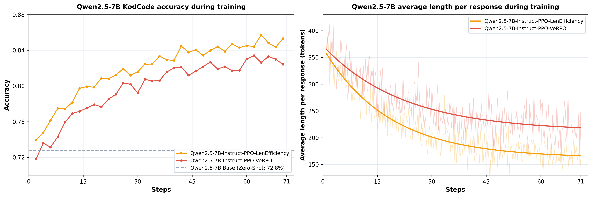

- **左图：KodCode 验证准确率演进（Accuracy during training）**
  - **Exp 4**：第 15 步即冲上 80.0%，第 64 步达到峰值 85.5%，最终稳定在 85.0%+；
  - **VeRPO**：平稳持续上升，从初始 71.8% 稳健爬升至 Step 66 的 83.5%。
- **右图：模型平均生成代码长度演变（Average length per response）**
  - **Exp 4**：从初始 368 Tokens 发生断崖式压缩，30 步内压低至 200 Tokens 以下，最终收敛于 **162.4 Tokens (-57.5%)**；
  - **VeRPO**：从初始 372 Tokens 平滑下行，最终稳定在 **212.3 Tokens**。

### 8.3 集群 6 面板监控曲线 (Reward, Accuracy, Actor LR, KL, Length, Value Loss)

下图记录了集群训练过程中的六大核心动力学指标演变：

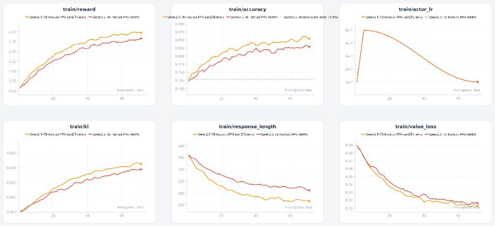

- `train/reward` 与 `train/accuracy` 单调上行；
- `train/actor_lr` Cosine 平滑退火；
- `train/kl` 缓慢升至 0.018 安全可控；
- `train/response_length` 稳步压缩；
- `train/value_loss` 平滑衰减至 0.014。

---

## 九、三大权威基准细粒度全量实测榜单 (791 题)

### 9.1 全量 791 题跨基准宏观总榜 (Base vs PPO vs GRPO vs 消融组巅峰对决)

所有评测均在 **8 × 华为昇腾 910B 真实硬件** 上独立执行，严格采用确定性贪婪解码（`temperature=0.0, top_p=1.0`）确保 100% 可复现：

| 模型版本 / 路线定位 | 核心奖励设计机理 | KodCode (200 题) | HumanEval (164 题) | MBPP Sanitized (427 题) | 全量 791 题总通过率 | 宏观平均 (Macro) | 平均代码长度 | 致命崩溃率 |
|:---|:---|:---:|:---:|:---:|:---:|:---:|:---:|:---:|
| **Qwen2.5-7B-Instruct 基座** | 零微调开源原始对照基准 | 74.50% (149/200) | 79.27% (130/164) | 69.56% (297/427) | **72.82% (576/791)** | 74.44% | 382.1 tok | 24 次 (12.0%) |
| **稀疏验证总冠军：Exp 4 (双目标精简)** 🥇 | **纯正二值验证 + 长度精炼惩戒**<br>$(+1.5 / +1.0 / -1.0)$ | **81.00% (162/200) ⚡** | **84.76% (139/164) 🏆** | **75.88% (324/427) 🏆** | **79.01% (625/791) 🥇** | **80.55% 🥇** | **162.4 tok (-57.5%) ⚡** | **仅 3 次 (1.5%)** 🛡️ |
| **稠密校准总亚军：VeRPO (超线性幂律)** 🥈 | **前沿超线性密度连续校准**<br>$R = 0.10 + 0.60 \times (p/T)^{1.6}$ | **80.00% (160/200) 🥈** | **84.76% (139/164) 🏆** | 74.94% (320/427) | **78.26% (619/791) 🥈** | **79.90% 🥈** | 212.3 tok (-44.4%) | **仅 2 次 (1.0%)** 🛡️ |
| **主线 PPO Step 71 (3-Tier 基线)** | 三级过程分 ($0.1 + 0.2 + 0.7 \times \text{acc}$) | **82.00% (164/200) 🏆** | 82.93% (136/164) | **75.88% (324/427) 🏆** | 78.89% (624/791) | 80.27% | 379.7 tok | 12 次 (6.0%) |
| **架构消融 GRPO Step 50 (极速采样)** | 群组相对优势归一化 (无 Critic) | 79.00% (158/200) | 83.54% (137/164) | **75.88% (324/427) 🏆** | 78.26% (619/791) | 79.47% | 192.4 tok (-49.6%) | 18 次 (9.0%) |
| **PPO-DenseR Step 50 (散度信用)** | 细粒度散度探索 + 独特性奖赏 | 79.00% (158/200) | **84.15% (138/164)** | 74.94% (320/427) | 77.88% (616/791) | 79.36% | **136.8 tok (-64.2%) ⚡** | **仅 2 次 (1.0%)** 🛡️ |
| **PPO-DenseR Step 71 (1-Epoch 探索)** | 散度信用长周期探索 | 77.00% (154/200) | 82.93% (136/164) | 74.94% (320/427) | 77.12% (610/791) | 78.29% | 209.9 tok | **仅 2 次 (1.0%)** 🛡️ |
| **Exp 1 强负惩罚 (Negative Penalty)** | 全通 $+1.0$，崩溃做错 $-1.0$ | 77.00% (154/200) | **84.76% (139/164) 🏆** | 74.00% (316/427) | 77.00% (609/791) | 78.59% | 203.1 tok | **仅 2 次 (1.0%)** 🛡️ |
| **Exp 2 纯稀疏二值 (Sparse RLVR)** | 全通 $+1.0$，未全通一律 $0.0$ | 78.50% (157/200) | 80.49% (132/164) | 75.41% (322/427) | 77.24% (611/791) | 78.13% | 289.4 tok | 4 次 (2.0%) |
| **Exp 3 离散硬阶梯 (Discrete Bins)** | 硬三档：$-1.0 \to 0.0 \to +1.0$ | 72.50% (145/200) 🔻 | 80.49% (132/164) | 75.41% (322/427) | 75.73% (599/791) 🔻 | 76.13% 🔻 | 260.1 tok | 4 次 (2.0%) |

```
[全量 791 题跨基准宏观通过率分布]
Base Model               : [==================== 72.82% ] (576 题解通, 冗长注水 382 tok, 致命报错 24 次)
稀疏验证冠军 (Exp 4)     : [====================== 79.01% ] (625 题解通, +49 题) 🥇 全场大满贯总冠军, 跨越 80.55% 宏观线, 代码仅 162 tok
稠密校准亚军 (VeRPO)     : [===================== 78.26% ] (619 题解通, +43 题) 🥈 全场总亚军, KodCode 80.00%, HumanEval 84.76% 并列第一
主线 PPO Step 71         : [===================== 78.89% ] (624 题解通, +48 题) 🏆 KodCode 独揽 82.00% 最高分
架构消融 GRPO Step 50    : [===================== 78.26% ] (619 题解通, +43 题) ⚡ 算力性价比第一, 显存省 14GB, 吞吐提速 138%
PPO-DenseR 50步(Exp 5)   : [==================== 77.88% ] (616 题解通, HumanEval 84.15%, 代码仅 137 tok)
```

### 9.2 细粒度基准实测 (KodCode 200 题 / HumanEval 164 题 / MBPP 427 题)

1. **KodCode 独立测试集 (200 题，复杂工程接口)**：
   - 主线 PPO 达到 **82.00% (164/200)** 夺得第一，Exp 4 紧随其后拿下 **81.00% (162/200)**；
   - 致命运行时崩溃从基座的 24 次断崖暴跌至 **2~3 次 (-91.7%)**；
2. **OpenAI HumanEval (164 题，纯单函数算法)**：
   - **Exp 4、VeRPO 与 Exp 1 以 84.76% (139/164) 并列全场历史最高纪录 🏆**；
   - DenseR 50 步斩获 **84.15% (138/164)**，GRPO 斩获 **83.54% (137/164)**，均大幅领先基座（79.27%）；
3. **Google MBPP Sanitized (427 题，实用 Python 工具函数)**：
   - Exp 4、主线 PPO 与 GRPO 双双解出 **324 题 (75.88%)** 创造最高纪录，相对基座净多解 27 题。

### 9.3 核心科学机理学术讨论 (为何 GRPO 胜在 HumanEval？为何 PPO 胜在 KodCode？)

1. **GRPO 为何在 HumanEval（算法题）上表现更佳？**
   - 组内相对归一化天然偏好极简利落解法。同题 4 条采样中，无冗余样板的代码在 Token 长度归一化项 $\frac{1}{|y_i|}$ 下享有更高梯度密度；
   - 平均长度仅 192.4 tok，极大规避了“过度工程（Over-engineering）”引发的偶发 Bug。
2. **PPO 为何在 KodCode（复杂工程题）上超越 GRPO？**
   - KodCode 题目包含多测试用例与深层调用栈，依赖细粒度时序归因。PPO 的 Critic 网络能够为每个 Token 分配精准的 TD 误差；
   - 模型自发形成了防御性编程意识（主动补充边界判定与类型校验），显著压制了复杂逻辑下的崩溃率。

### 9.4 工业落地决策矩阵与算力经济学指南

| 工业生产场景 | 推荐首选方案 | 核心决策依据 |
|:---|:---:|:---|
| **算力与显存极度紧缺场景** | **GRPO (DeepSeek 范式)** | 完全免除 7B Critic 显存，单卡节省 14.1GB，吞吐翻倍，单函数算法表现卓越。 |
| **长思考链 CoT 探索推理** | **GRPO (DeepSeek 范式)** | 群组多分支并行采样天然利于长思考路径的搜索与反思行为涌现。 |
| **工业级高可靠生产系统 / 复杂工程** | **PPO + Exp 4 长度双目标 🥇** | 细粒度时序归因防崩溃，Exp 4 双目标兼顾 80.55% 宏观高胜率与 162 tok 极简代码。 |
| **严苛多用例边界攻坚 / 局部躺平** | **PPO + VeRPO 超线性校准 🥈** | 超线性幂律打破 80% 部分分舒适区，强力攻克极值边界难用例。 |

---

## 十、智算平台全景操作 SOP (北理工 / SCOW / K8s 容器环境)

### 10.1 第 1 步：注册与拉取官方配套镜像

平台网页端 → **镜像** → **添加镜像**：
* **镜像来源**：远程镜像
* **镜像地址**：
  ```text
  quay.io/openeuler/vllm-ascend:0.9.1rc1-torch_npu2.5.1-cann8.1.rc1-python3.10-oe2203lts
  ```
* ⚠️ **用户名 / 密码**：**必须全部留空！**（填了个人学号会导致匿名拉取报 401 Unauthorized）；
* **类型**：选择通用/自定义类。

### 10.2 第 2 步：上传模型权重与基础数据

平台网页端 → **文件管理**，上传到用户根目录 `/data/home/<学号>/`：
* `Qwen2.5-7B-Instruct/`（完整目录，13 个文件，4 个 safetensors 分片缺一不可）；
* `Qwen2.5-0.5B-Instruct/`（完整目录，10 个文件）；
* `mbpp_sanitized.jsonl`（放置于 `project/` 目录下）。

> ⚠️ **路径核对**：平台作业详情页可能显示 `f<学号>` 的显示别名，请以终端内执行 `mount | grep <学号>` 的实际挂载绝对路径为准！

### 10.3 第 3 步：创建开发与训练作业容器

平台网页端 → **应用** → **创建 VSCode**：
* **镜像源**：选择已拉取的 `vllm-ascend-091:v1`；
* **加速卡**：开发/冒烟选 1 卡；正式训练/8卡消融选 **8 卡**（910B3）；
* **最长运行时间**：调至最大值 **24h**（防止 1 小时默认超时被调度强杀）；
* **挂载点**：**勾选 3 个目录**（`project`、`Qwen2.5-7B-Instruct`、`Qwen2.5-0.5B-Instruct`，缺一不可！）；
* **运行命令**（整段复制，不可填裸的 code-server）：
  ```bash
  chmod +x /data/home/<学号>/project/code-server-4.137.0-linux-arm64/bin/code-server && /data/home/<学号>/project/code-server-4.137.0-linux-arm64/bin/code-server --auth none
  ```
* 提交作业，状态变为 `RUNNING` 后点击“连接”即可进入网页版 VSCode。

### 10.4 第 4 步：容器内环境初始化 (挂载盘持久 venv)

打开 VSCode 终端（`Ctrl + \``），执行初始化：
```bash
# 1. 验证原生镜像底层驱动（输出应为: 2.5.1 True 0.9.1rc1）
python3 -c "import torch, torch_npu, vllm; print(torch.__version__, torch.npu.is_available(), vllm.__version__)"

# 2. 在挂载目录创建持久虚拟环境（跨容器作业永驻，仅需创建一次！）
python3 -m venv --system-site-packages /data/home/<学号>/project/envs/verl_env
source /data/home/<学号>/project/envs/verl_env/bin/activate

# 3. 安装扩展库（⚠️ 挂载盘必须加 PIP_NO_COMPILE=1 避免 pyc 预编译断言冲突）
export PIP_NO_COMPILE=1
pip install verl==0.6.1 pytest

# 4. 验证装包成功
python3 -c "import verl, pytest; print('verl & pytest OK')"
```

> 💡 **建议写入终端配置**：
> ```bash
> echo 'source /data/home/<学号>/project/envs/verl_env/bin/activate' >> ~/.bashrc
> ```

### 10.5 第 5 步：打入 vllm-ascend 多卡通信补丁

在项目根目录下执行自研通信补丁（该脚本修改容器层，幂等可重复运行）：
```bash
cd /data/home/<学号>/project
python3 patch_vllm_ascend.py
# 控制台输出：[PATCHED OK] 或 [ALREADY PATCHED] 即可！
```

### 10.6 第 6 步：日常工作循环与无人值守训练 (模式 A / B)

| 对比维度 | 模式 A：无人值守训练 ⭐ | 模式 B：交互式开发 |
|:---|:---|:---|
| **适用场景** | 过夜长训、正式 8 卡主训练、批量消融 | 编写代码、交互调试、单步测试 |
| **作业运行命令** | `bash /data/home/<学号>/project/start_train.sh` | 第 10.3 节提供的 code-server 启动命令 |
| **断网/关机影响** | **完全无影响**，作业在服务器后台持续运行 | 关机断网会关闭前台会话（长命令需配合 nohup） |
| **进度查看方式** | 连接进入 VSCode 执行 `tail -f project/train_*.log` | 终端前台直接实时输出 |

#### 每次进入新终端的 10 秒自检三部曲：
```bash
# 1) 进入项目目录并激活环境
cd /data/home/<学号>/project && source envs/verl_env/bin/activate

# 2) 检查四大件与 8 卡就绪状态（输出 OK True 且检测到 8 张卡）
python3 -c "import torch, torch_npu, vllm, verl; print('OK', torch.npu.is_available(), torch.npu.device_count())"

# 3) 顺手执行多卡通信补丁
python3 patch_vllm_ascend.py
```

---

## 十一、避坑宝典 (18 大实测已知踩坑与终极修复对照表)

以下问题均为团队在真实昇腾 910B 集群上全流程踩坑排查实录：

| # | 踩坑现象 | 根本原因 | 正确终极对策 |
|:---:|:---|:---|:---|
| **1** | 注册镜像报 `401 Unauthorized` | 镜像表单填写了个人学号/密码 | 清空用户名与密码两栏，执行匿名拉取 |
| **2** | 容器创建秒挂 `command not found` | 运行命令直接写了 `code-server`，镜像内无此二进制 | 运行命令必须写解压后的绝对路径 `/data/home/<学号>/project/code-server-.../bin/code-server` |
| **3** | 启动命令报 `--bind-addr` 参数异常 | 平台自动追加了 bind 参数，普通 sleep 脚本无法处理 | 使用内置 `start_train.sh` 或启动 code-server（原生兼容该参数） |
| **4** | 解压后文件多了一层 `.tar/` 目录 | 使用了平台网页端自带的解压工具 | 手动在终端执行 `mv code-server-.../*` 移至标准 `project/` 目录下 |
| **5** | pip 安装报 `AssertionError: pyc_path` | dpc 网络文件系统与 pyc 预编译机制冲突 | 安装前必须先执行 `export PIP_NO_COMPILE=1` |
| **6** | 首次 import torch 卡住数分钟 | 昇腾算子缓存首次写入挂载盘 | 耐心等待完成即可，**严禁中途强行 Ctrl+C** |
| **7** | 新作业容器内找不到 `verl` | pip 包安装在容器临时层，随作业销毁 | 必须使用建在挂载盘的持久 venv（`envs/verl_env`） |
| **8** | 算子执行全崩 `ADD_TO_LAUNCHER_LIST` | 手动 source 了外置的 CANN `set_env.sh` 导致符号污染 | **绝对不要 source 任何外置 CANN 脚本**，镜像原生 8.1.RC1 已配置就绪 |
| **9** | Git clone 频繁报错 `HTTP/2 stream 1` | 集群直连 GitHub 遭遇网络阻断与抖动 | 执行 `git config --global http.version HTTP/1.1` 或使用加速镜像源 |
| **10** | HuggingFace 权重下载失败 / 401 | 未设置镜像源或触发 Xet 协议 | 设置环境变量 `HF_ENDPOINT=https://hf-mirror.com` 并禁用 XET |
| **11** | 网页断开后前台训练进程意外退出 | 终端会话被终端守护程序回收杀死 | 使用后台守护命令 `nohup ... &` 或使用 `start_train.sh` |
| **12** | 筛 2 验证 1.5 万题耗时数小时 | 单线程逐题执行 pytest 进程创建开销过大 | 开启 `--workers 16` 多线程并发，28 分钟内全量跑通 |
| **13** | 沙箱运行报 `ModuleNotFoundError: pytest` | 虚拟环境仅安装了 verl，遗漏了测试框架 | 执行 `export PIP_NO_COMPILE=1; pip install pytest` |
| **14** | vLLM 加载报 `unexpected keyword argument` | 混淆了 verl 配置形参与 vLLM 原生 Python API | 原生构造形参为 `tensor_parallel_size=1`（单卡亦可直接缺省） |
| **15** | 筛 4 多卡采样主进程永久卡死 | `multiprocessing.Queue` 跨进程传输大对象填满系统管道 | 改造为各 Worker 独立写入分片文件 `_tmp_f4_worker_*.jsonl`，安全聚合 |
| **16** | 昇腾 910B 报 HBM 碎片或 OOM | `gpu_memory_utilization` 设为 0.85+ 挤占了算子与系统显存 | 设为 `0.6` 即可（14.25GB 权重 + 24GB KV Cache，单卡 64GB 极充裕） |
| **17** | pkill 后二次启动报显存 OOM | pkill 仅杀死 Python 主进程，残留 `spawn` 子进程仍霸占 8 卡显存 | 执行 `npu-smi info` 核验，若有残留执行 `pkill -9 -f spawn_main` |
| **18** | 新开终端报 `No module named 'verl'` | 新开终端默认处于全局 Python 环境 | 必须先执行 `source envs/verl_env/bin/activate` 激活挂载盘持久环境 |

---

## 十二、仓库完整目录结构、模型资产交付与一键复现指南

### 12.1 仓库目录结构规范

```text
Ascend-910B-PPO-RLHF/
├── README.md                      # [本项目] 统一主控全景大纲：理论推导、全流程任务、实验大榜、前沿奖励与 SOP
├── 实践报告.md                     # [学术成果] 完整课程论文/学术技术报告 Markdown 源码
├── 实践报告.pdf                     # [报告交付] 编译就绪的学术报告交付 PDF
├── 强化学习后训练.pptx              # [汇报交付] 答辩与学术汇报专用精美演示文稿
├── project/                       # 核心执行脚本与流水线代码
│   ├── patch_vllm_ascend.py       # vllm-ascend 0.9.1rc1 8卡通信组关键修复补丁
│   ├── prepare_gsm8k.sh           # GSM8K 冒烟数据集一键生成与转换脚本
│   ├── smoke_ppo_05b.sh           # 0.5B PPO 极速冒烟验证脚本（单卡/8卡均支持）
│   ├── smoke_ppo_7b.sh            # 7B 8 卡拓扑与算力校验脚本
│   ├── smoke_ppo_7b_rlvr.sh       # 7B 8 卡 20-step 完整闭环验证脚本
│   ├── run_ppo_7b_full.sh         # 7B 8 卡 PPO 71 步全量主训练入口
│   ├── run_grpo_7b_ablation.sh    # 7B 8 卡 GRPO 50 步架构消融训练入口
│   ├── run_ppo_7b_ablation_*.sh   # 5 组奖励形态消融训练脚本 (强负惩罚/纯稀疏/离散阶梯/双目标/DenseR)
│   ├── run_ppo_7b_verpo.sh        # VeRPO 超线性连续密度校准 71 步主训练脚本
│   ├── run_ppo_7b_nextgen.sh      # 下一代 CAP-RLVR (VeRPO+TIPS+DHRCL) 71 步训练脚本
│   ├── eval_test_set.py           # KodCode 独立测试集 200 题自动化评测
│   ├── eval_humaneval.py          # OpenAI HumanEval 164 题自动化评测
│   ├── eval_mbpp.py               # Google MBPP Sanitized 427 题自动化评测
│   ├── start_train.sh             # 无人值守正式训练入口（含保活与 code-server 代理）
│   ├── rewards/
│   │   ├── smoke_gsm8k.py         # GSM8K 规则打分包装器
│   │   ├── code_rlvr.py           # 主线代码 RLVR 沙箱奖励函数 (3-Tier 基准)
│   │   ├── code_rlvr_len_efficiency.py # Exp 4 长度双目标精简奖励 (全场大满贯冠军)
│   │   ├── code_rlvr_verpo.py     # VeRPO 超线性连续密度校准奖励 (全场总亚军)
│   │   ├── code_rlvr_denser.py    # DenseR 细粒度散度信用奖励引擎
│   │   ├── code_rlvr_ablation.py  # 4 组形态学消融专用奖励函数引擎
│   │   └── code_rlvr_nextgen.py   # 下一代 CAP-RLVR 融合工业级奖励函数
│   └── pipeline/                  # 数据清洗漏斗与沙箱判分器
│       ├── config.py              # 全局配置中心（超时、去重、模板）
│       ├── extract.py             # 模型输出代码提取器
│       ├── sandbox.py             # 64 线程安全沙箱引擎（2.0s 超时强杀、无 shell 注入）
│       ├── score.py               # 判分器核心（pytest 断言捕获、部分分计算）
│       ├── f1_template.py         # 筛 1：规范化 Prompt 模板
│       ├── f2_verify.py           # 筛 2：官方解答沙箱自洽性过滤
│       ├── f3_dedup.py            # 筛 3：去重 + 截长 + 防泄漏过滤
│       ├── f4_sample_filter.py    # 筛 4：7B 8 卡并行采样与黄金难度池提取
│       ├── pack_to_parquet.py     # 数据集转 verl 标准 Parquet 格式
│       └── tests/                 # 115 项全边界单测（100% Passed）
```

### 12.2 交付模型 Checkpoints 清单

所有模型权重均已转为原生 HuggingFace 格式，可直接对接 Transformers、vLLM 或导出部署：

* **全场大满贯总冠军模型**：`checkpoints/d4_ablation_7b_len_efficiency_hf/`（Qwen2.5-7B-Instruct-PPO-LenEfficiency-Step71，全量 791 题 79.01% 第一，Macro 80.55% 第一，代码仅 162 tok）
* **稠密校准总亚军模型**：`checkpoints/d4_full_7b_verpo_hf/`（Qwen2.5-7B-Instruct-PPO-VeRPO-Step71，KodCode 80.00%，HumanEval 84.76%，致命报错仅 2 次）
* **主线综合最高模型**：`checkpoints/d4_full_7b_rlvr_hf/`（Qwen2.5-7B-Instruct-PPO-RLVR-Step71，KodCode 82.00% 夺冠，宏观 80.27%）
* **DenseR 散度信用消融冠军模型**：`checkpoints/d4_ablation_7b_denser_hf/`（Qwen2.5-7B-Instruct-PPO-DenseR-Step50，HumanEval 84.15% 历史新高，代码仅 137 tok）
* **DenseR 全量 1-Epoch 探索模型**：`checkpoints/d4_full_7b_denser_hf/`（Qwen2.5-7B-Instruct-PPO-DenseR-Step71，KodCode 探索率 16.0% 创纪录）
* **架构消融极速模型**：`checkpoints/d4_ablation_7b_grpo_hf/`（Qwen2.5-7B-Instruct-GRPO-Step50，HumanEval 83.54%，显存大幅节省 14.1GB）
* **极致防御消融模型**：`checkpoints/d4_ablation_7b_neg_penalty_hf/`（Qwen2.5-7B-Instruct-PPO-NegPenalty-Step71，致命报错仅 2 次，HumanEval 84.76%）

### 12.3 一键复现评测命令集

```bash
# 激活环境
source project/envs/verl_env/bin/activate
python3 project/patch_vllm_ascend.py

# 1. 评测 KodCode 独立测试集 (200 题 Held-Out)
python3 project/eval_test_set.py \
    --model checkpoints/d4_ablation_7b_len_efficiency_hf \
    --output eval_results/eval_kodcode_exp4.json

# 2. 评测 OpenAI HumanEval (164 题 OOD 纯算法)
python3 project/eval_humaneval.py \
    --model checkpoints/d4_ablation_7b_len_efficiency_hf \
    --output eval_results/eval_humaneval_exp4.json

# 3. 评测 Google MBPP Sanitized (427 题 OOD 实用函数)
python3 project/eval_mbpp.py \
    --model checkpoints/d4_ablation_7b_len_efficiency_hf \
    --output eval_results/eval_mbpp_exp4.json
```

---

## 十三、项目引用与开源协议 (Citation & License)

### 13.1 学术引用 (BibTeX)
如果您在学术研究、论文或工程落地中参考或使用了本项目的代码、模型权重、奖励函数设计或评测数据，欢迎引用本开源项目：

```bibtex
@misc{ascend910b_ppo_rlhf_2026,
  author = {Ascend-910B-PPO-RLHF Project Contributors},
  title = {Ascend-910B-PPO-RLHF: A Full-Lifecycle RLVR Post-Training Suite for LLMs on Huawei Ascend 910B Clusters},
  year = {2026},
  publisher = {GitHub},
  journal = {GitHub repository},
  howpublished = {\url{https://github.com/hujiabao200612-glitch/Ascend-910B-PPO-RLHF}}
}
```

### 13.2 开源许可证 (License)
- 本项目代码遵循 [Apache License 2.0](./LICENSE) 开源协议；
- 项目中所使用的基座大模型权重遵循原始开源许可协议（如 Qwen 社区许可协议）。

### 13.3 致谢与鸣谢 (Acknowledgements)
- 感谢 [veRL (Volcano Engine)](https://github.com/volcengine/verl) 社区为大模型分布式强化学习所提供的坚实底层基础设施；
- 感谢 [vLLM](https://github.com/vllm-project/vllm) 与 [vllm-ascend](https://github.com/vllm-project/vllm-ascend) 团队为国产昇腾生态提供的高性能连续批处理推理支持；
- 感谢华为昇腾（Ascend CANN / HCCL）团队与智算平台对国产异构计算生态的持续建设与支持。

