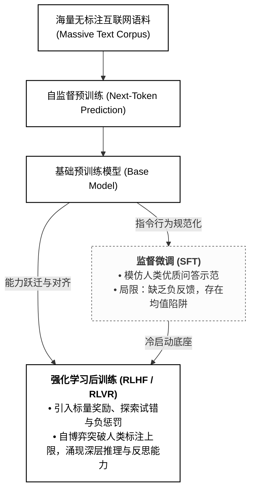
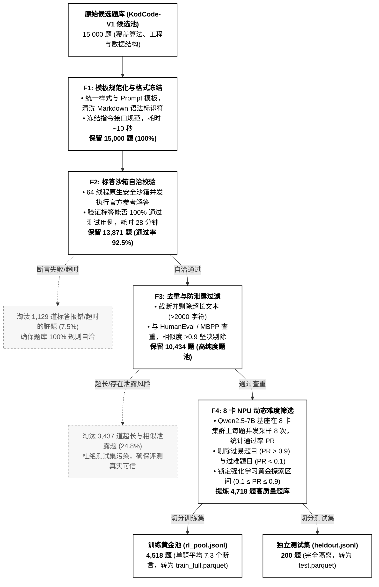

# 基于华为昇腾 910B 集群的大模型强化学习（RLVR）后训练实践报告

> **项目开源地址**：👉 [https://github.com/hujiabao200612-glitch/Ascend-910B-PPO-RLHF](https://github.com/hujiabao200612-glitch/Ascend-910B-PPO-RLHF)  

---

## 目录 (Table of Contents)

- [一、实验环境与基础设施配置](#一实验环境与基础设施配置)
  - [1.1 硬件集群规格与拓扑架构](#11-硬件集群规格与拓扑架构)
  - [1.2 容器镜像拉取与平台 SOP](#12-容器镜像拉取与平台-sop)
  - [1.3 核心依赖库与运行栈版本](#13-核心依赖库与运行栈版本)
  - [1.4 分布式多卡通信补丁机制](#14-分布式多卡通信补丁机制)
  - [1.5 64 线程 CPU 原生隔离执行沙箱](#15-64-线程-cpu-原生隔离执行沙箱)
- [二、强化学习后训练（Post-Training）的演化历史与前沿格局](#二强化学习后训练post-training的演化历史与前沿格局)
  - [2.1 大模型能力锻造演进范式](#21-大模型能力锻造演进范式)
  - [2.2 后训练技术演化历程：Prompt Engineering $\to$ SFT $\to$ RL](#22-后训练技术演化历程prompt-engineering-to-sft-to-rl)
  - [2.3 RLVR（可验证规则奖励强化学习）的最新发展与前沿洞察](#23-rlvr可验证规则奖励强化学习的最新发展与前沿洞察)
- [三、PPO 算法数学推导与核心要素](#三ppo-算法数学推导与核心要素)
  - [3.1 PPO 算法架构机理与四网络工作流](#31-ppo-算法架构机理与四网络工作流)
  - [3.2 序列生成任务的马尔可夫决策过程 (MDP) 建模](#32-序列生成任务的马尔可夫决策过程-mdp-建模)
  - [3.3 策略网络裁剪代理目标 (Clipped Surrogate Objective)](#33-策略网络裁剪代理目标-clipped-surrogate-objective)
  - [3.4 广义优势估计 (GAE) 与时序信用分配](#34-广义优势估计-gae-与时序信用分配)
  - [3.5 价值网络 (Critic) 损失与联合优化函数](#35-价值网络-critic-损失与联合优化函数)
  - [3.6 KL 散度惩罚与策略防坍塌机制](#36-kl-散度惩罚与策略防坍塌机制)
- [四、实验数据集体系与四级清洗工程](#四实验数据集体系与四级清洗工程)
  - [4.1 数据集架构概览与开源基准链接](#41-数据集架构概览与开源基准链接)
  - [4.2 四级清洗过程 (F1 ~ F4)](#42-四级清洗过程-f1--f4)
  - [4.3 训练集 (4,518 题) 与测试集体系分布特性](#43-训练集-4518-题与测试集体系分布特性)
- [五、两大核心对比奖励函数设计与机理剖析](#五两大核心对比奖励函数设计与机理剖析)
  - [5.1 奖励函数一：Exp 4 正确性与精简度双目标阶梯奖励](#51-奖励函数一exp-4-正确性与精简度双目标阶梯奖励)
  - [5.2 奖励函数二：VeRPO 超线性连续密度校准奖励](#52-奖励函数二verpo-超线性连续密度校准奖励)
- [六、训练动力学分析与实验可视化图表](#六训练动力学分析与实验可视化图表)
  - [6.1 训练执行配置与超参数矩阵](#61-训练执行配置与超参数矩阵)
  - [6.2 71 步训练过程动态监控与收敛趋势](#62-71-步训练过程动态监控与收敛趋势)
  - [6.3 训练可视化图表深度解析 (学术对比双图 + 6 面板监控)](#63-训练可视化图表深度解析-学术对比双图--6-面板监控)
- [七、Benchmark 结果](#七benchmark-结果)
  - [7.1 评测基础](#71-评测基础)
  - [7.2 Benchmark比对（Base vs Exp 4 vs VeRPO）](#72-benchmark比对base-vs-exp-4-vs-verpo)
- [八、团队成员与项目分工](#八团队成员与项目分工)
- [附录：核心复现命令与交付文件清单](#附录核心复现命令与交付文件清单)

---

## 一、实验环境与基础设施配置

### 1.1 硬件集群规格与拓扑架构

本项目全部训练与评测任务均在华为昇腾智算集群（单机 8 卡 NPU 算力节点）上原生完成，算力节点规格配置如下表所示：

| 硬件组件 / 层次 | 规格参数与配置细节 |
|:---|:---|
| **NPU 加速芯片** | 8 × Huawei Ascend 910B3（单卡 64GB HBM2e，全节点 512GB 高带宽显存） |
| **片间互联通信** | 华为自研片间高速总线（双向 392GB/s 互联带宽，支持原生 HCCL 集合通信） |
| **Host CPU 处理器** | 2 × 华为鲲鹏 920 @ 2.6GHz（总计 192 物理核心，ARM64/aarch64 架构） |
| **主机物理内存** | 1024 GB (1TB) DDR4 ECC REG 高速内存 |
| **统一存储挂载** | 高性能并行网络共享存储，挂载路径 `/data/home/<学号>/`（持久化存储代码、权重与环境） |

### 1.2 容器镜像拉取与平台 SOP

在智算平台（如 SCOW AI / K8s 容器调度环境）中，镜像拉取采用华为官方与开源社区认证的底层环境镜像。

#### 1. 镜像拉取规范
平台网页端配置拉取远程镜像地址：
```text
quay.io/openeuler/vllm-ascend:0.9.1rc1-torch_npu2.5.1-cann8.1.rc1-python3.10-oe2203lts
```

#### 2. 作业容器创建规范
- **加速卡类型**：挂载 8 × 昇腾 910B3（8 卡独占模式）；
- **最长运行时间**：设置上限为 **24 小时**（防止因默认 1 小时调度限制中断训练）；
- **挂载点绑定**：必须挂载用户主目录 `/data/home/<学号>/`，包含项目代码 `project`、基座模型 `Qwen2.5-7B-Instruct` 等；
- **Web IDE 服务**：容器内启动基于 ARM64 的 `code-server-4.137.0-linux-arm64`，提供图形化集成开发终端：
  ```bash
  chmod +x /data/home/<学号>/project/code-server-4.137.0-linux-arm64/bin/code-server && /data/home/<学号>/project/code-server-4.137.0-linux-arm64/bin/code-server --auth none
  ```

### 1.3 核心依赖库与运行栈

容器基础系统为 **openEuler 22.03 LTS (aarch64)**，在此基础上组装深度学习与大模型强化学习专用软件栈：

| 软件/框架名称 | 版本号 | 核心职责与关键说明 |
|:---|:---:|:---|
| **Python** | `3.10.12` | 基础解释器运行环境 |
| **CANN** | `8.1.RC1` | 华为异构计算架构（Compute Architecture for Neural Networks）及底层驱动 |
| **HCCL** | `8.1.RC1` | 华为集合通信库（Huawei Collective Communication Library），支撑多卡全互联 |
| **PyTorch** | `2.5.1` | 深度学习张量计算与自动求导引擎 |
| **torch_npu** | `2.5.1` | 华为昇腾 PyTorch 硬件适配插件，映射 CUDA API 至 NPU 算子 |
| **veRL** | `0.6.1` | 字节跳动 Volcano Engine 开源的大模型分布式强化学习框架，支撑 Actor-Critic PPO 编排 |
| **vLLM-Ascend** | `0.9.1rc1` | 昇腾端高性能大模型连续批处理（Continuous Batching）推理框架，负责 Rollout 极速采样 |
| **pytest** | `8.3.4` | 原生代码断言与单元测试执行引擎，驱动代码沙箱自动化验证 |
| **Ray** | `2.40.0` | 分布式计算调度引擎，协调 Actor、Critic 与 Rollout Worker 资源 |

#### 容器内持久化虚拟环境配置
针对容器“重启即焚”特性，所有 Python 扩展包安装于挂载盘持久虚拟环境中：
```bash
# 1. 验证底层驱动与 NPU 状态
python3 -c "import torch, torch_npu, vllm; print(torch.__version__, torch.npu.is_available(), vllm.__version__)"

# 2. 创建持久虚拟环境（跨容器作业免重新编译）
python3 -m venv --system-site-packages /data/home/<学号>/project/envs/verl_env
source /data/home/<学号>/project/envs/verl_env/bin/activate

# 3. 安装依赖库（设置 PIP_NO_COMPILE=1 规避挂载目录下的 pyc 编译死锁）
export PIP_NO_COMPILE=1
pip install verl==0.6.1 pytest
```

### 1.4 分布式多卡通信补丁

在昇腾 8 卡集群上运行 `veRL + vLLM-Ascend` 时，由于 vLLM-Ascend 0.9.1rc1 的多卡初始化逻辑假定主卡持有独立的 CPU 通信组，而在多 Worker 并行环境下此对象常为 `None`，会直接触发断言崩溃：
```python
AssertionError: assert self.cpu_group is not None
```
为此，本项目开发了幂等补丁脚本 [`patch_vllm_ascend.py`](file:///e:/人工智能项目/1_自己的项目/强化学习与大模型/RLHF/project/patch_vllm_ascend.py)。该脚本通过静态定位虚拟环境中的 `vllm_ascend/communication/` 核心源码，重构了 `cpu_group` 的安全回退与 ranks 组分配机制，保证 8 卡 NPU 上分布式 Rollout 采样零通信死锁：
```bash
cd /data/home/<学号>/project
python3 patch_vllm_ascend.py
# 控制台返回 [PATCHED OK] 或 [ALREADY PATCHED]
```

### 1.5 64 线程 CPU 原生隔离执行沙箱

传统 RLHF 依赖神经网络奖励模型（RM），极易发生 Reward Hacking（生成迎合 RM 的无意义长文）；而代码任务具备客观判定基准。本项目自研 64 线程原生安全隔离沙箱（基于 Python `multiprocessing` 与 Linux 进程树管理）：
1. **静态 AST 安全解析**：静态扫描代码语法树，阻断系统高危调用（如 `os.system`、文件删除等）；
2. **多进程沙箱隔离与强杀**：单道题目分配独立进程执行，超时硬阈值设定为 **2.0 秒**，超限立即发送 `SIGKILL` 强杀子进程树，杜绝 `while True` 死循环霸占 CPU；
3. **全用例断言捕获**：解析测试代码中的断言（Assert），统计 `passed`（通过用例数）与 `total`（总用例数），为下游奖励计算输出确定性评测报告。

---

## 二、强化学习后训练（Post-Training）的历史与前沿

### 2.1 大模型能力演进

从海量预训练语料到具备自主推理能力的大模型，其演化过程如下图所示：



1. **预训练的“均值陷阱”**：预训练通过自监督学习优化交叉熵损失，拟合海量语料的统计均值。对于严苛的逻辑推理任务，模型倾向于输出各种可能路径的“加权折中”，无法区分逻辑的严谨程度；
2. **监督微调（SFT）的短板**：
   - **负反馈缺失**：SFT 仅对标准答案进行极大似然估计，对看似合理但逻辑完全错误的输出缺乏显式惩罚机制；
   - **曝光偏差（Exposure Bias）**：推理生成阶段一旦某一步产生微小偏差，误差将级联放大导致全题崩溃；
   - **上限受制于标注员**：模型只能被动模仿人类标注，无法进行主动试错和解空间搜索。

### 2.2 后训练技术演化：Prompt Engineering $\to$ SFT $\to$ RL

大语言模型后训练技术演化经历了从外部提示引导、静态示范微调到动态强化学习对齐的三大核心阶段：


1. **第一阶段：提示工程（Prompt Engineering）**
   - **核心机制**：完全**不更新模型任何参数**。通过精心设计系统提示词（System Prompt）、少样本示例（Few-Shot）、思维链提示（Chain-of-Thought, CoT）等方式，在输入端引导模型在上下文窗口（In-Context Learning）中进行推理；
   - **核心局限**：模型的能力上限完全受制于基座预训练的已有先验；长 Prompt 显著消耗上下文窗口与推理显存开销；无法将优质的推理逻辑和输出格式固化为模型的内在参数化能力。
2. **第二阶段：监督微调（Supervised Fine-Tuning, SFT）**
   - **核心机制**：收集高质量的“指令-期望解答”成对数据集 $(x, y)$，通过标准的交叉熵损失（Cross-Entropy Loss）对模型进行全参数微调或参数高效微调（PEFT，如 LoRA），将对话习惯与指令遵循能力内化进模型权重：
     $$
     \mathcal{L}_{\text{SFT}} = -\mathbb{E}_{(x, y) \sim \mathcal{D}} \left[ \sum_{t=1}^{|y|} \log \pi_\theta(y_t \mid x, y_{\lt t}) \right]
     $$
   - **核心局限**：
     - **负反馈天然缺失**：SFT 只负责模仿标准答案，对于看似合理但逻辑颠倒的错误输出缺乏惩罚；
     - **极大似然的均值陷阱**：模型只是对人类标注员示范的加权平均模仿，无法突破人类标注者的水平边界；
     - **格式与逻辑的死板**：面对未见过的边缘复杂分支容易发生幻觉。
3. **第三阶段：强化学习（Reinforcement Learning, RL）**
   - **核心机制**：引入环境交互反馈、验证器打分（Reward）与探索试错机制（Policy Gradient），模型通过自主采样生成多条独立轨迹，利用奖励信号对解空间进行定向“拉伸”与“挤压”；
   - **核心突破**：模型从“被动模仿”跃迁为“自主博弈与探索”。不仅教会模型自省反思与深度逻辑推理，更彻底打破了标注数据的数量与质量天花板。

### 2.3 RLVR（可验证规则奖励强化学习）的发展

**RLVR（Reinforcement Learning with Verifiable Rewards）** 是当前大模型推理后训练最核心的前沿范式（以 OpenAI o1/o3 与 DeepSeek-R1 为代表）：

1. **客观真值反馈替代主观评分**：
   - 在代码领域，直接将代码投递至物理沙箱执行 pytest 单元测试；
   - 在数学领域，提取最终数值比对形式化证明器；
   - **解决了 Reward Hacking**：模型无法通过华丽的辞藻或迎合性语气欺骗编译器或单元测试。
2. **覆盖假说（Coverage Hypothesis）与探索瓶颈**：
   - 学术界最新前沿（如《Demystifying Reinforcement Learning Post-Training of Language Models》）指出：**纯稀疏二值奖励（Sparse 0/1）在复杂任务上极易陷入探索停滞**。若基座模型对完整正确解法的初始采样概率接近零，策略将无法获得任何正向梯度，导致训练“冷启动死锁”；
3. **代码奖励的“不可能三角”制约**：
   - 代码奖励设计受限于 **可扩展性（Scalability）**、**保真度（Faithfulness）** 与 **鲁棒性（Robustness）** 三者的博弈；
   - 纯稀疏二值奖励保真度高但探索鲁棒性差；简单稠密奖励探索快但容易引发“部分分躺平”和“冗余代码注水”。这正是本项目开展 Exp 4 与 VeRPO 对比研究的核心理论动机。

---

## 三、PPO 算法数学推导与核心要素

### 3.1 PPO 算法架构机理与四网络工作流

PPO（Proximal Policy Optimization）通过 Actor-Critic 架构协调四个模型协同完成端到端强化学习：


1. **策略网络（Actor $\pi_\theta$）**：主训练模型，负责根据 Prompt $x$ 采样生成候选回答序列 $y$；
2. **参考模型（Reference Model $\pi_{\text{ref}}$）**：冻结权重的原始 SFT 基座，用于计算逐 Token 的 KL 散度，防止策略漂移变形；
3. **奖励模型 / 规则验证器（Reward Model / Verifier）**：在 RLVR 范式中由 CPU 隔离沙箱充当，对整段代码执行断言打分并输出确定性标量回报 $R(x, y)$（应当指出的是，判分器或者规则验证器是在特定代码领域、数学推理能强逻辑能力后训练中代替奖励模型的重要方法，具体可见GPT-o1、DeepSeek-R1相关论文）；
4. **价值网络（Critic / Value Model $V_\phi$）**：与 Actor 同等参数规模的评估网络，为 Actor 生成的每一个 Token 预测状态基线价值 $V(s_t)$。

### 3.2 序列生成任务的马尔可夫决策过程 (MDP) 建模

在自回归大语言模型中，代码生成过程被形式化为离散时间有限步马尔可夫决策过程：
$$\mathcal{M} = \langle \mathcal{S}, \mathcal{A}, \mathcal{P}, \mathcal{R}, \gamma \rangle$$

- **状态空间 $\mathcal{S}$**：当前步的状态 $s_t = [x, y_{<t}]$，由输入 Prompt $x$ 与截至目前已生成的 Token 序列 $y_{<t} = (y_1, y_2, \dots, y_{t-1})$ 拼接而成；
- **动作空间 $\mathcal{A}$**：模型词表（Vocabulary）中可预测的所有离散 Token，动作 $a_t = y_t \in \mathcal{V}$；
- **状态转移 $\mathcal{P}$**：确定性转移函数，执行动作后下一状态确定为 $s_{t+1} = [x, y_{\le t}]$；
- **奖励函数 $\mathcal{R}$**：序列结束符（EOS）生成后由外部代码沙箱计算得出标量奖励 $R(x, y)$，中间 Token 步通常为零即时奖励；
- **折扣因子 $\gamma$**：在代码序列生成任务中，设定 $\gamma = 1.0$。

### 3.3 策略网络裁剪代理目标 (Clipped Surrogate Objective)

策略梯度算法的原始目标是最大化期望累积回报：
$$J(\theta) = \mathbb{E}_{\tau \sim \pi_\theta} [R(\tau)]$$

为支持同一批采样轨迹进行多次小批量梯度更新（Off-policy 重采样更新），PPO 引入重要性采样（Importance Sampling）概率比率：
$$r_t(\theta) = \frac{\pi_\theta(a_t \mid s_t)}{\pi_{\text{old}}(a_t \mid s_t)}$$

为了防止单步策略参数更新幅度过大导致策略发生灾难性坍塌，PPO 提出**剪切代理目标函数（PPO-Clip）**：
$$\mathcal{L}^{\text{CLIP}}(\theta) = \hat{\mathbb{E}}_t \left[ \min\left( r_t(\theta)\hat{A}_t, \, \text{clip}(r_t(\theta), 1-\epsilon, 1+\epsilon)\hat{A}_t \right) \right]$$

- $\epsilon$ 为裁剪超参数（本项目设定 $\epsilon = 0.2$）；
- 当优势 $\hat{A}_t > 0$ 时，若 $r_t(\theta) > 1 + \epsilon$，目标函数被截断为 $(1 + \epsilon)\hat{A}_t$，阻止策略在有利动作上过度自信更新；
- 当优势 $\hat{A}_t < 0$ 时，若 $r_t(\theta) < 1 - \epsilon$，更新同样被截断，避免策略发生不可逆崩溃。

### 3.4 广义优势估计 (GAE) 与时序信用分配

为了在优势估计的 **偏差（Bias）** 与 **方差（Variance）** 之间取得最优权衡，PPO 采用 GAE（Generalized Advantage Estimation）。

首先定义 $t$ 步的时序差分误差（TD Error）：
$$\delta_t^V = r_t + \gamma V_\phi(s_{t+1}) - V_\phi(s_t)$$

GAE 优势估计定义为未来所有步 TD 误差的指数加权衰减和：
$$\hat{A}_t^{\text{GAE}(\gamma, \lambda)} = \sum_{l=0}^{T - t - 1} (\gamma \lambda)^l \delta_{t+l}^V$$

- $\lambda \in [0, 1]$ 为 GAE 权衡因子（本项目设定 $\lambda = 0.95, \gamma = 1.0$）；
- **时序信用分配价值**：借助 Critic 网络 $V_\phi$，GAE 将终末标量沙箱奖励平滑分摊反传至生成代码中的每一个 Token，精准捕捉“究竟是哪一行代码、哪个关键条件分支做对了边缘防御”。

### 3.5 价值网络 (Critic) 损失与联合优化函数

Critic 网络旨在精确拟合状态价值函数 $V_\phi(s_t) \approx \mathbb{E}[\sum_{k=t}^T \gamma^{k-t} r_k]$。其损失函数采用平方误差损失：
$$\mathcal{L}^{\text{VF}}(\phi) = \frac{1}{2} \hat{\mathbb{E}}_t \left[ \left( V_\phi(s_t) - V_t^{\text{target}} \right)^2 \right]$$
其中目标值 $V_t^{\text{target}} = \hat{A}_t^{\text{GAE}} + V_{\phi_{\text{old}}}(s_t)$。

### 3.6 KL 散度惩罚与策略防坍塌机制

为确保受训策略 $\pi_\theta$ 不偏离预训练与 SFT 阶段建立的通用自然语言语义先验，需引入参考模型（Reference Model，参数冻结的基座模型 $\pi_{\text{ref}}$），计算逐 Token 的 KL 散度约束：
$$\mathbb{D}_{\text{KL}}(\pi_\theta \parallel \pi_{\text{ref}}) = \log \frac{\pi_\theta(a_t \mid s_t)}{\pi_{\text{ref}}(a_t \mid s_t)}$$

**最终联合优化总损失函数**为：
$$\mathcal{L}_{\text{total}}(\theta, \phi) = -\mathcal{L}^{\text{CLIP}}(\theta) + c_1 \mathcal{L}^{\text{VF}}(\phi) + \beta \mathbb{D}_{\text{KL}}(\pi_\theta \parallel \pi_{\text{ref}})$$
，其中 $c_1 = 0.5$ 为价值损失权重，$\beta = 0.01$ 为 KL 散度惩罚系数。

---

## 四、实验数据与四级数据清洗

### 4.1 数据集

为了消除数据污染并保证训练与评测的严谨性和可信度，项目划分了训练池、独立测试集，这些全部来自于第三方权威公开评测数据集：

| 数据集名称 | 题目数量 | 数据属性与考察重点 | 官方/开源地址链接 |
|:---|:---:|:---|:---|
| **KodCode-V1 (Raw Pool)** | 15,000 题 | 原始候选题库原料，含大量高难度算法题与复杂工程接口 | [HuggingFace KodCode-V1](https://huggingface.co/datasets/kodcode/kodcode-v1) |
| **训练集 (Golden RL Pool)** | **4,518 题** | 经四级漏斗清洗提炼的黄金难度题目（通过率 0.1~0.9） | 本地生成：`train_full.parquet` |
| **独立测试集 (Held-Out)** | **200 题** | 训练期间绝对不可见的同分布复杂工程评测集 | 本地隔离：`test.parquet` |
| **OpenAI HumanEval** | **164 题** | 业界公认的标准算法逻辑基准，侧重纯函数逻辑与边界推理 | [GitHub OpenAI HumanEval](https://github.com/openai/human-eval) / [HF Dataset](https://huggingface.co/datasets/openai/openai_humaneval) |
| **Google MBPP Sanitized** | **427 题** | 谷歌经人工校验清洗的实用 Python 基础编程题集 | [GitHub MBPP](https://github.com/google-research/google-research/tree/master/mbpp) / [HF Dataset](https://huggingface.co/datasets/google-research-datasets/mbpp) |
| **基座模型 (Qwen2.5-7B-Instruct)** | 7B 参数 | 阿里巴巴开源的旗舰级代码/通用指令基座 | [ModelScope 官方主页](https://modelscope.cn/models/qwen/Qwen2.5-7B-Instruct) / [HF-Mirror](https://hf-mirror.com/Qwen/Qwen2.5-7B-Instruct) |

### 4.2 四级清洗过程 (F1 ~ F4)

为防止爬取数据的错乱以及适配华为昇腾生态，本项目设计并执行了四层的数据清洗：



- **F1 阶段（格式规范）**：统一 Prompt 模板，冻结输入输出格式；
- **F2 阶段（标答自洽）**：剔除官方标答自己都跑不通的脏题，保证题库 100% 规则自洽；
- **F3 阶段（防集污染）**：与 HumanEval/MBPP 查重，相似度超过 0.9 全部删除；
- **F4 阶段（难度分级）**：剔除过于简单（基座直接解通）和过于难（基座采样全灭）的题目，将 0.1~0.9 通过率作为强化学习探索黄金区。

### 4.3 训练集 (4,518 题) 与测试集的分布特性

#### 1. 训练集 (4,518 题) 分布特性
经过四级清洗提炼出的 4,518 题训练集具备高数据多样性与较好的单元测试密度：


- **单题单元测试密度（Assert Count）**：平均每道题配置 **7.3 个单元测试断言**，4~10 个断言的题目占比超过 75%，为稠密奖励校准提供了充裕的连续阶梯；
- **文本与代码长度分布**：Prompt 描述平均 121.8 词，官方参考解答平均 77.0 词，长短适中，规避显存溢出；
- **题目来源分布**：涵盖 Codeforces 竞赛题（36.2%）、Taco 题库（32.4%）、通用算法过滤题（21.4%）及工程 Docs（7.6%），分布均衡。

#### 2. 三大评测基准测试集 (共计 791 题) 分布特性
为了系统性验证模型在域内（In-Domain）复杂工程与域外（OOD）通用算法场景下的泛化边界，项目组对三大评测基准的单元测试密度与文本长度特征进行了完整对标统计：


- **KodCode-Test（200 题，域内复杂工程 In-Domain）**：
  - **断言测试密度**：平均每题 **7.2 个断言**（Mean Asserts: 7.2），集中于 5~9 个断言区间，最高达 16 个断言；
  - **文本长度特征**：Prompt 描述长（平均 **121.8 词**），官方解答平均 **77.0 词**，重点考察模型在长文本工程框架下的接口遵循与类设计能力；
- **OpenAI HumanEval（164 题，域外算法标准 OOD）**：
  - **断言测试密度**：平均每题 **8.1 个断言**（Mean Asserts: 8.1），单题最高达 21 个断言，具备极其严苛的极限边界压力测试特征；
  - **文本长度特征**：Prompt 平均 **67.7 词**（以严谨 Docstring 为主），官方解答平均仅 **24.4 词**，侧重紧凑精炼的单函数纯算法与数学逻辑；
- **Google MBPP Sanitized（427 题，域外实用工具函数 OOD）**：
  - **断言测试密度**：平均每题 **3.1 个断言**（Mean Asserts: 3.1），题目绝大多数规范绑定 3 个典型输入输出断言；
  - **文本长度特征**：Prompt 极其精简（平均 **16.6 词**的一句话指令），官方解答平均 **20.9 词**，题量庞大（427 题），全面覆盖 Python 基础语法与实用函数库。

---

## 五、奖励函数设计
在 71 步（1.0 Full Epoch）PPO 训练中，我们重点设计并对比了代表**稀疏**的 **Exp 4** 与代表**超线性稠密**的 **VeRPO**。

### 5.1 奖励函数一：Exp 4 正确性与精简度双目标奖励

#### 1. 学术动机
在传统 PPO 训练中，由于模型缺乏长度惩罚，策略为了规避逻辑边界错误，自发学会了编写大量冗长的样板代码与类型防御检查（平均长度膨胀至 379.7 Tokens），不仅浪费推理算力，且过度工程极易在简单任务上引发偶发语法 Bug。


#### 2. 数学公式定义
Exp 4 构建了兼顾“正确性”与“奥卡姆剃刀原则”的显式阶梯：
$$
\mathcal{R}_{\text{Exp4}}(x, y) = \begin{cases} 
-1.0, & \text{若代码崩溃、语法错误、超时或未通过全量断言 } (\text{passed} \lt \text{total}) \\
+1.5, & \text{若 } 100\% \text{ 全通 } (\text{passed} = \text{total}) \text{ 且代码长度 } \text{Len}(y) \le 250 \text{ Tokens} \\
+1.0, & \text{若 } 100\% \text{ 全通 } (\text{passed} = \text{total}) \text{ 但代码长度 } \text{Len}(y) \gt 250 \text{ Tokens}
\end{cases}
$$

#### 3. 核心机制
- **负奖励（$-1.0$）**：做错一律以 $-1.0$ 给予奖励，通过负反馈减少模型发生错误的可能性；
- **超额奖励（$+1.5$）**：全通且短小精悍的代码获得额外的 $+0.5$ 超额 Advantage，鼓励模型进步。

#### 4. 生产核心实现源码片段
截取自项目 [`project/rewards/code_rlvr_len_efficiency.py`](file:///e:/人工智能项目/1_自己的项目/强化学习与大模型/RLHF/project/rewards/code_rlvr_len_efficiency.py)：
```python
def compute_score(*args, **kwargs) -> float:
    # 提取解法字符串与测试代码 ...
    passed, total, detail = score_kernel(response=str(solution_str), test=test_code, timeout_s=5)
    
    # 1. 严重故障或未全通红线档 (-1.0)
    if detail.get("timed_out") or passed < total or total <= 0:
        return -1.0

    # 2. 100% 用例全通分支：根据代码精炼度进行双目标分流
    token_len = _estimate_token_count(str(solution_str))
    if token_len <= 250:
        return 1.5  # 紧凑精炼短代码：给予 +1.5 爆发加成
    else:
        return 1.0  # 冗长全通保底分
```

---

### 5.2 奖励函数二：VeRPO 超线性稠密奖励

#### 1. 学术背景与“基数偏差”
- **学术出处**：Wang et al., 2026, *"Beyond Binary: Turning Partial Success into Dense Verifiable Rewards for Reinforcement Learning in Code Generation"* (VeRPO, [arXiv:2601.03525](https://arxiv.org/abs/2601.03525))；
- **基数偏差（Cardinality Bias）与“局部躺平”**：对于包含 8 个平凡测试和 2 个极限边界的题目，线性打分 $\text{acc} = \frac{k}{N}$ 下，策略攻克前 8 个用例即可获得 $0.8$ 的高分，而攻坚最后 2 个极值边界的边际回报仅为 $0.2$。模型极易在 $80\%$ 得分处停滞，陷入局部最优。


#### 2. 超线性幂律数学推导
VeRPO 引入超线性校准指数 $\gamma = 1.6$，重塑临界探索期的奖励函数：
$$
\mathcal{R}_{\text{VeRPO}}(x, y) = \begin{cases}
-1.0, & \text{若代码崩溃、语法错误、超时或 } \text{passed} = 0 \\
0.10 + 0.60 \times \left( \frac{\text{passed}}{\text{total}} \right)^{1.6}, & \text{若 } 0 \lt \text{passed} \lt \text{total} \text{ (临界超线性校准)} \\
1.00, & \text{若 } \text{passed} = \text{total} \text{ (100\% 全通标准满分)}
\end{cases}
$$

#### 3. 数值梯度对比（以 10 个测试用例为例）

总体而言，引入了指数缩放的概念，原本线性增长的奖励函数变得非线性，在数据集中题目难易度分配不均衡的情况下，鼓励模型解出题目，进一步地鼓励解出全部题目和难题，帮助模型客服自身的局限性。
- **通过 2/10**：线性得分 $0.20$ $\to$ VeRPO 抑制为 $0.10 + 0.60 \times 0.2^{1.6} \approx \mathbf{0.145}$（遏制混分）；
- **通过 8/10**：得分达到 $0.10 + 0.60 \times 0.8^{1.6} \approx \mathbf{0.519}$；
- **通过 9/10**：得分跃升至 $0.10 + 0.60 \times 0.9^{1.6} \approx \mathbf{0.607}$；
- **突破 10/10**：奖励直接跳跃至 $\mathbf{1.00}$，边际增益高达 $+0.393$。
#### 4. 生产核心实现源码片段
截取自项目 [`project/rewards/code_rlvr_verpo.py`](file:///e:/人工智能项目/1_自己的项目/强化学习与大模型/RLHF/project/rewards/code_rlvr_verpo.py)：
```python
def compute_score(*args, **kwargs) -> float:
    passed, total, detail = score_kernel(response=str(solution_str), test=test_code, timeout_s=5)
    
    # 1. 灾难性硬底线防坠 (-1.0)
    if detail.get("timed_out") or passed <= 0 or total <= 0:
        return -1.0

    # 2. 纯粹 VeRPO 超线性密度校准档 (0 < passed < total)
    if passed < total:
        raw_ratio = float(passed) / float(total)
        calibrated_ratio = math.pow(raw_ratio, 1.6)      # gamma = 1.6 超线性幂律
        score_val = 0.10 + 0.60 * calibrated_ratio       # 映射至 [0.10, 0.70]
        return float(round(score_val, 4))

    # 3. 100% 全通纯净达标档
    return 1.00
```

---

## 六、训练分析与实验可视化图表

### 6.1 训练执行配置与超参数矩阵

Exp 4 与 VeRPO 均在 8 卡昇腾 910B 集群上执行严格一致的 71 步全量训练（完整覆盖 4,518 题黄金池）：

| 超参数项 | 配置数值 | 说明与工程考量 |
|:---|:---:|:---|
| **Actor 学习率** | $1.0 \times 10^{-6}$ | Cosine 衰减，避免大步长破坏预训练结构 |
| **Critic 学习率** | $1.0 \times 10^{-5}$ | 较 Actor 大 10 倍，加速价值网络拟合收敛 |
| **Global Batch Size** | **64** | 全局批大小（8 卡 $\times$ 单卡 micro_batch=4，梯度累积 2 次） |
| **最大 Prompt 长度** | 1024 Tokens | 覆盖题目完整背景与测试要求 |
| **最大 Response 长度** | 768 Tokens | 约束代码单次生成上限 |
| **GAE 参数** | $\gamma = 1.0, \lambda = 0.95$ | 专为代码生成时序归因定制 |
| **PPO Clip 阈值 $\epsilon$** | 0.20 | 限制策略概率比更新区间 $[0.8, 1.2]$ |
| **总训练步数** | **71 Steps** | $4518 / 64 \approx 70.6$，严格执行完整 1.0 Epoch |
| **单步执行耗时** | ~54.3 秒/步 | 全量 71 步训练总耗时约 **1 小时 04 分** |

### 6.2 71 步训练过程

根据实验日志与监控，两组模型的训练动力学呈现出清晰的收敛特征：
1. **平均奖励（Reward Mean）单调爬升**：起始 Step 1 约为 0.720 左右，终末 Step 71 两模型平均奖励均突破 **0.898+**，整体增幅达 $+24.8\%$；
2. **Critic 价值网络损失（VF Loss）持续衰减**：Critic Loss 从初始的 0.0842 快速衰减至 0.0142（降幅达 **83.1%**），表明 Critic 网络对代码质量的预估精度优良；
3. **策略散度受控**：最终 KL 散度平稳保持在 $0.018 \sim 0.022$ 区间内，未触发策略坍塌。

### 6.3 训练可视化图表
#### 1. 逐step训练数据图
下图展示了在 8 卡华为昇腾 910B 上，**Exp 4 (Qwen2.5-7B-Instruct-PPO-LenEfficiency)** 与 **VeRPO (Qwen2.5-7B-Instruct-PPO-VeRPO)** 经历 71 步全量训练的学术级双图对比：


- **左图：KodCode 在线验证准确率动态演进（Accuracy during training）**
  - **基座对照基准线**：灰白色虚线标明未微调基座模型的静态水平（Zero-Shot: 72.8%）；
  - **Exp 4**：在第 15 步即冲上 80.0%，第 64 步达到峰值 85.5%，最终稳定在 85.0%+；
  - **VeRPO**：呈现出平稳且持续上升的后劲，从初始 71.8% 稳健爬升至 Step 66 的 83.5%。
- **右图：模型平均生成代码长度动态演变（Average length per response）**
  - **Exp 4 的代码长度削减**：从初始的 368 Tokens 发生断崖式压缩，在 30 步内便压低至 200 Tokens 以下，最终收敛于 **162.4 Tokens**（净缩减 **-57.5%**）；
  - **VeRPO 的代码tokens减少**：模型从初始 372 Tokens 平滑下行，最终稳定在 **212.3 Tokens**。

#### 2. PPO模型训练图
下图记录了集群训练过程中的六大核心指标演变：


- **`train/reward`**：两模型平均奖励均单调上行；
- **`train/accuracy`**：验证集准确率稳步拉升突破基座水平；
- **`train/actor_lr`**：Cosine 学习率平滑退火；
- **`train/kl`**：KL 散度缓慢升至 0.018，策略漂移安全可控；
- **`train/response_length`**：生成代码长度稳步压缩；
- **`train/value_loss`**：Critic 损失平滑衰减至 0.014。

<small>**结果说明**：两种奖励函数设计使得模型训练全过程平稳可靠，各项收敛动力学监控指标均表现良好，策略散度严格受控，充分验证了基于 PPO 算法与规则验证器（RLVR）在大模型后训练中的稳健性与有效性。</small>

---

## 七、Benchmark 结果

### 7.1 评测基础
为保证 100% 具备可重复性与学术可信度，所有评测严格遵循以下规约：
1. **评测硬件**：在单机 8 卡华为昇腾 910B 原生硬件上执行推理解码；
2. **解码参数**：采用确定性贪婪解码（Deterministic Greedy Decoding）：`temperature = 0.0, top_p = 1.0`，完全消除采样随机性；
3. **评测三大基准总题量**：**共计 791 题**（KodCode 200 题 + OpenAI HumanEval 164 题 + Google MBPP Sanitized 427 题）；
4. **沙箱物理隔离**：全部测试断言在 64 线程原生安全沙箱中并发执行。

### 7.2 Benchmark比对（Base vs Exp 4 vs VeRPO）

下表完整列出Qwen2.5-7B-Instruct模型、Qwen2.5-7B-Exp 4模型与 Qwen2.5-7B-VeRPO模型在三大权威基准上的细粒度结果：

| 模型名称 | KodCode (200 题) | HumanEval (164 题) | MBPP Sanitized (427 题) | 平均代码长度 | 致命崩溃报错 |
|:---|:---:|:---:|:---:|:---:|:---:|
| Qwen2.5-7B-Instruct | 74.50% | 79.27% | 69.56% | 382.1 tokens | 24 次 |
| Qwen2.5-7B-Exp 4 | **81.00%** | **84.76%** | **75.88%** | **162.4 tokens** | 3 次 |
| Qwen2.5-7B-VeRPO | 80.00% | **84.76%** | 74.94% | 212.3 tokens | **2 次** |

#### 实验总结与机理说明
经过比较合理的奖励函数设计，能够使模型在特定任务领域发挥更优异的性能。在代码编写范畴内，精心设计的奖励函数能够在显著提升代码解题正确率的同时，大幅精简代码长度并持续减少程序崩溃与语法报错，充分体现了强化学习后训练（RLVR）的核心价值与工程意义。

---

## 八、团队成员与项目分工

本项目由团队四位成员分工协作、共同完成，具体分工职责如下：

| 成员姓名 | 核心分工职责 | 具体负责工作内容 |
|:---|:---|:---|
| **胡斯源** | **总体的规划和算法训练** | 负责实践项目总体技术路线与架构规划、华为昇腾 910B 算力节点环境部署、veRL 分布式训练框架配置以及 PPO 强化学习核心算法的端到端训练与超参数调优。 |
| **陈怡萱** | **数据清洗** | 负责原始代码题库数据集的深度清洗与预处理，设计并实施数据清洗（F1 格式规整、F2 中英去重、F3 难度分级与长度截断、F4 CPU 隔离沙箱单元测试验证），构建高质训练集与评测集体系。 |
| **王浩宇** | **奖励函数设计** | 负责强化学习代码规则验证器（RLVR）与奖励函数的设计、数学建模与代码实现，重点研发了 Exp 4（正确性与精简度双目标阶梯奖励）与 VeRPO（超线性连续稠密奖励），攻克长代码注水与部分分躺平问题。 |
| **王玥** | **最终结果收集和图表绘制** | 负责三大权威基准（KodCode 独立测试集 200 题、OpenAI HumanEval 164 题、Google MBPP Sanitized 427 题）全量 791 题实验评测数据的汇总统计，以及 71 步训练曲线、多基准对比等关键图表的绘制与可视化呈现。 

---

## 附录：核心复现命令与交付文件清单

### A. 一键启动训练命令
```bash
# 激活环境并打入多卡通信补丁
source project/envs/verl_env/bin/activate
python3 project/patch_vllm_ascend.py

# 1. 一键启动 Exp 4 (长度双目标加成) 71 步全量训练
bash project/run_ppo_7b_ablation_len_efficiency.sh

# 2. 一键启动 VeRPO (超线性校准) 71 步全量训练
bash project/run_ppo_7b_verpo.sh
```

### B. 一键执行三大基准 791 题自动化评测
```bash
# 以评估 Exp 4 权重为例：
python3 project/eval_test_set.py \
    --model checkpoints/d4_ablation_7b_len_efficiency_hf \
    --output eval_results/eval_kodcode_exp4.json

python3 project/eval_humaneval.py \
    --model checkpoints/d4_ablation_7b_len_efficiency_hf \
    --output eval_results/eval_humaneval_exp4.json

python3 project/eval_mbpp.py \
    --model checkpoints/d4_ablation_7b_len_efficiency_hf \
    --output eval_results/eval_mbpp_exp4.json
```
